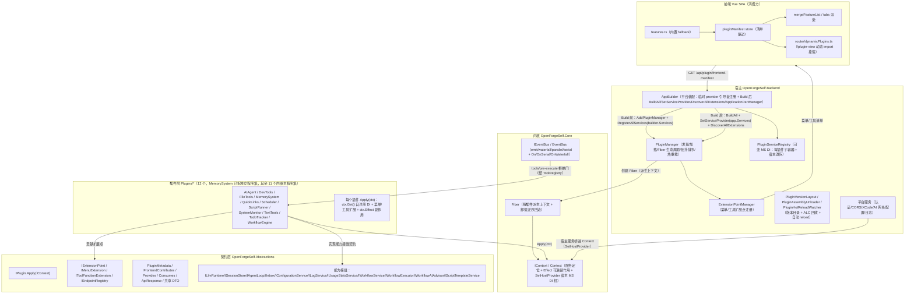

# 01-architecture — Cordis 内核（.NET 版）架构设计

> 功能编号：027
> 状态：已实现/已闭环（ADR 001；内核、契约层、插件自注册、可变 MS DI、文件级热更新、前端清单驱动均已落地；剩余项见功能档案「已知问题 / 待办」）
> 最后更新：2026-08-16
> 关联：调研见 [`06-research/001-deepseek-harness-plugin-architecture.md`](../06-research/001-deepseek-harness-plugin-architecture.md)，功能档案见 [`02-features/027-cordis-kernel.md`](../02-features/027-cordis-kernel.md)，路线图见 [`15-roadmap/plugin-architecture.md`](../15-roadmap/plugin-architecture.md)

本文描述新增项目 `OpenForgeSelf.Core`（.NET 版 Cordis 内核）的设计：它是什么、为什么这样设计、核心抽象是什么、如何渐进接入 `OpenForgeSelf.Backend`。

---

## 架构全景图（一切皆插件）

> 下图展示新架构的分层、核心组件、依赖方向与数据流；箭头方向 = 依赖/调用方向。



### 分层职责（有什么）

| 层 | 组件 | 职责 | 与当前项目对应 |
|---|---|---|---|
| 宿主 | `AppBuilder` | 平台装配：认证/CORS/XCode/AI 网关等平台服务；Build 前用临时 provider 引导插件自注册，Build 后 `BuildAll` + 桥接 MS DI + `DiscoverAllExtensions` + ApplicationPartManager 注册插件程序集 | `OpenForgeSelf.Backend/AppBuilder.cs` |
| 宿主 | `PluginManager` | 发现/加载/拓扑排序/Fiber 生命周期/热重载；独立 DLL 优先、内嵌插件主程序集回退 | `Plugins/PluginManager.cs` |
| 宿主 | `PluginServiceRegistry` | 可变 MS DI：每插件子容器 + 宿主服务透传 + Transient 转发描述符 + `BuildAll` 延迟构建；卸载后解析失败 | `Services/PluginServiceRegistry.cs` |
| 宿主 | `ExtensionPointManager` | 收集插件贡献的菜单/工具扩展 | `Plugins/ExtensionPointManager.cs` |
| 宿主 | `PluginVersionLayout` / `PluginAssemblyUnloader` / `PluginHotReloadWatcher` | side-by-side 版本目录 + `current` 指针；ALC 回收 + 文件锁探测；`FileSystemWatcher` 自动 reload | `Plugins/PluginVersionLayout.cs` / `Plugins/PluginAssemblyUnloader.cs` / `Plugins/Services/PluginHotReloadWatcher.cs` |
| 宿主 | 共享基础设施 | `IToolRegistry`/`ToolRegistry`/`ToolCallContext`、`ICronParser`/`CronParser`、`IRuntimeDetector`/`RuntimeDetector`（宿主中性，供插件复用） | `Services/` |
| 内核 | `IContext`/`Context` | 服务定位 + `Effect` 可逆副作用 + `SetHostProvider` 宿主 MS DI 桥 | `OpenForgeSelf.Core/IContext.cs`/`Context.cs` |
| 内核 | `Fiber` | 每插件一个派生上下文，`Mount` 装配 / 卸载逆序回滚，幂等 | `OpenForgeSelf.Core/Fiber.cs` |
| 内核 | `IEventBus`/`EventBus` | 类型化事件四模式 + `On`/`OnSerial`/`OnWaterfall` 注册句柄 | `OpenForgeSelf.Core/IEventBus.cs`/`EventBus.cs` |
| 契约 | `IPlugin` | 单一 `Apply(IContext)` 插件契约 | `OpenForgeSelf.Abstractions/IPlugin.cs` |
| 契约 | 扩展点 | `IMenuExtension`/`IToolFunctionExtension`/`IEndpointRegistry` | `OpenForgeSelf.Abstractions/` |
| 契约 | 能力接缝 | `ILlmRuntime`/`ISessionStore`/`IAgentLoop`/`IInbox`/`IConfigurationService`/`ILogService`/`IUsageStatsService`/`IWorkflowService`/`IWorkflowExecutor`/`IWorkflowAIAdvisor`/`IScriptTemplateService` 等可替换 Provider 契约 | `OpenForgeSelf.Abstractions/` |
| 插件 | 12 个插件 | 各自 `Apply` 自注册服务/菜单/工具/副作用 | `OpenForgeSelf.Backend/Plugins/*`（MemorySystem 已拆独立程序集，其余 11 个内嵌主程序集） |
| 前端 | `pluginManifest store` + `features.ts` + `dynamicPlugins.ts` | 由后端清单驱动菜单/视图；动态 import 挂载 `/plugin-view` 路由 | `OpenForgeSelf.Frontend/src/` |

### 核心关系（怎么协作）

1. **启动装配**：`AppBuilder` 在 `Build` 前用临时 provider 拿 `PluginManager` → `RegisterAllServices(builder.Services)` → 每个插件 `Apply(ctx)` 经 `ctx.Get<IServiceCollection>()` 把服务 `AddScoped/AddSingleton` 进该插件独立 `IServiceCollection`、贡献菜单/工具扩展、注册 `ctx.Effect` 副作用。
2. **运行时桥接**：`Build` 后 `PluginServiceRegistry.BuildAll` 构建每插件子 provider（合并宿主服务透传），`PluginManager.SetServiceProvider(app.Services)` 把宿主 DI 桥进 `Context`，插件工具函数运行期经 `CreateScope()/GetService<T>()` 解析宿主服务。
3. **扩展点接线**：`DiscoverAllExtensions` 把插件贡献的菜单/工具注册到 `ExtensionPointManager`，供前端清单与 `ToolRegistry` 使用。
4. **工具执行拦截**：`ToolRegistry` 通过平台 `IEventBus`（AppBuilder 注册单例）发 `tools/pre-execute`（`SerialAsync` 拒绝门）→ `tools/execute`（`EmitAsync`）→ `tools/post-execute`（`EmitAsync`）。
5. **热更新**：`PluginVersionLayout` 用 side-by-side 版本目录 + `current` 指针，`PluginAssemblyUnloader` 做 `ForceCollect` + `FileShare.None` 探测 + 延迟删除，`PluginHotReloadWatcher`（`FileSystemWatcher` + 300ms debounce）自动 reload；卸载走 `registry.Unmount → Fiber.Dispose → ALC Unload`。
6. **前端驱动**：前端 `GET /api/plugin/frontend-manifest` → `pluginManifest store` → `mergeFeatureList` 合并菜单 → tabs 渲染；`router/dynamicPlugins.ts` 按清单把 `route + views` 映射为 `/plugin-view/*` 动态 import 懒加载路由（试点 MemoryView/QuickLinksView/TodoView），清单失败/为空时回退静态路由。

---

## 1. 定位与目标

`OpenForgeSelf.Core` 是 deepseek-harness / Cordis 架构在 .NET 上的**薄内核**，为「一切皆插件」提供底座。它不是 DI 容器（复用 Microsoft.Extensions.DependencyInjection），而是补齐 MS DI 缺失的三件事：

1. **可逆副作用**（`ctx.Effect`）：任何运行期注册都配对注销，插件卸载即逆序回滚。
2. **类型化事件总线**（`IEventBus`）：四种分发模式（emit / waterfall / parallel / serial），提供拦截点。
3. **能力接缝**（`IContext` 服务定位）：服务定义（接口）+ 服务提供者（实现）+ 消费者（`ctx.Get<T>()`），替换 Provider 零改动消费者。

**终态**：`AppBuilder.cs` 不再硬编码任何插件的 DI 注册；每个功能以插件形式通过 `IContext` 自注册。

---

## 2. 设计原则

1. **没有内核，只有插件**：系统只提供 `IContext`，不预设任何业务能力。
2. **可逆注册优先**：热更新稳不稳取决于「卸载即回滚」，而非文件锁技巧。
3. **复用 MS DI**：服务解析交给 ASP.NET Core 容器，`IContext` 只做「服务定位 + 副作用 + 事件」这一薄层。
4. **最佳设计优先**：本项目未上线，不留兼容层；`IPlugin` 一步到位改 `Apply(IContext)`，插件一步到位拆独立程序集（ADR D1/D2）。

---

## 3. 核心抽象

### 3.1 IContext（共享上下文）

```csharp
public interface IContext : IServiceProvider
{
    void Register<TService>(TService instance) where TService : class;
    void Register<TService, TImpl>() where TService : class where TImpl : class, TService, new();
    TService? Get<TService>() where TService : class;
    IDisposable Effect(Func<IDisposable> sideEffect);
    IEventBus Events { get; }
    IContext Derive();
}
```

`Context` 实现为「类型 → 实例」本地字典 + 父级查找（`Derive()` 派生上下文用于会话/作用域隔离）。副作用按注册逆序释放，与 Cordis Fiber 的 dispose 语义一致。

### 3.2 IEventBus（类型化事件）

```csharp
public interface IEventBus
{
    Task EmitAsync<TEvent>(string name, TEvent payload);                                   // 广播
    Task<TResult> WaterfallAsync<TEvent, TResult>(string name, TEvent payload, Func<Task<TResult>> fallback); // 环绕/短路
    Task ParallelAsync<TEvent>(string name, TEvent payload);                                // 并发
    Task<TResult?> SerialAsync<TEvent, TResult>(string name, TEvent payload);               // 按序短路
    IDisposable On<TEvent>(string name, Func<TEvent, Task> handler);
}
```

事件名用「命名空间/动作」风格。规划中的事件族：

| 事件族 | 典型事件 | 用途 |
|--------|----------|------|
| `session/*` | `session/event` | 持久事实，追加到会话日志 |
| `agent/*` | `agent/pre-step`、`agent/request`、`agent/turn-stopping` | 观察/拦截 Agent 生命周期 |
| `tools/*` | `tools/pre-execute`、`tools/execute`、`tools/post-execute` | 工具执行管道（允许/拒绝门 + 结果检查） |
| `fs/*` / `telemetry/*` | 能力事件 | 给接缝附加策略，无需 import 循环 |

### 3.3 Service（服务基类，对标 Cordis Service）

```csharp
public abstract class Service : IDisposable
{
    public static IReadOnlyList<string> Inject { get; } = Array.Empty<string>();
    protected Service(IContext ctx, string name);
    public IContext Context { get; }
    public string Name { get; }
}
```

派生类在构造函数中调用 `Context.Register<ISomeService>(this)` 贡献服务，通过 `static Inject` 声明依赖的服务名（宿主据此拓扑排序，对标 Cordis 的 `inject`）。

### 3.4 插件契约（IPlugin，ADR D1 已决策）

```csharp
public interface IPlugin
{
    void Apply(IContext ctx);   // 一切贡献（服务/工具/端点/副作用/事件）都在此声明
}
```

插件只贡献、不管理生命周期；`Apply` 内注册的一切 effect 由 **Fiber** 在卸载时逆序回滚。元数据（Id/Name/Version/Provides/Consumes/contributes）单一真源在 `plugin.json`，插件代码不重复声明。

### 3.5 能力接缝（Capability Seams）约定

> 设计稿中的接缝全集（`ctx.llm` / `ctx.tools` / `ctx.agents` / `ctx.agentLoop` / `ctx.fs` / `ctx.shell` / `ctx.sessions` / `ctx.sandbox`）为规划愿景。**当前已落地的契约**在 `OpenForgeSelf.Abstractions`：

| 接缝（`ctx.Get<T>()`） | 服务定义（已落地契约） | 可替换 Provider 示例 |
|------------------------|----------|----------------------|
| `ctx.llm` | `ILlmRuntime`（`StreamAsync(Message[]) → StreamChunk`） | OpenAI / Anthropic / Responses / AgentChat |
| `ctx.agentLoop` | `IAgentLoop`（`RunAsync(AgentRunRequest) → TurnEvent`） | 默认驱动器（可替换） |
| `ctx.sessions` | `ISessionStore`（`Append`/`Replay`/`DeriveMessages`，仅追加） | SQLite 事件日志 |
| `ctx.inbox` | `IInbox`（`Followup`/`Steer`/`Inject`） | 会话收件箱 |
| 端点 | `IEndpointRegistry`（`Map(pattern, handler) → IDisposable`） | 宿主桥接 HTTP 路由 |
| 配置/日志/统计 | `IConfigurationService` / `ILogService` / `IUsageStatsService` | 平台实现 |
| 工作流/脚本 | `IWorkflowService`/`IWorkflowExecutor`/`IWorkflowAIAdvisor` / `IScriptTemplateService` | 插件实现 |

> 未落地接缝（`IToolRuntime`/`IAgentRuntime`/`IFsRuntime`/`IShellRuntime`/`ISandboxRuntime`）仍属设计稿规划，代码暂无对应契约。消费者只依赖接口，通过 `ctx.Get<T>()` 获取，替换 Provider = 换注册实例，消费者零改动。

---

## 4. Cordis → .NET 映射

| Cordis (TS) | OpenForgeSelf.Core (.NET) |
|---|---|
| Context（`ctx`） | `IContext` / `Context` |
| Service（`super(ctx,'name')`） | `Service` 基类 + `ctx.Register<T>(this)` |
| `inject: ['tools']` | `static Inject` + 构造注入 |
| `ctx.effect()` | `ctx.Effect(Func<IDisposable>)` |
| typed events（emit/waterfall/parallel/serial） | `IEventBus` 四方法 |
| capability seam | `ISeam` 三件套（接口定义 + Provider 实现 + 消费者） |
| Fiber 生命周期 | `Context.Dispose()` 逆序释放 + 现有 `PluginManager` 状态机 |
| declaration merging 类型安全 | C# 泛型接口（必要时 Source Generator，后置） |
| HMR | ALC `Unload()` + `GC` 回收 + `FileSystemWatcher` |

---

## 5. 项目结构

```
OpenForgeSelf.Core/            # 内核（net10.0，零外部依赖，已实现）
  IContext.cs / Context.cs     # 共享上下文（含 SetHostProvider 宿主 MS DI 桥）
  IEventBus.cs / EventBus.cs   # 类型化事件总线（四模式 + On/OnSerial/OnWaterfall）
  Disposable.cs / Service.cs   # 辅助 + 服务基类
  Fiber.cs                     # 插件生命周期（Mount/Dispose 逆序回滚，已实现）

OpenForgeSelf.Abstractions/    # 契约程序集（已建立，ADR D2）
  IPlugin.cs                   # 单一 Apply(IContext) 契约
  IEndpointRegistry.cs         # 端点注册接缝（Map → IDisposable）
  IExtensionPoint.cs / IMenuExtension.cs / IToolFunctionExtension.cs  # 扩展点
  PluginMetadata.cs            # 元数据（FrontendContributes / Provides / Consumes）
  IAgentLoop.cs / ISessionStore.cs / IInbox.cs / ILlmRuntime.cs        # 能力接缝
  IConfigurationService.cs / ILogService.cs / IUsageStatsService.cs    # 平台服务契约
  IWorkflowService.cs(WorkflowServiceContracts.cs) / IScriptTemplateService.cs  # 工作流/脚本契约
  UsageStatsModels.cs / WorkflowModels.cs / ScriptModels.cs / ApiResponse.cs  # 共享 DTO

OpenForgeSelf.Core.Tests / OpenForgeSelf.Abstractions.Tests           # 内核/契约测试（12+9 全绿）
```

`OpenForgeSelf.Core`、`OpenForgeSelf.Abstractions` 均已实现并编译通过，`Fiber` 已补齐；`OpenForgeSelf.sln` 现含 7 个项目（Core/Abstractions/Backend/三个 Tests + MemorySystem 插件项目）。接缝 Provider 实现按需在各插件/宿主内落地。

---

## 6. 如何接入 Backend（已实现）

1. **P0 内核 + 契约（已完成）**：`OpenForgeSelf.Core` 已建立并挂载；`Fiber` 已实现；`OpenForgeSelf.Abstractions` 已建立；`IPlugin` 定为 `Apply(IContext)` 并全量迁移。
2. **P1 独立程序集 + 自注册（部分完成）**：12 个插件已全部迁移到 `Apply(IContext)` 自注册，`AppBuilder.cs` 硬编码已删除（仅保留 Scheduler `ITaskScheduler` 启动直引用）；独立程序集仅 MemorySystem 已拆（其余 11 个仍内嵌，见功能档案已知问题①）。
3. **P2 可逆注册 + 热更新闭环（部分完成）**：可变 DI（`PluginServiceRegistry`，Scoped 语义近似）、side-by-side 版本目录（N=2）、破文件锁（`PluginAssemblyUnloader`）、自动 reload（`PluginHotReloadWatcher`）均已实现；动态端点移除未做（见已知问题②）。
4. **P3 事件总线接线（已完成）**：`ToolRegistry` 执行管道接入 `tools/pre-execute` / `tools/execute` / `tools/post-execute`。
5. **P4 上层能力（契约已完成）**：`IAgentLoop` + `ISessionStore` + `ILlmRuntime` + `IInbox` 接缝契约已迁入 Abstractions；Backend 侧 Provider 实现与 Profile 配置层叠未接线。

详见 [`15-roadmap/plugin-architecture.md`](../15-roadmap/plugin-architecture.md)。

---

## 7. 边界与风险

- **不重写 DI 容器**：`IContext` 是薄层，服务已通过 `PluginServiceRegistry` 桥接到 MS DI（插件子容器 + 宿主透传）；宿主 Scoped 语义为近似（透传统一 Transient 转发）。
- **ALC 回收不保证**：残留根引用（事件订阅、静态字段、定时器）是热卸载失败的头号原因；每个插件强制 `IDisposable` 全量释放 + dispose 测试门禁；`WorkflowHub` 仍有静态 `SetServiceProvider`（无调用）技术债待清。
- **类型安全**：C# 泛型足够日常使用；强类型声明合并能力需 Source Generator，属可选项。
