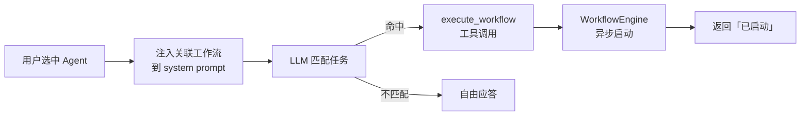
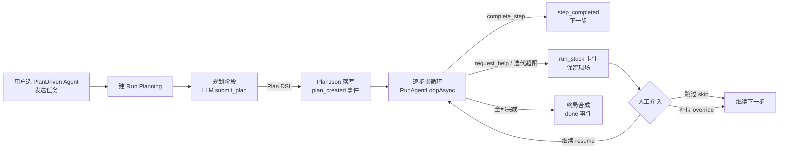

# 021 · AI 智能体（AI Agent）

> 状态：已实现（代码中已落地）
> 最后更新：2026-09-10

## 概述

AI 智能体编排框架：多 Agent 协调与执行（`AgentsController`）、智能规划建议（`PlanningController`）、AI 辅助工作流（`AIWorkflowController`，见 013）、脚本生成与错误分析（`AIScriptController`）、AI 聊天（`AIChatController`）。是连接「统一 AI 网关」与「上层工具」的协调层。

## 代码落点

| 层 | 文件 |
|----|------|
| 控制器 | `Plugins/AIAgent/Controllers/`：`AgentsController.cs`（`[Route("api/agents")]`）、`PlanningController.cs`（`[Route("api/planning")]`）、`AIWorkflowController.cs`（`[Route("api/ai-agent/workflow")]`）、`AIScriptController.cs`（`[Route("api/ai-agent/script")]`）、`AIChatController.cs`（`[Route("api/ai-agent/chat")]`）、`ProjectController.cs`（`[Route("api/project")]`） |
| 服务 | `Plugins/AIAgent/Services/`：`AIAgentService`（Agent 工具循环 `RunAgentLoopAsync`）、`AgentRegistryService`（Agent 定义加载 + 空表 seed 内置 Agent）、`AgentExecutorService`、`AgentCoordinatorService`、`WorkflowPlannerService`、`AIWorkflowAssistant`、`ProactivePlanningService`、`ProjectWorkspaceService` 等 |
| 模型 | `Plugins/AIAgent/Models/AgentModels.cs`（`AgentDefinition` / `AgentWorkflowRef` / 任务与实例模型）、`SkillDefinition.cs` |
| 数据 | `Plugins/AIAgent/Data/`：XCode 实体 `AgentDefinition`（含 `ConfigJson` 持久化人格/工具/工作流关联）、`AIChatMessage`（连接名 `AIAgent`，`Model.xml` 生成模式） |
| 前端视图 | 插件自带界面 `Plugins/AIAgent/web/`（`plugin.json.frontend.route = /ai-agent`）：`AiAgentView` + `SessionPanel`（会话/Agent 列表）/ `ChatPanel`（对话 + composer）/ `ContextPanel`（AI 上下文）/ `AgentEditDialog`（Agent 编辑）；宿主残留 `src/views/AgentsManageView.vue`（管理视图） |
| 前端服务 | 插件 `web/src/http.ts`（自带 token 直连后端）、`web/src/types.ts` |

## 核心 API

**`api/agents`**：列表 / 详情 / 按类型 / `find` / `best-match` / `coordinate` / `execute` / `handle` / `execute-task`；实例管理 `instances[/{instanceId}]`；CRUD `POST /`、`PUT {agentId}`、`DELETE {agentId}`（v1.6.5 起，AgentDefinition 入库后开放）。

**`api/planning`**：`suggestions`、`suggestions/pending`、`suggestions/{id}/action|dismiss`、`patterns`、`profile`、`skills`、`preferences`、`event`。

**`api/ai-agent/workflow`**：`plan`、`plan/prompt`、`execute`、`{executionId}/status`、`tools/match`（详见 013）。

**`api/ai-agent/script`**：`generate`、`analyze-error`、`suggest-fix`、`templates[/{templateId}]`、`templates/categories`。

**`api/ai-agent/chat`**：`POST /`、`POST /stream`（SSE：content / tool_call / tool_result / usage / done）、`history/{sessionId}`、`DELETE session/{sessionId}`、`tools`。

**`api/project`**：工作目录选择 / 文件列表 / 读写（MCP 工具 `aiagent.list_files/read_file/write_file`，见 028）。

## Agent 可配置项（AgentDefinition，v1.6.5–v1.6.7）

Agent 定义为 XCode 实体（空表时 seed 7 个内置 Agent），`AgentEditDialog` 支持编辑：

- 基本信息：名称 / 头像 / 描述 / 类型 / 排序 / 最大迭代 / 启用开关
- 系统提示词（SystemPrompt）
- 五维能力画像：创造力 / 分析力 / 同理心 / 自信度 / 正式度
- 擅长领域 / 能力 / 工具 / 局限性（TagInput 多值）
- 关联工作流（见下节）

## Agent 关联工作流（v1.6.7）

Agent 可关联多个 WorkflowEngine 工作流，执行时注入提示词，由 LLM 用 `execute_workflow` 工具按需调用。

**数据模型**：`AgentDefinition.Workflows`（`List<AgentWorkflowRef>`：`WorkflowId` + 冗余 `Name`/`Description`），随 `ConfigJson` 持久化（`AgentDefinition.Biz.cs` ToModel/FromModel 透传），零迁移。

**关联 UI**：`AgentEditDialog.vue`「关联工作流」区块 —— 多选下拉（`fetchWorkflows` 拉 `api/workflows?page=1&pageSize=200`）+ 已关联 chips + 空态降级（无工作流时提示）。

**执行期注入**：`AIAgentService.AppendAssociatedWorkflows` 在每轮 agent 循环前把「## 本 Agent 关联的工作流」追加进 system prompt，提示 LLM：任务匹配某工作流时调 `execute_workflow(workflowId, inputVariables)`，不匹配不强行调用。

**执行工具**：`ExecuteWorkflowToolFunction`（Id `aiagent.execute_workflow`，[AIAgentPlugin.cs](../../ForgeSelf.Api/Plugins/AIAgent/AIAgentPlugin.cs)）——经 `IWorkflowService` 启动工作流执行。

**已知限制（记录于 2026-09-09，后续由 spec 029 解决）**：

1. `execute_workflow` 为**异步启动即返回**：不等待工作流终态、不校验步骤、不回注结果 → LLM 可在流程未完成时宣称完成，**无走完保证**。
2. 无步骤级完成度校验（多工作流取舍、步骤推进均靠 LLM 自决）。

**回归保护**：`ForgeSelf.Web/e2e/plugins/ai-agent/ai-agent.spec.ts` 含「关联工作流区块渲染」用例（多选/空态二选一 + 无 5xx 护栏）。

## 使用要点

- Agent 协调依赖 `AgentCoordinatorService`，可编排多个子 Agent 完成任务。
- `PlanningController` 基于历史行为给出主动性建议（见 `preferences`/`patterns`）。
- 聊天会话复用统一 `ChatSession` 聚合（见 010）。
- 工具白名单（`enabledToolNames`）与技能注入（`skillIds`）随聊天请求传递（v1.5.5 工作台重构）。
- 执行模式（`executionMode`）：`free`（自由循环，默认）/ `plan`（计划驱动），随 `AgentDefinition.ConfigJson` 持久化（v1.6.7，见下节）。

## 计划驱动执行引擎（v1.6.7–v1.6.9 · spec 029）

Agent 可配置执行模式为「计划驱动 PlanDriven」：任务先规划（Plan DSL）再逐步执行，代码逐步驱动 LLM（`complete_step` 推进 / `request_help` 卡住），全部步骤留痕可复盘，卡住可人工介入（跳过/补位/继续），支持中断后续跑。

### 数据模型（XCode 双表，连接名 `AIAgent`）

| 表 | 字段要点 |
|----|----------|
| `AgentRun` | 执行实例：`AgentId`/`SessionId`/`TaskInput`/`PlanJson`（Plan DSL）/`StepCount`/`CurrentStepIndex`/`Status`（Pending→Planning→Running→Completed/Stuck/Failed/Cancelled）/`StuckReason`/`TotalTokens` |
| `AgentStepRun` | 步骤明细：`RunId`+`StepIndex`（唯一）/`StepId`/`Name`/`Objective`/`InputJson`/`OutputJson`/`ToolCallsJson`/`StuckReason`/`HumanNote`/`HumanOverride`/`RetryCount`/`TokensUsed`/`DurationMs` |

**Plan DSL**（存 `AgentRun.PlanJson`）：`{ goal, steps[] }`，每步 `{ id, name, objective, expectedOutput, allowedTools, mandatory }`；`mandatory` V1 先埋不启用（D5）。

### 执行流程（RunOrchestrator）

### 模式配置与入口

- **执行模式开关**：`AgentEditDialog.vue`「执行模式」radio（自由循环 FreeLoop / 计划驱动 PlanDriven）→ 写 `AgentDefinition.ConfigJson.ExecutionMode`（`free` 默认，缺省向后兼容）。
- **前端分流**：`AiAgentView.sendMessage` 依据激活 Agent 的 `executionMode`——`plan` 走 `POST /api/ai-agent/runs`（SSE 流），`free` 走既有聊天流。
- **步骤进度卡** `StepProgressCard.vue`：与消息流并列常驻，消费 `plan_created/step_started/step_completed/run_stuck` SSE 事件，折叠展示目标/产出/卡住原因。
- **执行记录面板** `RunRecordPanel.vue`：中栏右上「执行记录」按钮打开——Run 列表（状态徽标）+ 详情（步骤时间线、入参出参、卡住原因）+ 操作（继续/重开/跳过/补位/取消）。

### 核心 API（`api/ai-agent/runs`，`AgentRunsController`）

| 端点 | 说明 |
|------|------|
| `POST /` | 创建并驱动执行（SSE 流：`plan_created`/`step_started`/`step_completed`/`run_stuck`/`content`/`tool_call`/`tool_result`/`usage`/`error`/`done`） |
| `GET /` | Run 列表（分页 + `sessionId`/`status` 过滤，`RetrieveTotalCount=true`） |
| `GET /{id}` / `GET /{id}/detail` | Run 摘要 / 详情（含步骤列表） |
| `POST /{id}/resume` | 恢复执行（仅 Stuck/Failed，从 `CurrentStepIndex` 续跑，SSE 流） |
| `POST /{id}/restart` | 同 Plan 新建 Run 从头执行 |
| `POST /{id}/cancel` | 取消（终态拒绝） |
| `PATCH /{id}/steps/{index}` | 人工介入（`skip` 跳过 / `override` 补位，`HumanNote` 批注） |

**特殊工具**（仅 PlanDriven 步骤循环挂载，不进 FreeLoop）：`submit_plan`（规划器提交 Plan）、`complete_step`（步骤完成声明）、`request_help`（卡住求助）。

> **status 字段契约**（v1.6.9 实测对齐）：`AgentRunDto.status` / `AgentStepRunDto.status` 经 System.Text.Json **默认序列化为 int**（枚举序号，非字符串名）。前端 `web/src/types.ts` 的 `runStatusName`/`stepStatusName` 统一做 int→小写语义映射；`status` 过滤查询参数同样传 int。详见 `specs/029-agent-plan-driven-execution/contracts/agent-runs-api.md` §8。

### 回归保护

`ForgeSelf.Web/e2e/plugins/ai-agent/ai-agent.spec.ts` 含「执行模式开关持久化」「计划驱动执行全链路」（runs SSE + 步骤卡 + 执行记录面板）用例（真实后端，零 mock）。

## 后续演进

- **步骤完成度强校验**（V2，`mandatory` 出口校验）：触发条件 = V1 实测出现「谎报完成」案例（not-to-do 台账 006.1）。
- **`execute_workflow` 同步等终态**：异步启动即返回、无走完保证，已记 not-to-do 006.2，可独立小修先行。
- **Run 记录供给其他插件**（sems 看板等）：触发条件 = 第二消费方出现（not-to-do 006.5）。
