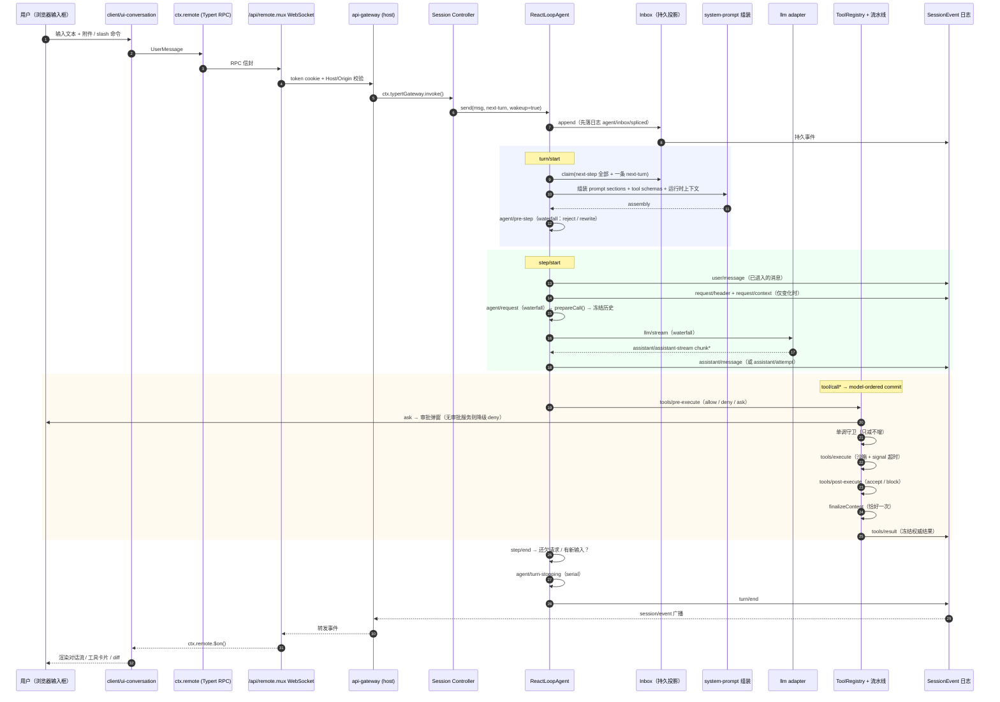

# DeepSeek Harness 运行全链路：从 Web 输入框到工具执行完成

> 功能编号：06-research · 003
> 状态：调研（对标 DeepSeek Harness 运行全链路）
> 最后更新：2026-09-27
> 关联：总纲 [`../01-architecture/dsh-alignment-plan.md`](../01-architecture/dsh-alignment-plan.md)；既有插件化调研 [`001-deepseek-harness-plugin-architecture.md`](001-deepseek-harness-plugin-architecture.md)

> 版本参照：`deepseek-harness` 0.1.0-rc.x（开发者预览，官方声明会有破坏性变更）。
> 术语一律保留英文原文，便于对照源码。文末附**信息可信度标注**。

---

## 0. 结论先行

**Harness 不是模型，是夹在模型和真实世界之间的那一整层工程系统。官方公式：`Model + Harness = Agent`。**

从你在 Web 输入框敲下回车，到屏幕上出现结果，中间发生的事可以压缩成一句话：

> **一次输入 → 落进持久 inbox → 开一个 turn → 组装 prompt → 发一次模型请求（step）→ 拿回 tool\_call → 过五道工具流水线闸门 → 结果落日志 → 事件回流渲染 → 判断是否还"欠"一次请求 → 循环或收束。**

真正的分水岭只有一个不变量：

> **Model-visible means logged（对模型可见，即已落日志）。**
> 任何想进入模型请求上下文的东西，必须先扩展 `SessionEventMap`、再从日志渲染出来，**不允许悄悄塞进 prompt**。

这一条决定了后面所有设计：可回放、可 fork、可 resume、可审计、可自进化——全都是从这份 append-only 事件日志上长出来的。

---

## 1. 参与者地图：谁负责什么

Web GUI 被劈成**两个半包**：`host`（跑在 Node.js 里）+ `client`（Vite + React 浏览器应用），两者走 WebSocket。

| 层 | 包 | 职责 | ctx 键 |
|---|---|---|---|
| 会话事实源 | `core/session` | append-only `SessionEvent` 日志 + 内存存储 | `ctx.sessions` |
| 提示词组装 | `core/system-prompt` | prompt 分段 + 工具 schema 装配 | `ctx.systemPrompt` |
| 工具 | `core/tools` | 作用域化工具注册表 + 受保护执行管线 | `ctx.tools` |
| Agent 接口 | `core/agent` | `Agent` 接口、实时注册表、`agent/*` 事件词汇 | `ctx.agents` |
| 主循环 | `core/agent-loop` | 默认驱动 `ReactLoopAgent`（**唯一**实现，但可整体替换） | `ctx.agentLoop` |
| 模型 | `llm/llm` | 消息/流词汇 + 适配器接缝 | `ctx.llm` |
| 作用域 | `core/scope` | per-agent 作用域注册原语 | — |
| 传输 | `client/connection` / `api-gateway` / `host/webserver` | `/api` 路由与信任边界 / 类型化 Remote 分发 / 纯路由注册 | `ctx.webServer` 等 |

**关键约束**：扩展插件只依赖 `core/agent`（接口包），**从不直接依赖 `agent-loop`**。官方原话——agent-loop 只是"Agent 公开接口的**一个**具体实现"（one concrete implementation）。没有特权核心可以打补丁，想换循环就换一个插件。

---

## 2. 阶段 0：启动（在你敲第一个字之前已经完成）

`npx @deepseek-ai/dsh web` → 默认 `http://127.0.0.1:3080`。

### 2.1 组合模型：profile → bundles → patches

一台跑起来的 dsh，是**一棵在启动时按层组合出来的插件树**。

- **Profile**：存在 Harness home 里的命名组合，声明它堆叠哪些 bundle、装哪些 out-of-tree 插件、带哪份 `cordis.patch.yml`。官方模板：`web` / `headless`。
- **Bundle**：打包 Cordis 配置行 + 这些行挂载的代码。`dsh-base` 是每个 profile 的第一层（模型适配器、工具、持久化、沙箱与审批策略、设置、凭据、遥测）；`dsh-web-app` 加浏览器应用；`dsh-headless` 加一次性 runner。
- **叠放顺序**：profile 里的 bundle（按声明序）→ profile 的 `cordis.patch.yml` → home 级 patch → `--patch` overlay。

想看你机器实际启动的是哪棵树：

```sh
dsh --profile web --dump-config
```

> **patch 是整行替换（row-level replace），不是字段级合并。** 改之前先 dump，这是官方文档反复强调的纪律。

### 2.2 启动三阶段（`AppCLIEntry.run()`）

1. **分层环境**：ambient 环境 → cwd 的 `.env` → `$DSH_HOME/.env`（这一步修掉了"DSH\_HOME 里的 API key 读不到"的老 bug）；
1. **patch 组合**：bundle 层 / profile patch / `--patch` overlay / telemetry 开关按序叠放；
1. **Loader include 启动 + 激活审计**：`auditStartupEntries` 收口 —— 必需 id 集合（`agent-loop`、`webserver`、`modules`、`connection` 等）未激活则抛 `StartupError`；可选条目失败只警告。

浏览器侧的 `AppWebEntry.run()` 镜像同一过程：把 `window.__DSH_BOOT__` 解析成 `BootManifest` → 建模块系统 → **并行预取 `immediately` 层工厂** → **创建条目前 await 预取完成**（这条顺序是踩坑换来的：不 await 会有 10%–25% 启动竞态）→ 采纳 modules 条目 → settle → sweep。

### 2.3 Cordis：插件为什么能干净地装卸

底层是 **Cordis**（脱胎于 Koishi 的插件元框架，DeepSeek 与北大联合发过论文《A Programming Paradigm for Spatiotemporal Composability》）。它只管三件事：加载、卸载、依赖管理。

- **时间可组合性**：插件注册的一切（提示词片段、工具 schema、监听器）都通过 `ctx.effect()` 注册，卸载时像栈一样自动弹回，**不留垃圾状态**；
- **空间可组合性**：组件声明/发现/校验依赖，依赖出现或消失时自动激活/停用，不用手编排启动顺序；
- **汇合性（Confluence）**：无论插件以什么顺序插入、移除、替换，最终状态与"一次性静态组装出最终配置"同构——**不用操心调度顺序**。

---

## 3. 阶段 1：浏览器输入框 → host（跨进程）

### 3.1 前端侧

输入框属于 `client/ui-conversation`（另有 `ui-input-trigger`、`ui-commands` 斜杠命令、`ui-attachment` 附件、`ui-model-selection` 模型选择）。用户的文本在这里被包装成一条 `UserMessage`，可能附带附件引用、slash command 解析结果、@提及等。

### 3.2 传输：不是 REST，是 Typert RPC over WebSocket

| 包 | 职责 |
|---|---|
| `dsh-host-webserver` | **纯路由注册**，`ctx.webServer`。只认 `register(route)` / `renderIndex(html)` / `port` 三个原语，**不认识任何 Harness 概念**。匹配顺序：全表精确匹配 → 最长前缀 → fallback |
| `dsh-client-connection` | 拥有 `/api` 路由、请求/响应信封、**浏览器认证**、Host/Origin 检查 |
| `dsh-api-gateway` | 类型化 Remote 分发 + **多路复用 WebSocket**（`/api/remote.mux`） |
| `dsh-client-modules` | 增量包扫描、bundle 路由、`__DSH_BOOT__` 启动注入 |
| `dsh-client-hmr` | `fs.watchFile` + `/plugins/events` SSE（**纯展示通道，不进会话日志**） |

浏览器调 `ctx.remote(...)`，Host 侧 `ctx.typertGateway.invoke()` 解析描述符与服务、校验**精确命名参数**、解析注册的对象/Context 身份，再调用公开业务方法。

### 3.3 信任边界（这块设计得很实）

- **认证**：进程每次启动铸造随机 token，打印并打开带 `?token=...` 的根 URL；`frontend-static` 委托 `ctx.connection.authorizeIndex`，只在 `GET /` 上接受 token，写 authority 绑定的**签名 cookie** 后 302 到干净的 `/`。分发 RPC 前 cookie 缺失/过期/畸形 → 401。
- **请求信任**：任何请求先过 `Host` 检查（必须回环或命中 `trustedHosts`），`Origin` 必须等于 Host，`sec-fetch-site: cross-site` 直接拒。防 DNS rebinding 与跨站请求。
- **CLI 故意拒绝 `--host 0.0.0.0`** —— 官方说这不是 bug，是安全设计。
- **心跳**：Host 每 2s 发 Ping 控制帧，浏览器在 WebSocket 协议层回 Pong；未应答的 socket 下一间隔被终止。
- **重连**：以 50%–100% 抖动、封顶 500ms/1s/2s/4s/8s/10s 退避重试。

---

## 4. 阶段 2：host → Agent inbox

Host 侧业务方法（Session Controller 层）把消息交给目标 Agent。**输入通道有三种语义**，区别只在"模型什么时候能看到"：

| 通道 | 语义 | 何时被消费 |
|---|---|---|
| `followup(message)` | 普通后续 turn | 下一个 **turn** 边界，入队并**唤醒**驱动 |
| `steer(message)` | 转向 | 运行中的驱动在下一个 **step** 边界消费；空闲则开新 turn |
| `inject(message)` | 注入上下文 | **不唤醒**；运行中在最近 step 边界被认领，空闲就留在 inbox 等下次唤醒 |

底层统一是 `send(message, target: 'next-turn' \| 'next-step', wakeup: boolean)`。

### Inbox 是持久投影，不是内存队列

Inbox = 两条有序待处理消息列表（next-turn / next-step），由持久事件 **`agent/inbox/spliced` 重建**。所有变更（append/prepend/replace/remove/clear/splice/claim）**先落日志再改内存**。

- `claim(target)` 取出提案批次：全部 next-step 输入 + turn 边界上的一条 next-turn 消息；
- 配套通知事件：`agent/inbox/inserted`、`claimed`、`discarded`。

**为什么值得抄**：重启进程后 inbox 还在，UI 也能画出"还有几条待办没被认领"——`AgentLoop` 的持久 inbox 投影可以在没有活 Agent 的情况下暴露 pending 输入。

---

## 5. 阶段 3：turn 开启与 prompt 组装

> **step（步）= 一次模型请求 + 这次请求调用的所有工具。**
> **turn（轮）= 零个或多个 step**：在第一个输入被认领之前开启，当"什么都不欠了"时关闭。

```
turn/start
  claim: next-step 输入 + 一条 next-turn 消息
  组装 prompt sections + 工具 schema；投影运行时上下文
  → agent/pre-step (waterfall)
      reject | enter(messages, startsRequestSeries?)
      被拒绝、或首次 enter 被改写为空 → 无 step 直接关 turn
  step/start
```

### 5.1 组装什么

`core/system-prompt` 把系统提示词拆成**多个 section**（分段注册，插件可各自贡献一段），再加：

- 工具 schema（来自 `ctx.tools` 当前作用域下的注册表）；
- 运行时上下文（`context/` 家族）：工作区指令、时间上下文、引用（references）；
- skill 目录、plan 状态、todo 状态等插件注入的内容。

### 5.2 `agent/pre-step`：决定模型看什么的最后一个闸门

这是 **waterfall**（监听器必须调 `next()` 委派，也可以直接返回决策短路）。监听器可以**改写被认领的消息**，也可以**直接 reject**。

设计要点：

- **不能改消息内容这件事只在 `agent/request` 层成立**——模型可见内容必须走持久通道；
- 一个 enter 决策可以带 `startsRequestSeries`：循环会记一条新的 `request/header`（reason = `series`，或 envelope 也变了时 `startsSeries: true`）；
- 包装型监听器必须原样保留该声明：`{ ...decision, messages }`；
- 实例：`installModelSelection()` 挂在这个 waterfall 上，检测到会话中途 provider/model 变了，就在 messages 末尾追加一条 **durable 的 user-role 通知**：
  `[model changed: assistant turns above this point were generated by ${from}; the session continues with ${to}]`

---

## 6. 阶段 4：step —— 一次模型请求

```
step/start
  agent/request (waterfall) → prepareCall()
      （取消发生在这两个异步阶段内 → system 与 users 都不落盘）
  用 prepared call 对账 system/message
  把已进入的消息追加为 user/message
  按需记录 request/header 与 request/context
  从日志派生并冻结模型历史
  流式输出已绑定的 prepared call → llm/stream → agent/assistant-stream start
  ├─ chunk*
  ├─ assistant/message（成功）| assistant/attempt（失败/重试/取消）
  └─ agent/assistant-stream end
  tool/call* → 工具调度
  step/end
```

几个容易忽略但很关键的细节：

1. **请求是可重建的纯函数**。每个请求都从 session 日志重建（`deriveMessages` + `foldRequestHeader` 折叠），请求信封本身也写进日志（`request/header`）——历史、信封、工具 schema 全部可重建。
1. **cancellation 干净**：`agent/request` 与 `prepareCall()` 任一异步阶段内取消，**system 与 users 都不提交**。
1. **重试不重复组装**。每次 attempt 同步对账同一份已渲染的 assembly，只在**首次** attempt 追加 users；重试不重跑 assembly、不重跑 `agent/pre-step`。
1. **系统提示词只作为 `system/message` 历史传播**。渲染为空就清空所有活跃 system 节点（不留旧提示词给模型看见）；有能力变更的路由可以在缓存前缀之后追加非空更新，没能力的路由和新 request series 会把非空提示词文本合并到第一个 system 节点。
1. **重试不在 `llm/stream` 里做**。`LlmRuntime` 只把失败归一为 terminal finish，重试完全由 `agent/request-error` + `dsh-llm-retry` 承担——理由：带重复 chunk 的 wrapper 没有持久 attempt 边界，重试必须放在 step 关闭边界的瀑布里才能安全重建。

> 源码次序勘误（社区实测 vs 官方文档）：实际是 `chunk* → assistant/message/attempt → agent/request-error → step/end(finally) → agent/error → turn/end`，即 **request-error 在 step/end 之前**，且返回 retry 时 step 根本不关闭。

### 流式事件

`agent/assistant-stream` 发布**进程内**的 start / transient chunk / end 帧；循环把完整的压缩流作为**一条**消息提交，或在提交 end 帧前记为 log-only attempt。Web 的 Session-follow 适配器是这个 live 事件**唯一的远程消费者**——也就是说，你在 UI 上看到的流式字，走的是 live 通道；而真正进历史的是那条完整的 `assistant/message`。

---

## 7. 阶段 5：工具执行流水线（五道闸门）

模型返回 `tool/call*` 后，每个调用按固定顺序过一遍：

```
tools/pre-execute → 单调守卫 → tools/execute → tools/post-execute → finalizeContent → tools/result
```

### 7.1 `tools/pre-execute`：可重排的策略层

返回类型化决策 `PreToolDecision`：

| 决策 | 含义 | 后续 |
|---|---|---|
| `{ kind: 'allow' }` | 放行 | 继续走守卫与后续环节 |
| `{ kind: 'deny'; reason }` | 拒绝 | 物化成错误结果，**工具主体被跳过** |
| `{ kind: 'ask'; reason? }` | 询问用户 | 只有审批服务返回 `allowed-once` 才继续，否则拒绝 |

承载钩子、权限、沙箱等可重排策略。**参数不可被改写**——历史记录、审计、UI 与执行必须一致。

### 7.2 单调守卫：不可撤销的最终拒绝

waterfall 的天然缺陷：后注册的监听器能推翻前面的决策。需要"最终拒绝、谁也撤销不了"时用 `ctx.tools.guard()`：

```ts
type ToolGuard = (execution: Readonly<ToolExecution>) => string | undefined
```

**守卫没有 allow 结果**：返回字符串 = 拒绝，返回 `undefined` = 维持现状。监听器顺序永远无法把一次拒绝变回允许——**只减不增，只收权限，不给权限**。

### 7.3 `tools/execute`：环绕分派

把真正的工具主体包起来，超时/重试/指标收集在这一层。视图是 `ToolDispatchExecution`——**只有这个视图可以替换必需的 `exec.signal`** 来施加截止时间（可替换、不可移除，注册表在调用主体前重新融合调用方 signal）。

```ts
ctx.on('tools/execute', async (exec, next) => {
  const original = exec.signal
  exec.signal = AbortSignal.any([original, AbortSignal.timeout(30_000)])
  try { return await next() } finally { exec.signal = original }
})
```

> 注：文件 I/O 一类的操作不设超时，避免半写状态。

### 7.4 `tools/post-execute`：结果归一化之前

| 决策 | 含义 |
|---|---|
| `{ kind: 'accept'; content? }` | 接受，可替换**展示内容**（保留规范值与元数据） |
| `{ kind: 'accept'; value }` | 接受，可替换**规范值**（会重新校验并重算内容） |
| `{ kind: 'block'; feedback }` | 阻止结果，把纠正反馈变成错误结果 |

**内容替换是展示策略，不是保密策略**——要隐藏程序化值，必须替换该值或阻止结果。

### 7.5 `finalizeContent` / `tools/result`

- `finalizeContent`：工具定义自己拥有的回调，注册表**恰好调用一次**，同步执行——"最后的仅内容不变式"；
- `tools/result`：同步通知，观测**冻结的、不可变的权威结果**，观测者无法变换结果，失败也被隔离不影响主流程。审计、指标、重复调用守卫挂这里。

> 记忆法：pre-execute 决定**能不能做**，execute 决定**怎么做**，post-execute 决定**结果怎么呈现**，result 只负责**看一眼最终结果**。

### 7.6 调度与溢出

- **model-ordered commit**：工具调用**按模型返回顺序**逐个 `tools/execute`；作用域失配或未执行的调用会**合成一个 `tool/result`（skipped 标记）**，保证日志永远闭合——模型要求的每个 call 都有对应 result。
- **spill**：大结果溢出到存储，只把摘要/引用留在上下文里，避免上下文爆炸。
- **重复调用守卫**计数放在 `post-execute` 而非 `pre-execute`，因为 `deny` 也被路由到同一条流水线——模型反复敲一个被拒绝的调用恰恰是最该打破的循环。

### 7.7 权限与审批（`interaction` 家族）

| 预设 | 说明 |
|---|---|
| `readonly` | 只允许读，禁止写入和执行 |
| `auto-approve` | 自动批准（信任模式） |
| `default` | 读允许，写和执行需审批 |

通过 `tools/pre-execute` 实施。`user-approval` 缺失时**自动降级为拒绝**（fail-closed）。沙箱侧：Linux Landlock（DeepSeek 自己写的 Node addon）/ macOS Seatbelt / Windows ACL 受限令牌，默认工作区只读。

---

## 8. 阶段 6：回流与渲染

**持久事实**走 `session/event` 广播：所有 durable 事件（`turn/*`、`step/*`、`system/message`、`user/message`、`assistant/message`、`assistant/attempt`、`tool/*`）都会广播出去。

- Host 侧把 `ctx.remote.$on()` 暴露的转发事件发给浏览器；合法键**恰好是** Host 组合的转发选择；内部 `$events` 端点保留给该事件源，`ready` 帧携带 `clientId` 与 `host: { home }`；
- Client 侧 `connection` 管 WebSocket，`client/ui-*` 各包按事件类型渲染：对话流、工具调用卡片、文件 diff、子代理面板、目标面板、终端、审批弹窗。

**两条通道要分清**：

| 通道 | 内容 | 是否进会话日志 |
|---|---|---|
| `session/event` + gateway 转发 | 权威历史、模型可见内容 | ✅ |
| `/plugins/events` SSE（HMR） | bundle rebuilt、纯展示 wire | ❌ |
| `agent/assistant-stream` 帧 | 进程内 live 流（Web Session-follow 是唯一远程消费者） | 只提交压缩后的完整消息 |

这也解释了那句不变量为什么能被**运行时断言**强制：UI 渲染、replay、resume、fork、telemetry 全部收敛到同一个 `session/event` 源头，谁也绕不过去。

---

## 9. 阶段 7：收敛与终止

```
step/end
  工具还欠一次请求？或 next-step 来了新输入？
    → claim → 下一个 step
  → agent/turn-stopping (serial，无 next)
turn/end
```

- `agent/turn-stopping` 是 **serial**（无 `next()`），监听器返回 bail → 循环重读 inbox 再跑一步（`target='next-step'`）；
- **max-tokens 粘滞**：turn 内任一 step 触顶 → **整个 turn** 记为 `max-tokens`；
- **取消**：`cancel(cause, { keepInbox? })` 清空队列与转向工作（除非 keepInbox）并中止活动 turn；原因被拷贝进 `AbortSignal.reason`。持久 `turn/end` 只保留粗粒度 `{ kind: 'aborted' }`——**谁**取消的需要单独的事件，不重载终态；
- **取消后的唤醒收敛**：取消后提交的唤醒输入排队到下一 turn（wake latch 修复）。

### 三种取消原因

```ts
type AgentCancelCause =
  | { kind: 'user' } | { kind: 'parent' }
  | { kind: 'hook'; reason: string } | { kind: 'disposed' }
```

---

## 10. 全链路时序图



---

## 11. 三个必须记住的不变量

| # | 不变量 | 后果 |
|---|---|---|
| 1 | **Model-visible means logged** | 任何进上下文的东西必须先在日志里；运行时断言强制 |
| 2 | **请求是日志的纯函数** | header（配置 + 渲染后的系统提示词 + 工具 schema）全量入日志，`foldRequestHeader` 可重建 |
| 3 | **没有特权核心** | agent-loop、模型适配器、工具注册表、会话日志、UI 全是插件；注册是 effect，卸载即回滚 |

配套的三个事件域，选错域是改 dsh 时最常见的错误：

| 域 | 事件 | 用途 |
|---|---|---|
| 持久 | `session/event`（`turn/*`、`step/*`、`user/message`、`assistant/*`、`tool/*`） | 必须跨重载存活、重建模型可见历史 |
| 活体 | `agent/*` | 观察或拦截进行中的工作（inbox / step / status / request） |
| 能力 | `fs/*`、`tools/*`、`telemetry/*` | 给接缝挂策略与适配器，**不 import 主循环** |

---

## 12. 可抄的设计（对 OpenForgeSelf / IOC\_API 的启示）

| 机制 | dsh 的做法 | 可直接迁移到 |
|---|---|---|
| append-only 事件日志 + 单一事实源 | 会话 = 事件日志，UI/replay/fork/resume 全部从它派生 | 你的聊天记录详情 JSON 树（已有）——可升级为**权威事实源**而非"展示用快照" |
| capability seam 三段式（Definition / Provider / Consumer） | 换一个 fs/subprocess provider，bash/PTY/LSP 整体跟着搬 | SmokeAlarm adapter → MQTT → Redis Stream：把"接入"定义成 seam，换 provider 不改消费端 |
| 单调守卫（只减不增） | `ctx.tools.guard()` 无 allow 结果 | 权限/告警分发的最小权限模型：后注册者永远不能放宽 |
| 独立路径强制隔离 | 工具流水线每道闸门只负责一类策略，失败物化成结果而非抛穿 | 你的"告警分发失败不得污染持久化路径"——应落成**两条互不通话的事件链**，而非 try/catch |
| waterfall vs serial 分离 | 决策点用 waterfall（可委派/可短路），收敛检查点用 serial（无 next） | Intent/Orchestration/Capability 三层的事件语义定义 |
| 六种入口共享一个 runtime | web / headless / ACP / SDK / 双半包 / interaction | OpenForgeSelf 前端 7380 + 后端 7300 + 微前端：一个 runtime，多个入口 |
| cordis\_\* 运行时自修改 | Agent 可在会话中途 define/run/stop/undefine 插件，全程可回滚 | 你的"自迭代"理念：**自修改必须留痕可审、错了能退** |

**反面提醒**：dsh 的"一切皆插件"是为"未来需求不确定、需要高度可组合"准备的。对只想跑一条固定流程的场景，这是不必要的认知成本——加一层抽象总有代价。而且 **强 Harness 补不了弱模型**：小模型 + 强 Harness，天花板还是模型。

---

## 13. 验证清单（照着核对自己的理解）

- [ ] 能说清 **step** 与 **turn** 的区别（一次模型请求 + 其工具调用 vs 零到多个 step）
- [ ] 能说清 `followup` / `steer` / `inject` 三种输入通道分别在哪个边界被消费
- [ ] 能在自己机器上跑 `dsh --profile web --dump-config`，指出 agent-loop 那一行
- [ ] 能指出 `agent/pre-step`、`agent/request`、`llm/stream`、三个 `tools/*` 是 waterfall，`agent/turn-stopping` 是 serial
- [ ] 能解释为什么 `tools/result` 里不能改结果、`tools/post-execute` 才能改
- [ ] 能解释"单调守卫没有 allow 结果"如何保证只减不增
- [ ] 能解释模型中途切换 provider 时，那条 `[model changed: ...]` 通知挂在哪个事件上、是不是 durable
- [ ] 能解释为什么重试放在 `agent/request-error` 而不是 `llm/stream`
- [ ] 能复述 **Model-visible means logged** 以及它为何使 replay/fork/resume 成为可能
- [ ] 能指出 Web 流式字（live 通道）与历史消息（durable 通道）走的是两条路

---

## 附：信息可信度标注

| 来源 | 可信度 | 覆盖内容 |
|---|---|---|
| 官方 `docs/architecture.md`、`docs/capability-seams.md`（rc.2 / master） | 高 | turn flow、事件域、包职责、seam 定义、不变量 |
| 社区 handbook（`deepseek-harness-handbook`，标注 source-verified 到 rc.2 commit b150a551） | 中高 | 分层解读、扩展点地图（其七层分类法为作者解读，非上游术语） |
| 怕浪猫系列 / CSDN 拆解（第 5、6、8 章） | 中 | Turn/Step 状态机、工具流水线、多端架构；**部分细节为二手转述** |
| 决策笔记转述（web 配置树与传输层） | 中 | 启动三阶段、gateway/connection/webserver 职责划分 |
| 知乎 12 小时 5 万星拆解 | 中低（营销味较重） | 增长数据、定位比喻、模式介绍 |

**建议**：真要落地改造，以 `git clone` 后的 `docs/architecture.md` + `packages/core/agent-loop/src/agent.ts`（约 1600 行）为准，二手文章只用来建立地图。
