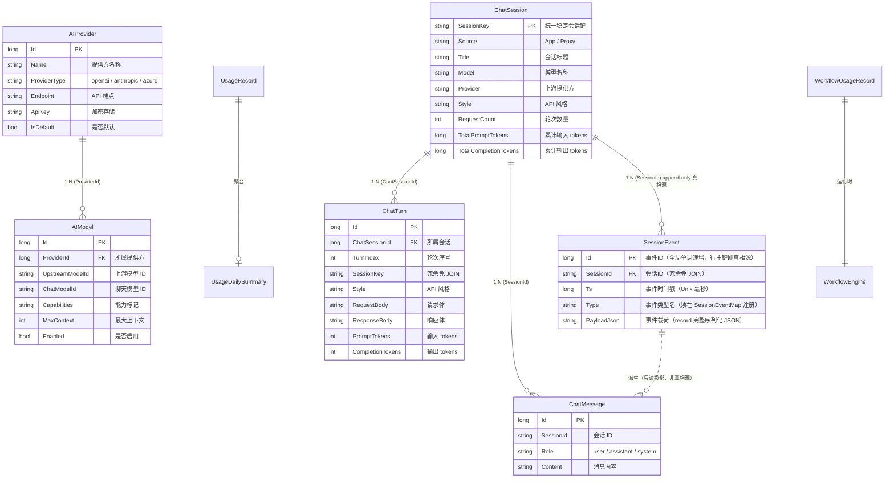

# 数据模型参考

> 项目使用 NewLife.XCode ORM，实体继承 `IEntity<T>` 接口，通过 `BindTable`/`BindColumn` 注解映射到 SQLite 表。XCode 在首次运行时自动建表（`DAL.Migration` 默认 On），无需手写迁移脚本。
> 最后更新：2026-09-30

## 实体关系总览

## 核心实体字段表

### ChatSession — 聊天会话

| 字段 | 类型 | 长度 | 说明 |
|------|------|------|------|
| Id | Int64 | — | 会话 ID（自增主键） |
| SessionKey | String | 64 | 统一稳定会话键（唯一索引） |
| Source | String | 16 | 会话来源：App（自有聊天）/ Proxy（代理录制） |
| Title | String | 200 | 会话标题 |
| Model | String | 100 | 模型名称 |
| Provider | String | 100 | 上游提供方 |
| Style | String | 30 | API 风格：OpenAI_Chat / Anthropic / Responses / AppChat |
| ClientKind | String | 30 | 客户端类型 |
| RequestCount | Int32 | — | 轮次数量 |
| MessageCount | Int32 | — | 消息数量 |
| FirstUserMsg | String | 500 | 首条用户消息预览 |
| TotalPromptTokens | Int64 | — | 累计输入 tokens |
| TotalCompletionTokens | Int64 | — | 累计输出 tokens |
| LastStatus | Int32 | — | 末轮 HTTP 状态 |
| CreatedTime | DateTime | — | 创建时间 |
| UpdatedTime | DateTime | — | 更新时间 |

**索引**：`UX_ChatSession_SessionKey`（唯一）、`IX_ChatSession_UpdatedTime`、`IX_ChatSession_Source`、`IX_ChatSession_ClientKind`

### ChatTurn — 聊天轮次

| 字段 | 类型 | 长度 | 说明 |
|------|------|------|------|
| Id | Int64 | — | 轮次 ID（自增主键） |
| ChatSessionId | Int64 | — | 所属会话 ID（外键） |
| TurnIndex | Int32 | — | 轮次序号（从 0 递增） |
| SessionKey | String | 64 | 会话键（冗余免 JOIN） |
| Style | String | 30 | API 风格 |
| Model | String | 100 | 模型名称 |
| RequestMethod | String | 10 | 请求方法 |
| RequestPath | String | 500 | 请求路径 |
| RequestHeaders | String | — | 请求头（JSON） |
| RequestBody | String | — | 请求体（JSON） |
| ResponseStatus | Int32 | — | 响应状态码 |
| ResponseHeaders | String | — | 响应头（JSON） |
| ResponseBody | String | — | 响应体（JSON） |
| RequestId | String | 50 | 请求 ID |
| ResponseText | String | — | 响应文本预览 |
| UserPreview | String | 500 | 用户消息预览 |
| AssistantPreview | String | 500 | 助手回复预览 |
| PromptTokens | Int32 | — | 输入 tokens |
| CompletionTokens | Int32 | — | 输出 tokens |
| TotalTokens | Int32 | — | 总 tokens |
| FirstTokenMs | Int32 | — | 首 token 延迟（ms） |
| ErrorMessage | String | 500 | 错误信息 |
| Temperature | Double | — | 温度参数 |
| MaxTokens | Int32 | — | 最大 tokens |
| MessageCount | Int32 | — | 消息数量 |
| ToolCallCount | Int32 | — | 工具调用次数 |
| HasReasoning | Boolean | — | 是否含推理 |
| DurationMs | Int64 | — | 耗时（ms） |
| CreatedTime | DateTime | — | 创建时间 |

**索引**：`IX_ChatTurn_ChatSessionId`、`IX_ChatTurn_ChatSessionId_Turn`（复合）、`IX_ChatTurn_SessionKey`、`IX_ChatTurn_CreatedTime`、`IX_ChatTurn_Style`、`IX_ChatTurn_Model`、`IX_ChatTurn_RequestId`

### ChatMessage — 聊天消息（旧版）

| 字段 | 类型 | 长度 | 说明 |
|------|------|------|------|
| Id | Int64 | — | 消息 ID（自增主键） |
| SessionId | String | 50 | 会话 ID |
| Role | String | 20 | 角色：user / assistant / system |
| Content | String | 2000 | 消息内容 |
| CreateTime | DateTime | — | 创建时间 |
| UpdateTime | DateTime | — | 更新时间 |

**索引**：`IX_ChatMessage_SessionId`、`IX_ChatMessage_CreateTime`、`IX_ChatMessage_SessionId_CreateTime`（复合）

> **dsh 对齐后降级为只读投影**：`ChatMessage` 不再是正确性来源。B4 改序后 `ISessionStore.Append` 是唯一写路径，本表数据由 `SessionProjectionService.SyncAsync` 从 `SessionEvent`（append-only 会话日志）**幂等全量重投影**得到（前缀对齐 + 孤儿行自愈）。控制器/服务一律不得直接写它；旧 `ChatController.SaveMessageAsync` 双写已删除。会话记录正确性唯一来源 = 会话日志（见下节）。

### SessionEvent — 会话事件日志（append-only 真相源，dsh 对齐 B1–B9）

> 实体类 `SessionEventEntity`，连接名 `ForgeSelf`（宿主库 `Data/ForgeSelf.db`）。一行 = 一条 `ForgeSelf.Abstractions.SessionEvent` 可辨识联合 record；只追加、不更新、不删除。
> 不变量 1（**Model-visible means logged**）：一切进入模型的消息先落本日志再派生，`model ⊆ log`。

| 字段 | 类型 | 长度 | 说明 |
|------|------|------|------|
| Id | Int64 | — | 事件 ID（自增主键，全局单调递增，行主键即真相源） |
| SessionId | String | 100 | 会话 ID（外键/冗余免 JOIN，`Master`） |
| Ts | Int64 | — | 事件时间戳（Unix 毫秒，规避时区与精度漂移） |
| Type | String | 50 | 事件类型名（如 `user/message`；必须在 `SessionEventMap` 注册，未注册类型写/读均抛） |
| PayloadJson | String | -1（文本不限长） | 事件载荷（record 完整序列化 JSON，多态还原见 `SessionEventJsonConverter`） |

**索引**：`IX_SessionEvent_SessionId`、`IX_SessionEvent_SessionId_Id`（复合）。

**事件类型（可辨识联合，编译期 record 层级穷举 + 运行期 `SessionEventMap` 强制注册）**：

| Type | record | 类别 | 是否投影进模型历史 |
|------|--------|------|--------------------|
| `system/message` | `SystemMessageEvent` | 消息 | ✅ |
| `user/message` | `UserMessageEvent` | 消息 | ✅（带 `MessageSource` 来源标记） |
| `assistant/message` | `AssistantMessageEvent` | 消息 | ✅（携带 ToolCalls/Usage/FinishReason） |
| `assistant/attempt` | `AssistantAttemptEvent` | 消息（轨迹） | ❌（失败/重试/取消，不入模型历史，仅供轨迹与诊断） |
| `tool/call` / `tool/result` | `ToolCallEvent` / `ToolResultEvent` | 工具 | ✅ call；result 四态（Ok/Error/Denied/**Skipped** 合成）保证「N call 必有 N result」日志闭合 |
| `turn/start` / `turn/end` | `TurnStartEvent` / `TurnEndEvent` | 结构 | ❌（`TurnEndReason`：Completed/MaxTokens/Aborted/NoInput/**Suspended**） |
| `step/start` / `step/end` | `StepStartEvent` / `StepEndEvent` | 结构 | ❌（`StepEndReason` 含 ExitTool/Suspended） |
| `request/header` / `request/context` | `RequestHeaderEvent` / `RequestContextEvent` | 请求信封 | ❌（对模型可见但独立成事件便于审计） |
| `agent/inbox/spliced` | `InboxSplicedEvent` | 收件箱投影 | ❌（followup/steer/inject 落地投影） |

> 投影规则：`ISessionStore.DeriveMessages` 仅取 system/user/assistant/tool 四类；attempt/结构/context 事件被排除。遇到未覆盖类型必须抛异常（漏投影在开发期炸出）。详见 [`01-architecture/dsh-runtime-architecture.md`](../01-architecture/dsh-runtime-architecture.md) 与 [`ai/pilot/dsh-alignment-b2-b9/02-spec.md`](../ai/pilot/dsh-alignment-b2-b9/02-spec.md)。

### AIProvider — AI 提供方配置

| 字段 | 类型 | 长度 | 说明 |
|------|------|------|------|
| Id | Int64 | — | 提供方 ID（自增主键） |
| Name | String | 100 | 提供方名称 |
| ProviderType | String | 20 | 类型：openai / anthropic / azure / openrouter |
| Endpoint | String | 500 | API 端点 URL |
| ApiKey | String | 500 | API 密钥（加密存储） |
| SupportedModels | String | 2000 | 支持的模型列表（JSON） |
| IsDefault | Boolean | — | 是否默认提供方 |
| TimeoutSeconds | Int32 | — | 超时秒数 |
| VisionModel | String | 100 | 视觉模型名称 |
| EnableMultimodal | Boolean | — | 是否启用多模态 |
| VisionPromptTemplate | String | 1000 | 视觉提示模板 |
| CreateTime | DateTime | — | 创建时间 |
| UpdateTime | DateTime | — | 更新时间 |

**索引**：`IX_AIProvider_Name`、`IX_AIProvider_IsDefault`

### AIModel — 供应商模型记录

| 字段 | 类型 | 长度 | 说明 |
|------|------|------|------|
| Id | Int64 | — | 模型 ID（自增主键） |
| ProviderId | Int64 | — | 所属提供方 ID（外键） |
| ProviderName | String | 100 | 提供方名称（冗余） |
| UpstreamModelId | String | 200 | 上游模型 ID |
| ChatModelId | String | 320 | 聊天模型 ID |
| Alias | String | 200 | 别名 |
| Capabilities | String | 500 | 能力标记（JSON 数组） |
| MaxContext | Int32 | — | 最大上下文长度 |
| Enabled | Boolean | — | 是否启用 |
| Owner | String | 100 | 所有者 |
| LastSyncTime | DateTime | — | 最后同步时间 |
| CreateTime | DateTime | — | 创建时间 |
| UpdateTime | DateTime | — | 更新时间 |

**索引**：`IU_AIModel_ProviderId_UpstreamModelId`（唯一复合）、`IX_AIModel_ProviderId`

### ApiServerKey — API 服务器密钥

| 字段 | 类型 | 长度 | 说明 |
|------|------|------|------|
| Id | Int64 | — | 密钥 ID（自增主键） |
| KeyCipher | String | 512 | 密钥密文 |
| IsActive | Boolean | — | 是否激活 |
| CreateTime | DateTime | — | 创建时间 |
| UpdateTime | DateTime | — | 更新时间 |

**索引**：`IX_ApiServerKey_IsActive`

### UsageRecord — 使用记录

| 字段 | 类型 | 长度 | 说明 |
|------|------|------|------|
| Id | Int64 | — | 记录 ID（自增主键） |
| PluginId | String | 100 | 插件 ID |
| ToolId | String | 100 | 工具 ID |
| ActionType | String | 50 | 操作类型 |
| UserAgent | String | 500 | 用户代理 |
| IpAddress | String | 50 | IP 地址 |
| DurationMs | Int64 | — | 耗时（ms） |
| Timestamp | DateTime | — | 时间戳 |
| MetadataJson | String | 2000 | 元数据（JSON） |
| WorkflowExecutionId | Int64 | — | 工作流执行 ID |
| StepId | String | 100 | 步骤 ID |

**索引**：`IX_UsageRecord_PluginId`、`IX_UsageRecord_ToolId`、`IX_UsageRecord_Timestamp`、`IX_UsageRecord_ActionType`、`IX_UsageRecord_PluginId_ToolId_Timestamp`（复合）

### UsageDailySummary — 每日使用汇总

| 字段 | 类型 | 长度 | 说明 |
|------|------|------|------|
| Id | Int64 | — | 汇总 ID（自增主键） |
| Date | DateTime | — | 日期 |
| PluginId | String | 100 | 插件 ID |
| ToolId | String | 100 | 工具 ID |
| UseCount | Int32 | — | 使用次数 |
| TotalDurationMs | Int64 | — | 总耗时（ms） |
| UniqueUsers | Int32 | — | 独立用户数 |

**索引**：`IX_UsageDailySummary_Date`、`IX_UsageDailySummary_PluginId`、`IX_UsageDailySummary_ToolId`、`IX_UsageDailySummary_Date_PluginId_ToolId`（复合）、`IX_UsageDailySummary_PluginId_ToolId_Date`（复合）

### WorkflowUsageRecord — 工作流使用记录

| 字段 | 类型 | 长度 | 说明 |
|------|------|------|------|
| Id | Int64 | — | 记录 ID（自增主键） |
| WorkflowId | Int64 | — | 工作流 ID |
| WorkflowName | String | 200 | 工作流名称 |
| ExecutionId | Int64 | — | 执行 ID |
| StartTime | DateTime | — | 开始时间 |
| EndTime | DateTime | — | 结束时间 |
| Status | Int32 | — | 状态码 |
| DurationSeconds | Double | — | 耗时（秒） |
| InputVariablesJson | String | 2000 | 输入变量（JSON） |
| OutputResultJson | String | 2000 | 输出结果（JSON） |
| ToolCallCount | Int32 | — | 工具调用次数 |
| StepCount | Int32 | — | 步骤数 |
| TriggeredBy | String | 100 | 触发方式 |
| IpAddress | String | 50 | IP 地址 |
| ErrorMessage | String | 500 | 错误信息 |

**索引**：`IX_WorkflowUsageRecord_WorkflowId`、`IX_WorkflowUsageRecord_ExecutionId`、`IX_WorkflowUsageRecord_StartTime`、`IX_WorkflowUsageRecord_Status`、`IX_WorkflowUsageRecord_WorkflowId_StartTime`（复合）、`IX_WorkflowUsageRecord_Status_StartTime`（复合）

### UpdateTrace — 更新操作记录

| 字段 | 类型 | 长度 | 说明 |
|------|------|------|------|
| Id | Int64 | — | 记录 ID（自增主键） |
| PreVersion | String | 50 | 更新前版本 |
| PostVersion | String | 50 | 更新后版本 |
| UpdateTime | DateTime | — | 更新时间 |
| Result | Int32 | — | 结果码 |
| ErrorMessage | String | 500 | 错误信息 |
| RollbackVersion | String | 50 | 回滚版本 |
| DownloadUrl | String | 500 | 下载 URL |
| PackageSize | Int64 | — | 包大小（字节） |
| DurationMs | Int64 | — | 耗时（ms） |

**索引**：`IX_UpdateTrace_UpdateTime`、`IX_UpdateTrace_Result`

## 实体关系说明

| 关系 | 源实体 | 目标实体 | 外键字段 | 说明 |
|------|--------|----------|----------|------|
| 1:N | ChatSession | ChatTurn | ChatTurn.ChatSessionId | 一个会话包含多轮对话 |
| 1:N | ChatSession | ChatMessage | ChatMessage.SessionId | 只读投影（由会话日志重投影，非真相源） |
| 1:N | ChatSession | SessionEvent | SessionEvent.SessionId | 会话日志（append-only 真相源，model ⊆ log） |
| 派生 | SessionEvent | ChatMessage | — | 只读投影：`SessionProjectionService.SyncAsync` 幂等全量重投影 |
| 1:N | AIProvider | AIModel | AIModel.ProviderId | 一个提供方有多个模型 |
| N:1 | UsageDailySummary | UsageRecord | — | 按日期/插件/工具聚合 |

## 数据库位置

- **开发环境**：`<程序目录>/Data/ForgeSelf.db`（`dotnet run` 开发形态，数据不污染用户目录）
- **生产环境**：`~/.forgeself/ForgeSelf.db`（Windows：`%USERPROFILE%/.forgeself/ForgeSelf.db`，发布/服务形态）
- **数据库类型**：SQLite（通过 NewLife.XCode 自动建表）
- **迁移策略**：XCode `DAL.Migration` 默认 On，启动时自动检测并建表/加列，无需手写迁移脚本
