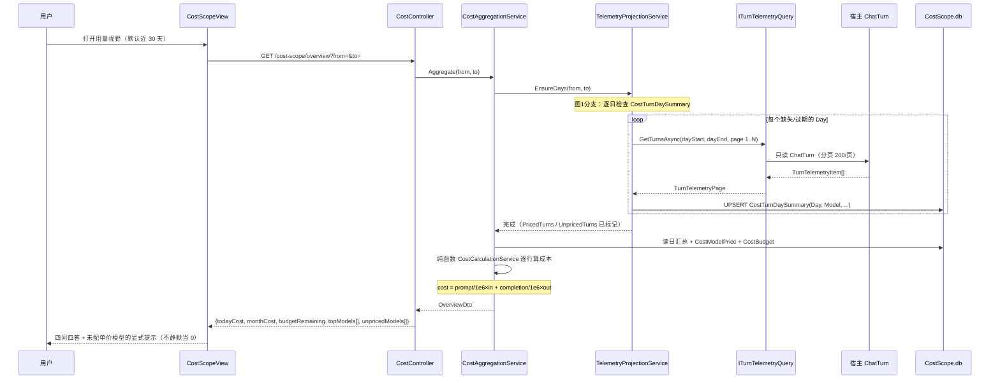
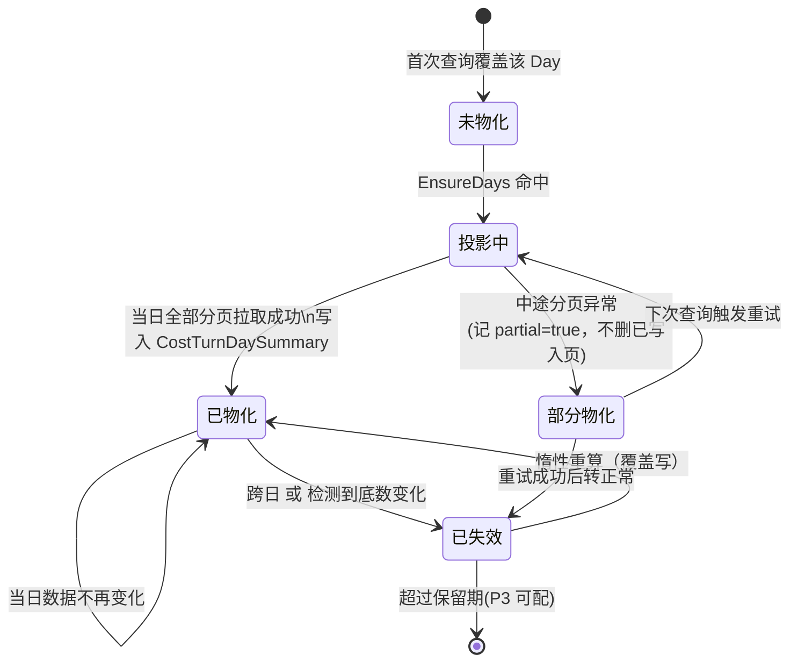
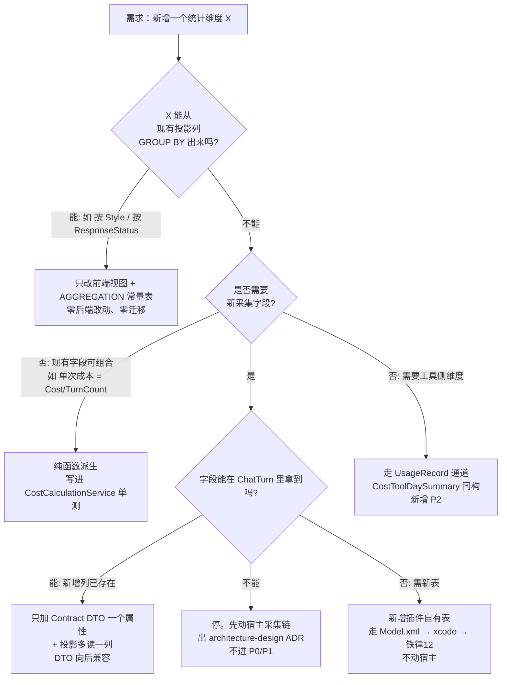

# 032 · CostScope — 设计方案（Design）

> 阶段：立项第 3 步 ｜ Task ID：PILOT-032 ｜ 日期：2026-09-28
> 上游：`research.md`（事实）→ `feasibility.md`（可行性/风险）→ 本文（架构与分期）
> ⚠️ **闸门1 唯一待裁决点**：§2.3 契约落位 A/B（推荐 A）。本文按 A 展开；选 B 仅改 §2.2/§3.1 实现侧，架构不变。

---

## 0. 设计目标

让**任何用户不看后台、不查数据库**，回答四个问题：
今天花了多少钱？哪个模型最贵？某供应商本月占多少？我还有多少预算？

---

## 1. 命名：CostScope · 用量视野（名实相符三问）

> 三问来源：`plugin-feasibility-study` §三（必须**功能定稿之后**才命名）。

| # | 问 | 答 |
| --- | --- | --- |
| 1 | **覆盖全部职责段？** | ✅ 它做四件事：**用量视图 / 成本计算 / 维度分析 / 预算守门**。"Scope（视野·范围）"精确覆盖"看得见的用量与成本"，且不含执行、不含消息推送、不含密钥管理（密钥来源审计另项，`02-goals.md:20`）。 |
| 2 | **不绑死实现手段？** | ✅ "Cost"反映产出（钱），与取数方式无关。反例校验：叫 `ChatTurnDashboard` 会把职责锁死在 ChatTurn 一张表（但 `UsageRecord` 工具维度也在范围内）；叫 `TokenBilling` 会把语义锁死在"计费扣费"（本插件只做**本地估算**，不扣费）。CostScope 不承诺计费，只承诺视野。 |
| 3 | **不撞名？** | ✅ 全仓 `grep -i "costscope\|cost-scope"` → **No matches**（Verified）；18 插件无用量/成本/仪表盘语义者；`system-monitor` 管主机资源（`015-system-monitor.md:26-29`），非 AI 成本。 |

| 项 | 值 |
| --- | --- |
| 目录 / 程序集 | `CostScope`（PascalCase） |
| 运行时 id | `cost-scope`（kebab-case） |
| `plugin.json` `Id` | `cost-scope` |
| 中文展示名 | 用量视野 |
| `EntryAssembly` | `CostScope.dll` |
| `EntryType` | `ForgeSelf.Api.Plugins.CostScope.CostScopePlugin` |
| 前端导出名 | `CostScopeView` |
| 路由 | `/cost-scope` |

> ⚠️ **spec 目录编号刻意不对齐**：`specs/032-*` 沿用工作日记 PILOT 序号（PILOT-032）；
> 功能文档须取 **`docs/02-features/039-cost-scope.md`**，因 `032` 已被 `032-agent-hub.md` 占用（research §5）。
> 039 文档头部注明对应 PILOT-032。

---

## 2. 架构

### 2.1 分层架构图（图 1）

```mermaid
flowchart TB
  subgraph FE[前端 web/dist/index.js]
    V1[CostScopeView 总览]
    V2[PricingPanel 单价目录]
    V3[BudgetPanel 预算]
    H[http.ts 自带 fetch + forge_api_token]
  end

  subgraph BE[插件 CostScope.dll]
    C[[CostController<br/>api/cost-scope/*]]
    SC[CostCalculationService<br/>纯函数成本引擎]
    AG[CostAggregationService<br/>按维聚合]
    PC[PriceCatalogService<br/>单价 CRUD]
    BG[BudgetService<br/>预算与守门判定]
    PR[TelemetryProjectionService<br/>宿主遥测→插件日汇总·惰性物化]
  end

  subgraph HOST[宿主 ForgeSelf.Api]
    Q[[ITurnTelemetryQuery<br/>只读契约 ★闸门1]]
    DB[(ForgeSelf.db<br/>ChatTurn · UsageRecord)]
  end

  PB[(Plugins/cost-scope/CostScope.db<br/>插件自有 4 表·唯一写入面)]

  V1 & V2 & V3 --> H
  H -. Authorization: Bearer .-> C
  C --> AG & PC & BG
  AG --> SC
  AG --> PR
  PR --> Q
  PR -->|仅写自己表| PB
  SC -->|只读| PB
  Q -->|只读| DB
  Q -. DTO 定义于 .-> AB[Abstractions]
  Q <-. 实现者 .- HOST
  PB -. 铁律12 插件自建表 .- PR
```

**四个刻意取舍**：

1. **插件永不写宿主库。** 写入面只有 `CostScope.db`（插件数据目录，铁律 12/10）；`ChatTurn`/`UsageRecord` 只读。→ 规避 SQLite 并发写锁，也规避「插件误删数据目录」风险。
2. **成本计算是纯函数，不进表。** `cost = round(prompt/1e6 × inputPrice + completion/1e6 × outputPrice, 6)`。单位换算（每 100 万 token）是全设计最易错点，纯函数化即可用单测锁死，且**改单价后历史成本自动重算**（无需回填埋）。
3. **无 `IHostedService`、无后台轮询。** 日汇总**惰性物化**：查询时发现当日行缺失/过期就即时重算。→ 规避技能铁律 14（插件热重载后宿主级 HostedService 不重启，新实例拿不到 StartAsync）。
4. **`CostTurnDaySummary` 是唯一新增持久化**，把「每轮」压成「日×模型」：既加速聚合，又让**宿主表被清理后历史成本仍可追溯**——正向对齐 `not-taken-decisions.md:89`「逐 token 追查（如成本审计）」预设的未来触发条件。

### 2.2 契约设计（选 A 时）

`ForgeSelf.Abstractions/ITurnTelemetryQuery.cs`（新建，只依赖 Abstractions）：

```csharp
namespace ForgeSelf.Abstractions;

/// <summary>会话轮次遥测的只读查询契约。
/// 首个消费者 = CostScope 插件；实现聚合宿主 ChatTurn（仅统一网关）/ SessionEvent / UsageRecord 三源。
/// 只读、无副作用、无缓存；实现落在宿主并注册为 Scoped。</summary>
public interface ITurnTelemetryQuery
{
    /// <summary>按时间窗口分页取轮次遥测（含按 model 过滤）。
    /// 实现须聚合多源：① ChatTurn（仅统一 AI 网关写入）② SessionEvent assistant/message+usage
    /// （app/agent 会话；当前主路径 Usage=null，见 Unknown U6）③ UsageRecord（工具维度，无 tokens）。</summary>
    Task<TurnTelemetryPage> GetTurnsAsync(
        DateTime from, DateTime toExclusive,
        string? model = null,
        int page = 1, int pageSize = 200);

    /// <summary>按时间窗口分页取工具调用遥测（跨插件）。</summary>
    Task<ToolUsagePage> GetToolUsagesAsync(
        DateTime from, DateTime toExclusive,
        string? pluginId = null, string? toolId = null,
        int page = 1, int pageSize = 200);

    /// <summary>取模型清单及其归属供应商名（用于前端下拉与模型维度对齐）。</summary>
    Task<IReadOnlyList<ModelIdentityDto>> GetModelsAsync();
}
```

配套的**只读 DTO**（`ForgeSelf.Abstractions/TurnTelemetryDtos.cs`）：

```csharp
/// <summary>单轮遥测投影——只含成本计算需要的 9 列（对齐 ChatTurnModel 稳定列）。</summary>
public sealed record TurnTelemetryItem(
    long Id, DateTime CreatedTime,
    string? Model, string? Style,
    int PromptTokens, int CompletionTokens, int TotalTokens,
    long DurationMs, long FirstTokenMs,
    int ResponseStatus, string? ErrorMessage);

public sealed record TurnTelemetryPage(
    IReadOnlyList<TurnTelemetryItem> Items, long Total, int Page, int PageSize);

/// <summary>工具调用投影（对齐 UsageRecordModel 稳定列）。</summary>
public sealed record ToolUsageItem(
    long Id, DateTime Timestamp, string PluginId, string ToolId,
    string ActionType, long DurationMs, string? MetadataJson);

public sealed record ToolUsagePage(
    IReadOnlyList<ToolUsageItem> Items, long Total, int Page, int PageSize);

/// <summary>模型身份（ChatTurn.Model 的解析基准）。</summary>
public sealed record ModelIdentityDto(
    string Model, string? ChatModelId, string? UpstreamModelId,
    string ProviderName, bool Enabled);
```

**契约稳定性论证**：`ChatTurnModel.cs:66-99` 的 tokens/duration/time 列均为 `Int*/DateTime`，
语义稳定；040（B1–B8）改造动的是会话事件日志与投影，不改 ChatTurn 列名。
契约**只依赖 9 个稳定列**；DTO 与实现解耦，宿主表再变也只改实现，不改 DTO（Unknown 表已登记）。

### 2.3 契约落位：闸门1 唯一待裁决点

| 选项 | 内容 | 改动面 | 评价 |
| --- | --- | --- | --- |
| **A. Abstractions 契约（推荐）** | 新增 `ITurnTelemetryQuery` + DTO，宿主实现并注册 | 宿主 2 文件 +1 行 DI | ✅ 契约层本就是跨插件共享的设计意图；签名窄、DTO 解耦、可单测 |
| B. 插件裸读宿主库 | 插件用 `GetHostDataDirectory()` 拼绝对路径 → 自建连接名 → `DbServer.ExecQuery` 裸 SQL | 仅插件 | ❌ 裸 SQL 绑死列名，宿主表一变插件静默破；绕开 XCode 实体层，与仓内「唯一 ORM」规范相悖 |

**裁决影响**：选 A = 需宿主装配改动（走 040 之外的独立小改）；选 B = 零宿主改动但引入脆性。
本文默认 A；**不替用户拍板**。

---

## 3. 数据层

### 3.1 插件自有 4 表（`Plugins/CostScope/Data/Model.xml` 真源 → xcode 生成）

遵循技能铁律 9（**先改 Model.xml 再 `xcode Model.xml`，禁手改 `.cs`**）与铁律 12（插件自建表）。

| 表 | 职责 | 关键字段 |
| --- | --- | --- |
| `CostModelPrice` | 模型单价目录 | `Model`(唯一索引)、`InputPrice` decimal(18,8)、`OutputPrice` decimal(18,8)、`Unit` const `1M`、`ProviderName`、`Enabled` 默认 1、`Remark`、`UpdateTime` |
| `CostBudget` | 预算规则 | `Name`、`Level`(枚举 `Model/Provider/Global`)、`Target`(Level=Model 时=模型名，Provider 时=供应商名)、`Period`(枚举 `day/month/quarter/year/all`)、`LimitAmount` decimal(18,4)、`WarnRatio` 默认 0.8、`Enabled`、`NotifyChannels`（P2 扩展位） |
| `CostTurnDaySummary` | 投影日汇总（物化） | `Day` date、`Model`、`ProviderName`、`TurnCount`、`FailCount`、`PromptTokens`、`CompletionTokens`、`TotalTokens`、`TotalDurationMs`、`AvgFirstTokenMs`、`CostAmount` decimal(18,6)、`PricedTurns`、`UnpricedTurns`、`RecomputedAt`。**唯一索引 (Day, Model)** |
| `CostSettings` | 插件单例设置（KV） | `Key`(唯一)、`Value`(JSON 字符串)：`currency` 默认 `CNY`、`defaultInputPrice`、`defaultOutputPrice`、`unpricedPolicy` = `unknown`(默认) / `zero` / `lastKnown` |

> **无用户身份列**：本仓单用户单机场景（无用户表），不发明 `UserId`。
> `UniqueUsers`（`UsageDailySummaryModel.cs:33`）在既有宿主表里恒为 0/占位，本插件不依赖它。

### 3.2 模型→供应商解析（Verified 数据链）

`ChatTurn.Model` ↔ `AIModel.ChatModelId` / `UpstreamModelId` / `Alias`
（`AIModelModel.cs:18,21,24,27`）→ `AIModel.ProviderName`(`:21`) / `AIModel.ProviderId`(`:18`) → `AIProvider.Name`(`AIProviderModel.cs:18`)、`SupportedModels`(`:30`)。

解析顺序（保守：**宁未匹配，不错配**）：
1. `ChatModelId` 精确等值（`提供商gpt-4o` 形式）；
2. `UpstreamModelId` / `Alias` 精确等值；
3. 大小写不敏感回退；
4. 仍不中 → `ProviderName = null`，前端标「未归属」，**不猜、不按前缀硬切**。
（`ChatModelId` 是「提供商:原始模型id」拼接形式，前缀切分易受空格/冒号歧义影响，只做最后兜底并打 warning。）

---

## 4. 数据流：一轮对话的成本怎么算出来（图 2 · 时序图）



**降级要点**（图 5 展开）：
- 某模型未配单价 → 该行进 `UnpricedTurns`，成本标 `Unknown`，**页面必须显式列出这些模型名并给出「去配单价」按钮**，绝不默默计 0（否则用户以为「没花钱」）。
- `GetTurnsAsync` 抛异常 → 该日不写投影，返回 `partiallyRefreshed=true`，已算出的其余日正常返回；**不整页失败**。
- `ChatTurn` 行 tokens 为 0 且 `ResponseStatus != 200` → 计入 `FailCount`，不计成本。

---

## 5. 状态机：一个日汇总行的生命周期（图 3）



**状态判定真源**：`RecomputedAt`（投影时间戳）与「当日是否已结束」。
当日未结束 → 每次查询都重算（用户开着页面，数字要增长）；
已结束 → 一次算到底，除非手动点「重建」。

---

## 6. 扩展判定树：新增一个「维度」怎么加（图 4）



**读树结论（写进规范）**：
- **P0/P1 新增维度一律走 C/E/G** 三条路（前端 / 纯函数 / DTO 加属性）→ 零迁移、零宿主改动。
- 需要新采集字段且宿主没有 → **升级给人出 ADR**，不自作主张加列。

---

## 7. 降级图：外部格式漂移怎么被发现（图 5）

```mermaid
flowchart TB
  subgraph IN[输入面]
    A[宿主 ChatTurn 表结构变化<br/>列改名/改类型]
    B[模型名格式变化<br/>ChatModelId 拼接规则变]
    C[上游未返回 usage<br/>tokens 恒为 0]
    D[单价目录为空]
  end
  subgraph G[探针防线]
    A --> G1[契约层异常<br/>ITurnTelemetryQuery 抛 ContractBrokenException]
    B --> G2[解析器命中率统计<br/>UnattributedModels 列表]
    C --> G3[空 tokens 探测<br/>连续 N 轮 0 tokens 即告警]
    D --> G4[未配置探测<br/>首屏即阻塞式提示]
  end
  subgraph O[用户可见结果]
    G1 --> O1[页面显示「数据源变更，需更新插件」<br/>其余日历史不受影响]
    G2 --> O2[「未归属模型: xxx (12 轮)」<br/>附一键填入单价按钮]
    G3 --> O3[「近 N 轮未返回用量数据」<br/>成本口径降级为『仅次数』]
    G4 --> O4[首屏大提示「请先配置单价」<br/>不显示 0 元假象]
  end
```

**版本号机制**：契约 DTO 顶部写 `profileVersion = "v1"` 常量；
探针断言（`ContractProbe` 单测 + 一次运行期探活）验证实现返回的列集合与 DTO 期望一致，
不一致时抛 `ContractBrokenException` → 前端明确报错而不是渲染一片空。
→ 对齐 `plugin-feasibility-study` §五 扩展性四问之「外部格式漂移怎么发现」。

---

## 8. API 面（`[Route("api/cost-scope")]`，类级 `[Authorize("ApiKeyPolicy")]`）

对齐技能铁律 17（管理面必须类级鉴权，mcp-center v2.1.0 踩坑）。全部走插件自带 `http.ts`。

| 方法 | 路由 | 说明 |
| --- | --- | --- |
| GET | `overview` | 总览：今日/本月成本、Token、轮次、Top 模型、预算余量、未配单价模型列表 |
| GET | `summary/daily` | 按日趋势（可选 `model` / `provider` 过滤，默认 30 天） |
| GET | `breakdown` | 维度排行：`by=model\|provider\|style\|day` |
| GET | `turns` | 轮次明细分页（`page`/`pageSize`/`from`/`to`/`model`，只读） |
| GET | `prices` | 单价目录列表（含「有历史用量但无单价」标记） |
| POST | `prices` | 新增单价（点即保存） |
| PUT | `prices/{model}` | 改单价（立即重算受影响历史行的 `CostAmount`） |
| DELETE | `prices/{model}` | 删除（二次确认；成本转为 Unknown，不删用量） |
| GET | `budgets` | 预算规则列表 + 每条当前达成率 |
| POST | `budgets` | 新增预算 |
| PUT | `budgets/{id}` | 改预算（二次确认，可能放宽限制） |
| DELETE | `budgets/{id}` | 删预算（二次确认） |
| POST | `summary/rebuild` | 手动触发投影重建（`from`/`to` 可选；破坏性提示） |
| GET | `settings` / PUT `settings` | 插件设置（货币/默认单价/未配单价策略） |

**点即保存**：所有 `POST/PUT` 立即落库并返回更新后的目标资源，前端**不再要求用户点第二个保存按钮**（对齐 `plugin-development` §3.4 交互设计 1）。

---

## 9. 安全模型

| 面 | 措施 |
| --- | --- |
| 管理面鉴权 | 控制器类级 `[Authorize("ApiKeyPolicy")]`（铁律 17）→ 无 token 裸 curl 得 401 |
| 前端取 token | 插件自带 `web/src/http.ts` 从 `localStorage['forge_api_token']` 取（照 ImGateway `fetchPluginVersion` 先例） |
| 数据写面 | **仅插件自有库**；对宿主库只读（铁律 10：无删库、无删目录、无 ProcessExit 清理） |
| 单价敏感性 | 单价是**用户本地配置**，不上传、不进入任何外发请求；不进 git |
| 破坏性操作二次确认 | `DELETE prices/*`、`DELETE budgets/*`、`POST summary/rebuild` → `ElMessageBox.confirm` + 明确文案（软标记语义：删单价≠删用量，历史成本转 Unknown 可撤销） |
| 输入校验 | `InputPrice/OutputPrice` ∈ [0, 1e6]；`LimitAmount` > 0；`WarnRatio` ∈ [0.1, 1.0]；后端拒绝非法值并返回 400 |
| 路径/注入 | 全部走 XCode 实体参数化查询，无裸 SQL 拼接（这也是选契约 A 的原因之一） |
| 长文本溢出 | 模型名/供应商名在 UI 用 `title` + 省略号；`MetadataJson` 只读展示前 200 字符 |

---

## 10. 分期（P0 → P3，闸门1 只批 P0）

| 期 | 内容 | 验收锚点 |
| --- | --- | --- |
| **P0（首批，必做）** | 单价目录 CRUD + 总览 + 按日趋势 + 按模型排行 + 未配单价显式提示；宿主侧契约（选项 A）与实现 | 用户能回答「今天/本月花了多少、哪个模型最贵」，且看到「还没配单价的模型」清单 |
| **P1** | 预算规则（Model/Provider/Global × day/month/quarter）+ 达成率条 + 阈值预警横幅（页面内，不发通知）；轮次明细页 | 用户能设「本月 ≤ 500 元」并看到实时余量与超支提示 |
| **P2** | 工具维度成本（`UsageRecord` 通道 → `CostToolDaySummary` 同构表）+ 供应商维度排行 + `summary/rebuild` 手动重建 UI | 跨插件工具调用也有成本可见 |
| **P3** | 通知渠道（预留 `NotifyChannels` 列）、投影保留期清理（**手动触发，绝不自动删**）、CSV 导出、默认单价表内置（待裁决） | 导出与保留策略可选 |

> **P0 明确不做**：告警推送、真实计费扣款、多人共享、历史导入、`workflows/*` 六个孤儿端点（仍归原所有者，research §8）。

---

## 11. 设计必答：扩展性四问（`plugin-feasibility-study` §五）

| # | 问 | 答 |
| --- | --- | --- |
| 1 | **新对象怎么加？** | 声明式优先：新模型加单价 = 一次 `POST /prices`（JSON），**零代码、零迁移**；新预算规则同为纯 CRUD。只有「全新的统计维度」才需要动代码（见判定树）。 |
| 2 | **新能力面怎么加？** | Facet 建模：`by=model\|provider\|style\|day` 是显式枚举，**未知能力面返回 400 + 明确错误**，不静默返回空表假装成功。P2 新增「工具维度」走同构表 + 追加枚举值，不动 P0 契约。 |
| 3 | **契约放哪层？** | `ITurnTelemetryQuery` 放 **`ForgeSelf.Abstractions`**（跨插件共享，首个消费者出现即上移——本次就是首个消费者），附 **`architecture-design` ADR** 说明为何不裸读、为何只读、DTO 为何不含宿主实体类型。插件内部 Service 全在插件内私有，不上移。 |
| 4 | **外部格式漂移怎么发现？** | ① DTO `profileVersion = "v1"` 常量；② `ContractBrokenException` 在运行时探活时抛出（前端显示「数据源变更」而非空白页）；③ 模型解析命中率统计 + `UnattributedModels` 列表，解析不中**显式上报而非猜测**；④ 连续空 tokens 探测降级为「仅次数」口径。 |

---

## 12. 决策清单

| # | 决策 | 理由 | 准则 |
| --- | --- | --- | --- |
| D1 | 契约落位选 **A（Abstractions）** | 裸 SQL 绑死列名会随宿主表演化静默崩；契约 DTO 解耦后宿主改表只改实现 | ✅ **闸门1 用户裁决，不擅定** |
| D2 | 成本计算做成**纯函数**，不落「算好的成本」到明细层 | 改单价后历史成本应自动重算；纯函数可完全单测锁住单位换算 | 单价变更 → `CostAmount` 由聚合时重算，明细表只存 tokens |
| D3 | **惰性物化**日汇总，不上 `IHostedService` | 铁律 14：插件热重载后宿主级 HostedService 不重启，实例会死等 | 当日未结束每次重算，已结束缓存到下次跨日 |
| D4 | 插件**只读**宿主库，写面只在 `CostScope.db` | 铁律 10/铁律 12；规避 SQLite 写锁；删除风险归零 | 宿主表零写入 SQL |
| D5 | 未配单价的模型显示 **Unknown**，不默默计 0 | 计 0 会让用户误以为「没花钱」，是数据欺骗 | 首屏必须显式列出未配模型名 |
| D6 | 不做真实扣费/计费 | 越界：本插件是"视野"，不是"收银台"（命名第 2 问） | 无支付、无外部账单同步 |
| D7 | 不内置默认单价表（P3 可议） | 单价变动快，内置必然过期；给用户一个"过期数据"是负资产 | 待裁决，默认不内置 |
| D8 | `workflows/*` 6 个孤儿端点**不消费** | 归 WorkflowEngine 语义，混进成本插件会职责越界 | 留在 research §8 TODO，等其原所有者或单独立项 |
| D9 | `UsageStatsController` 补 `[Authorize]` **不在本任务内** | 那是宿主控制器修补，插件无法给别人的控制器加特性 | 登记 TODO（P2），本插件自身严格带鉴权 |
| D10 | 单价单位统一 **每 100 万 token**，`decimal(18,8)` | 避免「每 1k / 每 1M / 每 100 万」混用导致 1000 倍误差 | 单测锁死换算；前端文案写清「元 / 100 万 tokens」 |

---

## 13. 图解自查：5 图发现的缺口与处置

| 图 | 发现的缺口 | 处置 |
| --- | --- | --- |
| 图 1 总体架构 | 插件无法直接引用 `ForgeSelf.Api.Entities.ChatTurn` → 存在**契约落位分叉** | 转 D1 闸门1 裁决，附 B 方案兜底 |
| 图 2 时序 | `EnsureDays` 遇分页中途异常会把当天写成**半条投影** | 状态机补「部分物化」态 + 重试幂等（图 3） |
| 图 2 时序 | 当日已结束 vs 未结束的**重复计算边界** | 明确「未结束每次重算，已结束缓存」判据（图 3 已失效态） |
| 图 3 状态机 | 投影**保留期**如何过期 → 自动删表违反铁律 10 | 移到 P3 且必须**手动触发重建/清理**，永不自动删 |
| 图 3 状态机 | `ChatTurn` 被宿主清理后历史成本是否还在？ | 由 `CostTurnDaySummary` 自身持久性兜住（设计取舍 4 的价值验证） |
| 图 4 扩展树 | 「新维度需要新字段但宿主没采集」时容易私自加宿主列 | 明确升级路径 = 出 ADR + 交人，不进 P0/P1 |
| 图 4 扩展树 | 前端维度枚举扩展易导致后端静默返回空表 | 后端未知 `by=` 返回 400 + 明确错误，禁止静默空表 |
| 图 5 降级图 | 模型名解析失败会被**静默归到错误供应商** | 解析不中止归「未归属」+ 命中率告警，绝不按前缀硬切 |
| 图 5 降级图 | 上游不返回 usage 时 tokens 恒 0，成本会显示 0 造成误解 | 连续空 tokens 探测 → 口径降级为「仅次数」并明示 |
| 图 5 降级图 | 单价目录为空时页面若默认显示 ¥0.00 是数据欺骗 | 首屏阻塞式提示「请先配置单价」，不渲染金额 |
| 全图 | 模型→供应商的**多值归属**：一个模型名可能同时出现在多个 provider 的 `SupportedModels` | 解析优先级固化（ChatModelId > UpstreamModelId > Alias > 大小写回退），仍不中即未知归属 |

> **回写 tasks.md**：上表 11 条全部转任务书条目（T001–T011），闸门1 一并审阅。

---

## 14. 实施任务书（T 清单，闸门1 批准 P0 后生效）

| T | 内容 | 允许改 | 禁止改 | 验证命令 |
| --- | --- | --- | --- | --- |
| T001 | Abstractions 加 `ITurnTelemetryQuery` + 只读 DTO（D1=A） | `ForgeSelf.Abstractions/ITurnTelemetryQuery.cs`、`TurnTelemetryDtos.cs`（新建） | 禁改既有 Abstractions 公开签名 | `dotnet build ForgeSelf.Abstractions` + 契约反射测试 |
| T002 | 宿主实现契约并注册（只读 ChatTurn/UsageRecord/AIModel/AIProvider） | `ForgeSelf.Api/Services/CostScope/TurnTelemetryQueryService.cs`（新建）、`AppBuilder.cs`（+1 行 DI）、`Controllers/` 无需新增 | 禁改 ChatTurn 实体列；禁改 `XCodeConfig` 连接注册（复用已有 `ForgeSelf` 连接） | `dotnet build` + 新增 `TurnTelemetryQueryServiceTests`（隔离 DB 夹具） |
| T003 | 插件骨架：`plugin.json` + `CostScopePlugin.cs` + `Data/Model.xml`→xcode（4 表）+ `CostScopeTables.cs`（自建表） | `Plugins/CostScope/**` | 禁写宿主库；禁 `File.Delete`/`Directory.Delete` 指向数据目录 | `dotnet build` + `CostScopeTablesTests`（铁律 12 断言：宿主未建表时插件自建表成功） |
| T004 | 纯函数成本引擎 `CostCalculationService` + **单位换算单测锁死** | `Plugins/CostScope/Services/CostCalculationService.cs` | 禁引入 IO / DB 依赖 | 单测含：1M token 基准、小数精度、0 tokens、负值拒绝、改单价后历史重算 |
| T005 | 投影 `TelemetryProjectionService`（惰性物化 + 部分物化态 + 幂等重试）+ 模型解析（4 级回退 + 未归属） | `Plugins/CostScope/Services/` | 禁对宿主库 `INSERT/UPDATE/DELETE` | 单测：分页中断重试、跨日重算、解析 4 级回退、重复调用幂等 |
| T006 | 聚合 + `CostController` 14 端点 + 类级 `[Authorize("ApiKeyPolicy")]` | `Plugins/CostScope/Controllers/CostController.cs` 等 | 禁省略鉴权特性；禁裸 SQL 拼接 | 单测 + 反射断言「控制器必带 ApiKeyPolicy」（照 `McpAdminAuthTests` 先例）；无 token curl 得 401 |
| T007 | 前端骨架（`plugin-frontend-scaffold`，导出名 = `CostScopeView` = `views[0]`） | `Plugins/CostScope/web/**` | 禁 import 宿主模块；禁 `@/` 别名；vue/vue-router/element-plus 必须 external | `pnpm run build` 后 `grep 'from "vue-router"' dist/index.js` 有命中 |
| T008 | 三视图 + 交互清单落地（点即保存 / 失败留窗 / 空态分级 / 二次确认 / 版本徽标 / 防闪） | `Plugins/CostScope/web/src/**` | 禁 `import { ElXxx } from 'element-plus'`；禁硬编码色值 | `pnpm run check` + `pnpm run test` |
| T009 | P0 插件层 e2e（`e2e/plugins/cost-scope/cost-scope.spec.ts`，零 mock）+ 菜单路由一致性 | `ForgeSelf.Web/e2e/**` | 禁一次性 `.cjs` 脚本；禁 mock | Playwright 通过 + 截图落 `screenshots/e2e/cost-scope/` |
| T010 | 文档同步：`docs/02-features/039-cost-scope.md`、`Plugins/README`、`032` 文档编号说明、反同步 `024-usage-stats.md:8` 过期表述 | `docs/**` | 禁手改 `openwiki/` | 链接与文件一致性检查 |
| T011 | 门禁 + 插件层验证 + 发布 + 走查（`plugin-development` 四步闭环，缺一不可） | — | 禁 `Stop-Process` 用户宿主；禁手工 Copy-Item 产物；提交/推送须用户明确指示 | `dotnet build` + `dotnet test` + `pnpm run check` + `pnpm run test` + 插件 build + e2e |

**门禁命令汇总（T011）**：
```
cd ForgeSelf.Api && dotnet build
cd ForgeSelf.Api.Tests && dotnet test
cd ForgeSelf.Web && pnpm run check && pnpm run test
cd Plugins/CostScope/web && pnpm run build     # 沙箱内改用技能 §3.2 出树构建兜底
# 插件端点鉴权回归 + e2e
```

---

## 15. Unknown（随设计未决，全数上交闸门1，不擅定）

| # | 不确定点 | 影响 | 处置 |
| --- | --- | --- | --- |
| U1 | 契约落位 A / B | 决定是否改动宿主 | **闸门1 裁决**，推荐 A（§2.3） |
| U2 | 是否内置「常见模型默认单价表」 | 首次体验 vs 过期数据风险 | 默认**不内置**（P3 可议） |
| U3 | 计价货币与税率 | 金额展示 | 固定 CNY 无税，用户按税前填写；P0 不做多币种 |
| U4 | 单价精度位数 | 小额舍入 | 固化 `decimal(18,8)`（D10），可再议 |
| U5 | 040 改造（B1–B8 进行中）是否会改 ChatTurn 表结构 | 契约稳定性 | 契约只依赖 9 个稳定列；若 040 改表，仅改 T002 实现，DTO 不动 |
| U6 | ⚠️ **数据源覆盖不全（实测已确认）**：`ChatTurn` 只由统一 AI 网关写入（`OpenAIChat/OpenAIResponses/AnthropicMessagesController` 的 `SaveTurnAsync`）；app 主聊天走 `ChatController.cs:129-131` 落 `SessionEvent`，且 **`Usage: null` 硬编码** | **决定性**：只读 ChatTurn 会让主聊天/agent 会话的消耗全部不可见 | **开工第一道检查（阻断项）**。两条路待裁决：(a) 契约聚合 ChatTurn + SessionEvent 双源；(b) 先让 `ChatController` 透传 `ILlmRuntime` 已返回的 `UsageInfo`（`SessionEvents.cs:31-34` 已定义 `UsageInfo? Usage`、`ILlmRuntime.cs:21` 已返回、`OpenAICompatibleProvider.cs:620-626` 已解析真实值——**只是一行透传**，属 040 收尾）。推荐 (b)+(a) 并行：(b) 补齐主链路，(a) 保证历史可回溯 |
| U7 | 投影保留期 | 磁盘占用 | P3，且必须手动清理（铁律 10 禁止自动删） |
| U8 | 今日/本月按本地时区还是 UTC | 日界线归属 | P0 固化**设备本地时区**，设置页可见该口径 |

---

## 16. 与门禁的对应（`AGENTS.md` §0 / §5 / §11）

| 门禁 | 本设计覆盖 |
| --- | --- |
| §0 预飞铁律 | 已写工作日记（`.forgeself/memory/2026-09-28.md` 输入32）+ 建 TODO（PILOT-032 条目）+ 读技能（`plugin-feasibility-study`、`plugin-development`；实施时补读 `plugin-frontend-scaffold`） |
| §0 出口清单 | 本设计**不含代码**，故不涉及 dotnet/pnpm/build/e2e 门禁；闸门1 放行后由 T011 承担 |
| §5.3 测试铁律 | T009 明确 Playwright e2e + 零 mock + 禁一次性 `.cjs` |
| §11 闸门 1 | 本文即闸门1 交付物：Intent(§0/§1) + Spec 骨架(§8/§11) + Plan(§10 分期) + Task(§14 T001–T011，含允许/禁止/验证命令) + Unknown(§15) |
| §11 闸门 2/3 | 待闸门1 通过、实施完成后走 Evidence + Review（05/06/07 工件）+ pre-commit hook 硬拦 |

---

## 17. 下一步（不越权）

1. **停下。** 本文与 `research.md` / `feasibility.md` 是闸门1 交付物，等用户拍板。
2. 用户裁决 **U1**（推荐 A）+ **U6**（数据源补齐方式，推荐 b+a 并行）+ 确认 P0 范围后，
   才转 `plugin-development` 执行 T001→T011。
3. 若 U1 选 B：改动仅限 T001/T002（不新建 Abstractions 文件，改为插件内自建连接 + 参数化查询），
   其余 T003–T011 不变。
4. **U6 若裁决选 (b)**：需先把 `ChatController.cs:131` 的 `Usage: null` 改为透传
   `ILlmRuntime` 返回的 `UsageInfo`（一行改动，属 040 收尾），否则主聊天链路永远无用量数据——
   这是 P0 的**前置阻断项**，必须先于 T002 落实。
