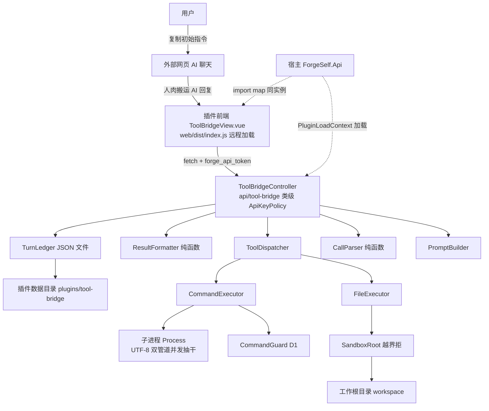
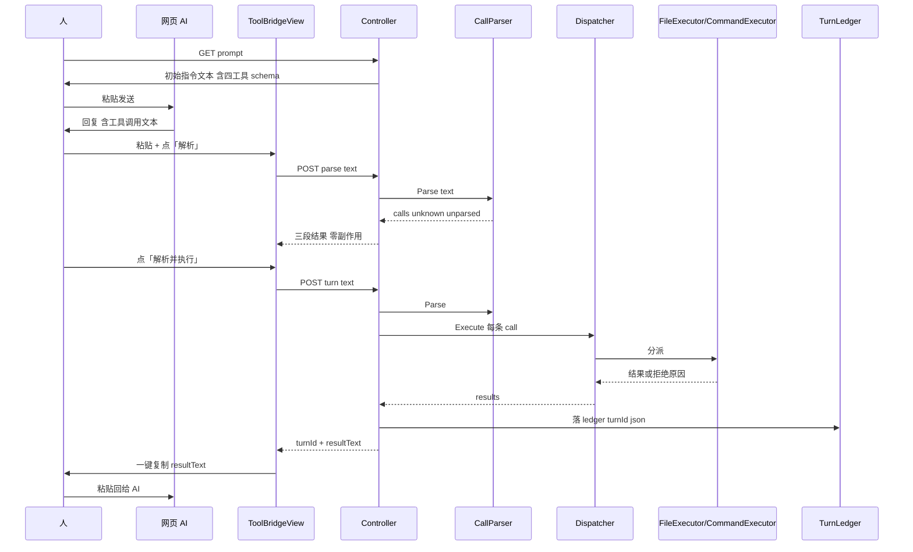
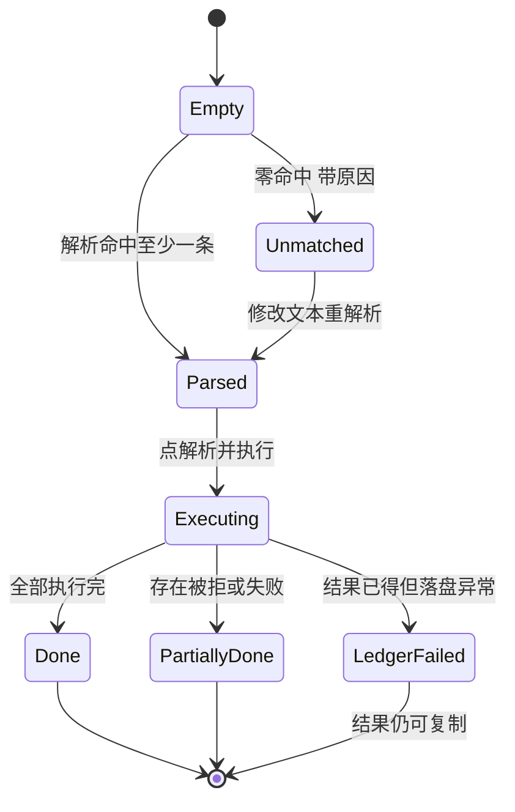
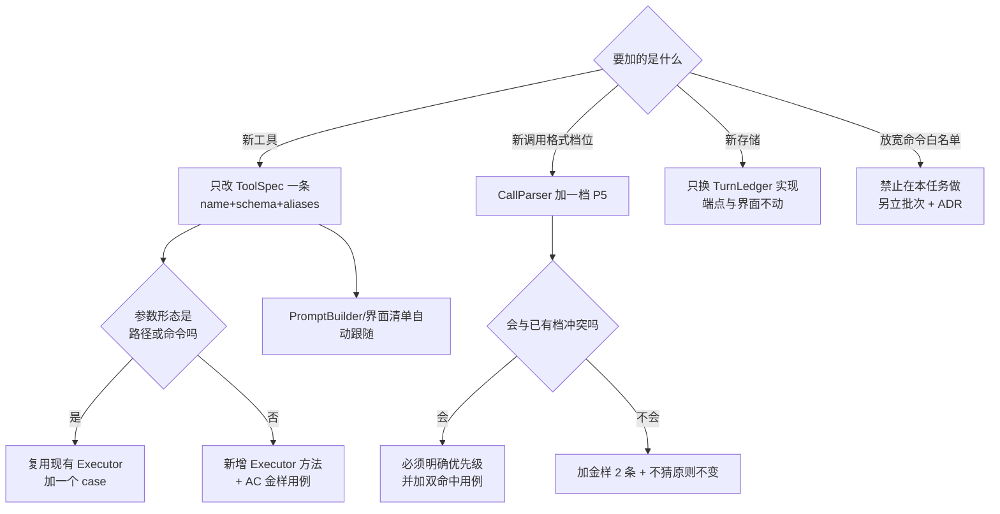
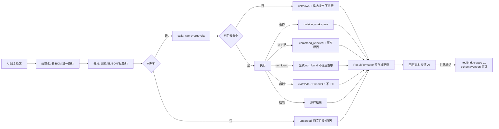

# Plan

> 阶段：Stage 3｜必须具体到真实文件路径，禁止只写「修改 Service、增加测试」。
> Task ID：PILOT-053 ｜ 插件：`ToolBridge`（id `tool-bridge`）｜ 日期：2026-10-06
> 依据：00-repository-understanding（事实）+ 01-intent（目标）+ 02-spec（AC1~AC16）+ 用户四问拍板（多格式解析 / 四工具+提示词 / 照搬守卫 / 插件专属沙箱）

## 命名（plugin-feasibility-study §三步 · 名实相符三问）

**目录/程序集 `ToolBridge`｜运行时 id `tool-bridge`｜菜单「工具桥」｜路由 `/tool-bridge`｜视图 `ToolBridgeView`**

| 问 | 自审 | 结论 |
| --- | --- | --- |
| 1 覆盖全部职责段？ | 职责=①把工具面说明**送出去**（提示词）②把 AI 的调用**接进来**（解析）③在本机**跑掉**（执行）④把观察**原样送回**（格式化）⑤留档可回看（台账）。"桥"= 双向搬运通道，四段全在覆盖内，不留窟窿 | ✅ |
| 2 不绑死实现手段？ | 名字不含 `Paste`/`Manual`/`WebChat`/`Clipboard`——粘贴只是当前的人肉搬运方式，将来若接了 AI API，搬运变自动而职责不变，名字不必改 | ✅ |
| 3 不撞名？ | 全仓 19 个插件无 `ToolBridge`；与 `AgentHub` 区别已在职责上写清（AgentHub=委派本机已装的 agent 进程；ToolBridge=把外部 AI 的文本调用接到本机原子能力）；与 `McpCenter` 区别（后者是协议网关，且其 test 端点为假实现）；与 `FileTools`/`ScriptRunner` 区别（那两个是**给人用的批量运维/脚本**面，无"解析 AI 文本"概念） | ✅ |

备选（若用户否决）：`ToolHarness`（工具台，harness 与 xUnit 语义易混）、`AgentLoopLab`（Lab 有玩具味）。

## 决策清单（含代价与证据）

| # | 决策 | 选择 | 背景与理由（带证据） | 代价 |
| --- | --- | --- | --- | --- |
| D1 | 命令守卫怎么复用 | **插件自带一份 `CommandGuard`（同规则），并新增跨实现一致性对账测试 `ToolBridgeGuardParityTests`**：同一张 40+ 命令金样表分别打 AIAgent 的 `TerminalCommandGuard` 与本插件 `CommandGuard`，判定必须逐条相同 | 真上移（进 `ForgeSelf.Core`/`Abstractions`）实测有硬障碍：**Core csproj 零 PackageReference**（实读 `ForgeSelf.Core/ForgeSelf.Core.csproj`，全文仅 TFM + InternalsVisibleTo）、**Abstractions 只引 DI.Abstractions**（`ForgeSelf.Abstractions.csproj:11-15`）⇒ 守卫里的 `XTrace.Log.Warn` 上移即编译不过，除非给内核层加 NewLife 依赖或删掉日志——**属改内核依赖结构 = 高风险，须走 `architecture-design` 出 ADR**（规范 §1.3/§7）。同时 `TerminalCommandGuard.cs:23` 自述第 3 道 CWD 门依赖 `IProjectWorkspaceService`（AIAgent 私有），上移还要连带动工作区契约 ⇒ blast radius 覆盖整个 AIAgent | 双实现风险由**机器对账**兜住（漂移即红，且红的归属明确）。红账不放宽：金样表覆盖三道门 + 破坏性词 + EncodedCommand 三类 |
| D2 | 台账怎么存 | **JSON 文件**（插件数据目录 `ledger/{turnId}.json`），不引入实体 | 规范 §1 硬性约束 2「不修改数据库结构」；引实体=新增 Model.xml+xcode 生成+建表+`XCodeConfig.PluginDbs` 登记（铁律 9/12），把一个测试工具做成 DB 变更，风险与收益不匹配。`ctx.EnsurePluginDataDirectory()` 已有 5 个插件实读用法 | 无索引/无查询语言；列表分页靠文件名时间戳排序（够用）；只增不删（铁律 10）⇒ 磁盘缓慢增长，界面写清 |
| D3 | 是否注册工具扩展点（`IToolFunctionExtension`） | **不注册** | 注册后与 AIAgent 已有的 `read_file`/`write_file`/`list_files` 在 `ToolRegistry` 内**同名并存**；且工具要进内置 agent 视野须加白名单 `AIAgentService.ToolScopePluginIds:564-567`，而 `:566` 注释实证「不挂全部宿主工具（~77 个会撑爆本地小模型 prompt → 400）」+ 有数量守卫测试 `AIAgentToolScopeTests.cs:10-23` | 外部/内置 agent 想复用这四个能力仍需走 MCP 网关或各自的实现 ⇒ 记 07 NOT-to-do，若要须出 ADR（U-4） |
| D4 | 界面用什么组件 | **原生 HTML + `--el-*` 变量 + Tailwind 布局原语**，不用 `<ElXxx` 系列 | 实读 `Plugins/QuickLinks/web/vite.config.ts:13-16` 注释：预编译产物不能依赖宿主编译期 unplugin 自动引入；plugin-development 铁律 4 虽称 `<ElXxx>` 可用（需宿主 `exposeSharedDeps` 暴露），但那是"逐个组件都要验暴露"的隐性依赖面。本界面四区皆为文本+按钮，原生足够 | 少了 EP 的现成弹窗；P0 无破坏性确认动作（无删除端点）⇒ 不需要 |
| D5 | 前端脚手架脚本用不用 | **手工复制 `Plugins/AIAgent/web` 结构**，不跑 `scaffold-plugin-frontend.ps1` | 实读该脚本 `:10-11` 仍指 `ForgeSelf.Api/Plugins/$Template/web`（插件早已迁仓库根 `Plugins/`）⇒ 照技能直跑必 "Template web not found"。修脚本属跨切面工具面，不在本任务 Allowed 内（已记 TODO） | 少一步自动生成 `generate-shared-shims.mjs` 调用 ⇒ 手工执行该脚本（`ForgeSelf.Web/scripts/generate-shared-shims.mjs` 实读存在） |
| D6 | 构建方式 | 插件 `pnpm run build`；沙箱内若失败改用 plugin-development §3.2 的**出树构建兜底** | 技能 §3.2 记实证：插件 `web/node_modules` 残缺 + `pnpm install` 被 safe-delete 拦 | 需临时目录，产物仍落 `Plugins/ToolBridge/web/dist`（判据：只应有 `index.js` + `style.css`） |

## Files To Change

### 新增 · 插件本体（`Plugins/ToolBridge/`）

- file: `Plugins/ToolBridge/plugin.json`
  reason: 清单。`Id=tool-bridge`、`EntryAssembly=ToolBridge.dll`、`EntryType=ForgeSelf.Api.Plugins.ToolBridge.ToolBridgePlugin`、`frontend` 四件（views/`ToolBridgeView`、menu/工具桥、route/`/tool-bridge`、icon、entry/`web/dist/index.js`）。形状照抄 `Plugins/QuickLinks/plugin.json`（实读全文）。
- file: `Plugins/ToolBridge/ToolBridge.csproj`
  reason: `net10.0` + `AssemblyName=ToolBridge` + `RootNamespace=ForgeSelf.Api.Plugins.ToolBridge` + FrameworkReference + 只引用 Core/Abstractions（照 `Plugins/AIAgent/AIAgent.csproj:3-36` 实读形状，去掉 XCode 包——本插件无实体）。
- file: `Plugins/ToolBridge/ToolBridgePlugin.cs`
  reason: `IPlugin.Apply`：取 `PluginMetadata.Id`（不硬编码）→ `ctx.EnsurePluginDataDirectory()` → `AddScoped` 注册服务 → **Apply 内绝不抛**（`SamplePlugin.cs:33-34` 权威注释）。不注册 ToolExtensions（D3）。
- file: `Plugins/ToolBridge/Services/ToolSpec.cs`
  reason: 四个工具的**唯一真源**（name/description/parametersSchema/required/aliases），FR-1.2。
- file: `Plugins/ToolBridge/Services/PromptBuilder.cs`
  reason: 纯函数，由 ToolSpec 拼初始指令文本（FR-1.1/1.3）。
- file: `Plugins/ToolBridge/Services/CallParser.cs`
  reason: 纯函数，四档格式解析 + `calls/unknown/unparsed` 三段输出（FR-2）。
- file: `Plugins/ToolBridge/Services/CommandGuard.cs`
  reason: 命令安全门（D1：与 AIAgent 同规则的本地实现，白名单/红线/截断/超时常量同值）。
- file: `Plugins/ToolBridge/Services/SandboxRoot.cs`
  reason: 工作根解析 + `ResolveSafePath`（照 `ProjectWorkspaceService.cs:98-122` 的三步判定），含 `settings.json` 读写（FR-5）。
- file: `Plugins/ToolBridge/Services/FileExecutor.cs`
  reason: `read_file`/`write_file`/`list_dir` 真实读写 + 截断/binarySuspect/not_found（FR-3.1~3.3、BC-4/5）。
- file: `Plugins/ToolBridge/Services/CommandExecutor.cs`
  reason: 进程执行（FR-3.7：UTF-8 显式、双管道并发抽干、超时不 Kill）+ 守卫先于进程（BR-3）。
- file: `Plugins/ToolBridge/Services/ToolDispatcher.cs`
  reason: name→执行分派、缺参校验、未知工具处理（FR-3、Error Handling 表）。
- file: `Plugins/ToolBridge/Services/ResultFormatter.cs`
  reason: 纯函数，`json`/`plain` 两模式回粘文本 + truncated 标记（FR-4）。
- file: `Plugins/ToolBridge/Services/TurnLedger.cs`
  reason: 回合记录落 `ledger/{turnId}.json`、列表/读取、损坏文件降级（FR-6、BC-8）。
- file: `Plugins/ToolBridge/Models/*.cs`（`ToolCallDto` / `ParseResultDto` / `ToolResultDto` / `TurnDto` / `WorkspaceDto` / `PromptDto`）
  reason: 请求/响应 DTO；PascalCase + 反序列化开 `PropertyNameCaseInsensitive`（BR-5，实证教训在 `RunTerminalCommandTool.cs:23-32`）。
- file: `Plugins/ToolBridge/Controllers/ToolBridgeController.cs`
  reason: 端点唯一载体；**类级 `[Authorize("ApiKeyPolicy")]`**（FR-8.1）+ `[Route("api/tool-bridge")]`；返回 `ApiResponse` 壳（Output 节）。

### 新增 · 插件前端（`Plugins/ToolBridge/web/`）

- file: `Plugins/ToolBridge/web/package.json` / `vite.config.ts` / `tsconfig.json`
  reason: lib 模式 ES 产物、`external: ['vue','vue-router','pinia','element-plus']`、`fileName: () => 'index.js'`、`assetFileNames: 'style[extname]'`、`cssCodeSplit:false`（全部照 `Plugins/QuickLinks/web/vite.config.ts:13-36` 实读形状）。
- file: `Plugins/ToolBridge/web/src/index.ts`
  reason: `export { ToolBridgeView }` + `export default`（导出名必须 == `views[0]`，`QuickLinks/web/src/index.ts:16-17` 实证）。
- file: `Plugins/ToolBridge/web/src/ToolBridgeView.vue`
  reason: 根视图四区 + 版本徽标（FR-7.1/7.2、铁律 8 的 `flex-shrink:0`、铁律 13）。
- file: `Plugins/ToolBridge/web/src/api.ts`（含 `http.ts` 取 `localStorage['forge_api_token']`）
  reason: 插件不能 import 宿主 `@/services`（铁律 4）；照 `ImGateway/web/src/http.ts` 的 `fetchPluginVersion` 形状。
- file: `Plugins/ToolBridge/web/src/clipboard.ts`
  reason: 纯函数化的复制/选中回退编排（`DeliveryMode.vue:238-266` 范式），可 vitest。
- file: `Plugins/ToolBridge/web/src/parseView.ts`
  reason: 把 `calls/unknown/unparsed` 整理成表格行/折叠项的纯逻辑（无 DOM），可 vitest。

### 新增 · 测试

- file: `ForgeSelf.Api.Tests/ForgeSelf.Api.Tests.csproj`
  reason: **改**（+1 `ProjectReference`）；缺它 ⇒ 测试编译报 CS0234（铁律 12b ③，`csproj:47-64` 现列 12 个插件）。
- file: `ForgeSelf.Api.Tests/Plugins/ToolBridgeTests/PromptBuilderTests.cs`
  reason: AC1/AC2（含"不含绝对路径/token/端口"守卫）。
- file: `ForgeSelf.Api.Tests/Plugins/ToolBridgeTests/CallParserTests.cs`
  reason: AC3/AC4/AC5 + BC-1/2/3 金样（四档各 ≥2 条）。
- file: `ForgeSelf.Api.Tests/Plugins/ToolBridgeTests/ToolBridgeGuardParityTests.cs`
  reason: **D1 的反漂移机器证据**：同表比对 `ToolBridge.CommandGuard` 与 `AIAgent.TerminalCommandGuard`。
- file: `ForgeSelf.Api.Tests/Plugins/ToolBridgeTests/ExecutorTests.cs`
  reason: AC6/AC7/AC8 + BC-4~7（含沙箱越界三形态、非 0 退出码语义、"被拒不启动子进程"用 PID 预检证明）。
- file: `ForgeSelf.Api.Tests/Plugins/ToolBridgeTests/ResultFormatterTests.cs`
  reason: AC9（json 可解析、plain 逐字节等于原文、truncated 带原长）。
- file: `ForgeSelf.Api.Tests/Plugins/ToolBridgeTests/WorkspaceAndLedgerTests.cs`
  reason: AC10/AC11（含落盘后**重开实例再读**的文件证据、损坏 JSON 不炸列表）。
- file: `ForgeSelf.Api.Tests/Plugins/ToolBridgeTests/ToolBridgeAuthTests.cs`
  reason: AC12 反射守卫（照 `DesignSystemAuthTests.cs:18-35`）。
- file: `ForgeSelf.Web/e2e/plugins/tool-bridge/tool-bridge.spec.ts`
  reason: AC14 完整一轮 + 截图读图 + 1280×720 溢出/裁字断言；照 `e2e/plugins/home/home.spec.ts` 的 fixture 路线（含冷启动重试）。

### 改 · 宿主侧（仅登记，零业务改动）

- file: `ForgeSelf.Api/ForgeSelf.Api.csproj`
  reason: 插件 ItemGroup（`:101-134`）+1 行 `<ProjectReference Include="..\Plugins\ToolBridge\ToolBridge.csproj" ReferenceOutputAssembly="false" />`。**这是历史上漏过最多的一次**（`:122-133` 注释自证 AgentHub/Home/DesignSystem/CostScope 各踩），缺它 ⇒ 宿主产物只有 plugin.json 没 DLL ⇒ 运行实例永不出现本插件（AC13 判据）。
- file: `ForgeSelf.Api/Data/XCodeConfig.cs`
  reason: **不改**。无实体 ⇒ `PluginDbs` 无条目（02-spec Compatibility 已记依据）。若实现期改成实体方案，须先回炉本 Plan。
- file: `ForgeSelf.Web/src/data/features.ts` / `src/router/dynamicPlugins.ts` / `e2e/menu-route-consistency.spec.ts`
  reason: **不改**（调研 Verified：features.ts 是历史兜底展示项、dynamicPlugins 走远程 entry 分支、一致性用例 manifest 驱动）。

### 改 · 文档

- file: `docs/02-features/039-tool-bridge.md`
  reason: 新增功能档案（编号 039 实读空闲）。含端点契约、四种可识别格式与示例、守卫白名单、已知限制（台账只增不删、白名单不可配、P0 不注册工具面）。
- file: `README.md`
  reason: 功能模块计数与列表当前写 22 个模块（实读 commit `2d80357`/`15a8427` 调过 README）⇒ 新增插件后同步一句，避免 README 说谎。
- file: `.agents/skills/plugin-development/SKILL.md`（复盘回写）+ `.agents/skills/plugin-feasibility-study/SKILL.md`
  reason: 技能 §七「复盘回写」自进化闭环；本批实证的新坑（脚手架脚本路径过期、Core/Abstractions 无 NewLife 依赖导致共享纯函数上移受阻）须入技能，否则下次照抄再踩。
- file: `AGENTS.md` §2.4
  reason: 若本批新建/修改技能 ⇒ 铁律「新增技能必须同步登记到 §2.4」。仅回写既有技能时不改表。
- file: `docs/07-decisions/not-taken-decisions.md`
  reason: AGENTS.md §10.4 汇报格式要求 NOT-to-do 同步入册（D3/D1 的备选、P0 不做的删除端点）。

## Implementation Steps

1. **骨架**：建 `Plugins/ToolBridge/`，写 `plugin.json` + `.csproj` + `ToolBridgePlugin.cs`（Apply 五件事，不抛异常）；立刻在 `ForgeSelf.Api.csproj` 加 `ProjectReference` ⇒ `dotnet build ForgeSelf.Api` 通、宿主产物出现 `Plugins/ToolBridge/ToolBridge.dll`（先把 AC13 的门立起来，别等写完）。
2. **真源**：`ToolSpec`（四工具 + schema + 别名表）→ `PromptBuilder`（纯函数）。写 `PromptBuilderTests`（AC1/AC2）先红后绿。
3. **解析**：`CallParser` 分四档实现（P1 JSON → P2 标签 → P3 key=value → P4 箭头），每档先加金样用例再加实现；`unknown`/`unparsed` 必须带原因字段。
4. **安全**：`CommandGuard`（从 AIAgent 的 `TerminalCommandGuard` 同规则实现，**逐条对照注释**）+ `ToolBridgeGuardParityTests`（同表对账）；先跑对账，红就改实现，不改金样表期望。
5. **执行**：`SandboxRoot`（含 settings.json）→ `FileExecutor` → `CommandExecutor` → `ToolDispatcher`；`ExecutorTests` 覆盖 AC6/AC7/AC8/BC-4~7。**"被拒不启动子进程"必须用可观测证据**（进程 PID 预检 + 断言无新 PID，参照记忆「先抽干管道再等退出」的写法）。
6. **回粘与台账**：`ResultFormatter`（AC9）+ `TurnLedger`（AC10/AC11）。
7. **端点**：`ToolBridgeController`（类级鉴权 + ApiResponse 壳 + camelCase）；`ToolBridgeAuthTests` 反射守卫（AC12）。
8. **前端**：手工复制 AIAgent/QuickLinks 的 `web/` 形状 → `src/{index.ts,ToolBridgeView.vue,api.ts,http.ts,clipboard.ts,parseView.ts}` → `pnpm run build`（或 D6 出树兜底）→ 产物自检 `grep 'from "vue-router"' dist/index.js` 有命中（铁律 4 的自检，证明裸导入）。
9. **门禁**：插件 `dotnet test --filter ToolBridge`；宿主 `pnpm run check` + `pnpm run test`；**中档全量 `dotnet test`**（碰了 `ForgeSelf.Api.csproj` ⇒ §5.6 触发条件 ①③）并与基线对表。
10. **e2e + 走查**：`e2e/plugins/tool-bridge/tool-bridge.spec.ts`（零 mock、地址取自 `e2e/helpers/e2e-env.ts`）→ 跑通 → 截图读图（Level 3：图标/间距/颜色/留白/对齐/遮挡/溢出）→ 隔离实例按用户视角走查（AC15 三空态）。
11. **发布与复验**：等用户提交授权 → 打 tag / 或 `release-local.ps1 -UpdateDir` → 用户更新后做**运行实例只读复验**（第⑤步）。
12. **文档与回写**：`docs/02-features/039-tool-bridge.md`、README、not-taken-decisions、技能复盘、05/06/07 工件、日记与 TODO。

## 扩展性四问（plugin-feasibility-study §五）

1. **新工具怎么加**：只改 `ToolSpec`（一条 name + schema + 别名）⇒ PromptBuilder/解析别名/界面清单三处自动跟随；执行分派在 `ToolDispatcher` 加一个 case。**声明式优先**，但第 5 个工具若参数形态非"路径/命令"仍需在 Dispatcher 写执行体（如实承认）。
2. **新能力面怎么加**：AI 协议格式（P5）作为独立档挂进 `CallParser` 的优先级链，未知格式 ⇒ `unparsed` 明确降级，不崩、不猜；台账/工作根各是一个服务，替换存储（改 JSON → 改实体）只动 `TurnLedger` 一处。
3. **契约放哪层**：本插件全部契约**私有**（`ForgeSelf.Api.Plugins.ToolBridge`）；`ITurnTelemetryQuery` 的先例是"首个消费者出现才上移 Abstractions"，本任务无第二个消费者 ⇒ 不上移。**唯一被证明的例外代价见 D1**：想共享一个纯函数时，Core/Abstractions 连 NewLife 都没有 ⇒ 上移即触内核依赖结构，必须 ADR。
4. **外部格式漂移怎么发现**：① 提示词文本带版本号 `toolbridge-spec v1`，AI 回包里若出现该串可判定协议世代；② `ToolSpec.schemaVersion` + 单测金样表 = 探针断言（AI 侧措辞漂移 ⇒ 金样 `unparsed` 比例上升，界面统计区可见）；③ 台账保留粘贴原文 ⇒ 事后可复盘"哪一版 AI 写的调用认不出来"。

## 流程图（plugin-feasibility-study §四强制清单，每图下记「画图发现的缺口」）

### 图 1 总体架构



**画图发现的缺口**：① 宿主前端与插件产物之间的 token 通道（`localStorage['forge_api_token']`）此前只在技能里口头提，未画进链路 ⇒ 现在明确 `api.ts` 依赖它，e2e 由 globalSetup 注入真实 token（00 §测试方式）。② `PromptBuilder` 与 `CallParser` 共享 `ToolSpec` 这条边画出来才看清：**若 schema 与解析器各自手写，AC2 无从判定** ⇒ 已落成 FR-1.2 硬要求。

### 图 2 主流程时序（一轮回合）



**画图发现的缺口**：③ `parse` 与 `turn` 之间 AI 文本可能被用户改动 ⇒ `turn` 必须**自己再解析一次**并在台账存原文（不做"拿上次 parse 结果执行"的隐式状态，避免"界面看到的 ≠ 实际执行的"）。④ 台账写盘失败发生在结果已回给浏览器之后 ⇒ 必须有 `ledgerError` 字段（Error Handling 表已补），否则用户以为有记录其实没有。⑤ 时序里没有"执行中用户再点一次"⇒ 前端须禁用按钮（FR-7.4）。

### 图 3 回合状态机



**画图发现的缺口**：⑥ `LedgerFailed` 是画图时才出现的态（记录失败不等于执行失败）⇒ 界面必须区分「结果可复制」与「已留档」两件事，否则会误导用户去回看空的台账。⑦ `PartiallyDone` 与 `Done` 的差别只在是否有被拒项 ⇒ 统计区必须显式给 `被拒 N / 成功 M`（AC15 走查核对点）。

### 图 4 扩展判定树（新增一个东西怎么走）



**画图发现的缺口**：⑧ "双档都能吃"的文本（例如一段里既有 JSON 又有 key=value 行）在判定树上没有落点 ⇒ 落成解析规则：**逐段扫描、每段独立定档**，而非整段只选一档（否则第二条协议的调用会被整段吞掉）。已写入 `CallParserTests` 应覆盖的形态（AC3）。⑨ 放宽白名单被画成一棵树的叶子 = 明确"本批不做"，防止实施期顺手加。

### 图 5 数据流与降级（外部格式漂移 / 失败）



**画图发现的缺口**：⑩ **被拒/未解析项也必须进回粘文本**，否则 AI 收到"什么都没有"会原地重复同一个调用（这是本插件作为评估工具最容易失效的地方）⇒ 已在 FR-4.3 固化，e2e 要有一条"AI 文本含一个坏调用"的用例。⑪ 画降级路径时发现"文件不存在"若返回空内容，AI 会误读成"文件是空的"⇒ BC-5 显式 `not_found`。⑫ 沙箱根指向本仓库自身时，AI 可覆写 `AGENTS.md`/`.agents/skills/` ⇒ 见图下补的 BC-11。

**由图 5 新增的规格条款（回写 02-spec）**：
- BC-11 危险工作根名单：工作根**不得**设为①盘符根②用户目录根③本仓库根④宿主数据根⑤其下的 `AGENTS.md`/`.agents/`/`ForgeSelf.Api`/`ForgeSelf.Web/src` 所在的**仓库目录树**；命中即拒绝设置并给原因。（依据：AgentHub 的 `dangerousCwd` 先例，`docs/ai/pilot/` 内 032 画图实证同族问题）
- BC-12 分段扫描：一段文本里的多个片段各自独立定档（图 4 缺口⑧）。

## Test Plan

1. **纯函数优先（红→绿）**：`PromptBuilderTests` / `CallParserTests` / `ResultFormatterTests` 三条先写用例跑红，再实现（TDD，AGENTS.md §6）。
2. **同源守卫（AC2）**：把 `ToolSpec` 里一个工具名临时改掉 ⇒ AC1 用例必须变红（反向探针，证"三处同源"不是嘴上说说）。
3. **不猜守卫（AC5）**：把别名匹配改成"包含匹配" ⇒ `未知工具_绝不就近执行` 用例必须变红（反向探针，同 CostScope A4 的做法）。
4. **反漂移对账（D1）**：`ToolBridgeGuardParityTests` 用 40+ 条命令金样表同时打两份实现，逐条比 `Allowed` 与原因前缀；再把本插件 `CommandGuard` 的白名单删一项 ⇒ 对账必须红。
5. **零副作用证明（AC3/AC7）**：解析用例前后快照沙箱目录文件名集合（断零新增）；"被拒不启动子进程"用 PID 预检（同一 API 预检，参照记忆「子进程判据的四个坑」）。
6. **真进程用例（AC7/AC8/BC-7）**：`git --version` 成功路径 + 故意选一个必然非 0 退出的白名单命令（如 `git rev-parse --verify 不存在的ref`）+ 超时路径（`pwsh -Command Start-Sleep` 形态会被守卫拒 ⇒ 改用可过守卫的长命令，实跑时按守卫实际行为定，**不为此放宽守卫**；若构造不出，降级为 `CommandExecutor` 层用可控假进程（如 `node -e` 过守卫）并如实记 Verified/Inferred）。
7. **落盘与重启（AC10/AC11）**：写完 `settings.json`/`ledger/*.json` 后，**新建实例重新读取**（同 DesignSystem 的 AC13 教训：判据要挂在不吃当次内存状态的路径上）。
8. **鉴权（AC12）**：反射守卫 + 匿名 HTTP 401（e2e 或 curl 实测，`GET prompt` 与 `POST turn` 各一次）。
9. **插件层 e2e（AC14）**：零 mock 真前后端；跑通完整一轮；截图读图 Level 3；窄屏溢出与区块裁字断言。
10. **中档全量**（AC16）：`dotnet test` 全量 + 基线对表（只报新增红，逐条给归属与真实报错）。

## Verification

### Build

```bash
pwsh -NoProfile -ExecutionPolicy Bypass -Command "$env:TEMP=$env:TMP='D:\src\my-proj\OpenForgeSelf\OpenForgeSelf\.temp\tmp'; cd ForgeSelf.Api; dotnet build" 
# 判据：0 error；且 AC13 宿主产物核对
#   ForgeSelf.Api/bin/Debug/net10.0-windows/Plugins/ToolBridge/ToolBridge.dll 存在
#   与 Plugins/ToolBridge/bin/Debug/net10.0/ToolBridge.dll md5 相同
```

### Unit Test

```bash
cd ForgeSelf.Api.Tests
dotnet test --filter "FullyQualifiedName~ToolBridge"      # 本插件全部
dotnet test --filter "FullyQualifiedName~TerminalCommandGuard"  # D1 回归：既有守卫测试不因引用而变
# 中档全量（碰 ForgeSelf.Api.csproj ⇒ §5.6 触发）
dotnet test                                                # 与基线对表，只报新增红
```

### Integration Test

```bash
# 端点级集成：插件控制器经宿主 WebApplicationFactory 路由可达 + 401 断言
# 依据：既有同层做法 ForgeSelf.Api.Tests/Plugins/Sems/SemsControllerTests.cs:104-119（Verified 存在）
```

### E2E

```bash
cd ForgeSelf.Web
$env:NO_PROXY='localhost,127.0.0.1,::1'   # §5.0 环境前置，否则 webServer 假超时
bash node_modules/.bin/playwright test e2e/plugins/tool-bridge --workers=1
# 地址一律取自 e2e/helpers/e2e-env.ts；截图落 screenshots/e2e/tool-bridge/ 并读图
```

### Other Checks

```bash
cd ForgeSelf.Web && pnpm run check && pnpm run test        # 宿主前端（本批零宿主前端改动，仍须跑以证无新增红）
cd Plugins/ToolBridge/web && pnpm run build                # 或 D6 出树兜底
# 产物裸导入自检（铁律4）：grep 'from "vue-router"' Plugins/ToolBridge/web/dist/index.js 须命中
pwsh -NoProfile -ExecutionPolicy Bypass -File scripts\verify-pilot-artifacts.ps1 -TaskId 2026-10-06-tool-bridge
```

## Plan 偏差记录

> 实现中发现 Plan 与仓库实际不符时，先在此记录偏差，再修正 Plan，不得直接绕过。

| 时间 | 偏差点 | 原 Plan | 修正后 |
| --- | --- | --- | --- |
| 2026-10-06（Plan 期，写 Plan 时即发现） | 命令守卫"上移共享层"被判定为高风险 | 初想：把 `TerminalCommandGuard` 移到 Core 供两插件共用 | 实读 `ForgeSelf.Core/ForgeSelf.Core.csproj` 与 `ForgeSelf.Abstractions/ForgeSelf.Abstractions.csproj`：两者**均无 NewLife.Core 引用** ⇒ `XTrace.Log` 上移即编译不过，要上移须给内核层加依赖 = 依赖结构变更（规范 §1.3 高风险）。改为 D1：插件自带 + 跨实现对账测试，真上移另立批次出 ADR |
| 2026-10-06（Plan 期） | 前端脚手架脚本路径失效 | 按 plugin-frontend-scaffold 技能跑 `scaffold-plugin-frontend.ps1` | 实读脚本 `:10-11` 指向已废弃的 `ForgeSelf.Api/Plugins/` ⇒ 改手工复制 + 单独跑 `generate-shared-shims.mjs`（D5），并记 TODO 待另批改脚本 |
| 2026-10-06（实施 T008） | 端点数量 7 → **8** | 04-task T008 写「ToolBridgeController（7 端点）」 | 实际 8 个：`GET prompt` / `POST parse` / `POST execute` / `POST turn` / `GET workspace` / `PUT workspace` / `GET turns` / `GET turns/{turnId}`。多出的是 `POST execute`（只跑选中条）与 `GET turns/{id}`（回看全文），两者都在 02-spec Output 表内，属规格既定而非扩 scope；界面版本徽标复用宿主既有 `GET /api/plugin`，不计入本插件端点 |
| 2026-10-06（实施 T009，**发布链隐患**） | 新建插件前端必须带 `pnpm-lock.yaml` + `pnpm-workspace.yaml` | Plan 依调研结论「scripts 无插件名单，打包脚本无需改动」——这句仍然成立，但**漏了一处**：`scripts/release/build-frontend.ps1:39` 对每个 `Plugins/*/web` 跑 `pnpm install --frozen-lockfile`，**没有 lockfile 就直接红**（CI 发布链的 frontend 段） | 已补 `Plugins/ToolBridge/web/pnpm-lock.yaml` + `pnpm-workspace.yaml`（`allowBuilds.esbuild: true` + `onlyBuiltDependencies: [esbuild]`，与其余 9 个插件 web 同款），并按 CI 同参数本地复现 `pnpm install --frozen-lockfile` + `pnpm build` 通过。登记入技能与 agent-workflow，防下一个插件再踩 |
| （实施期待填） | | | |