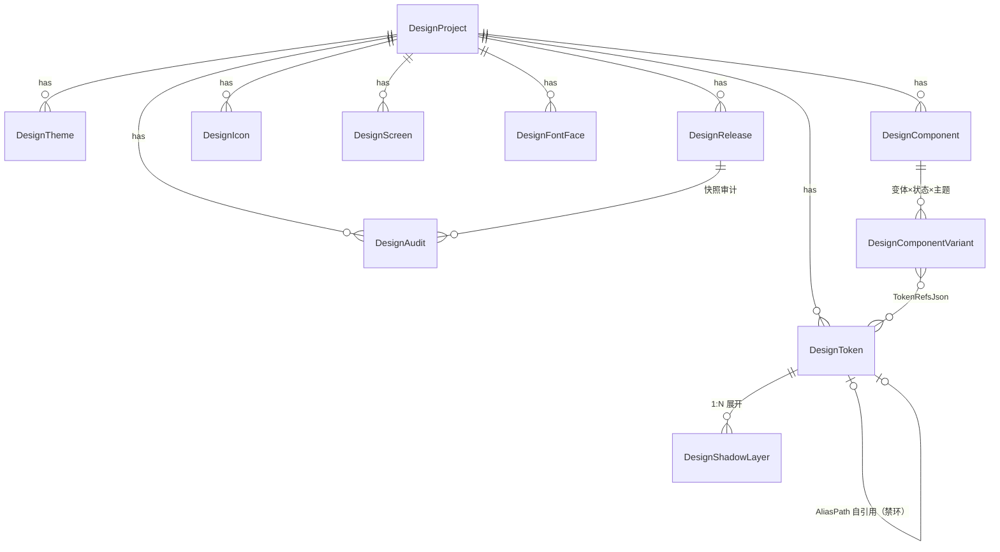
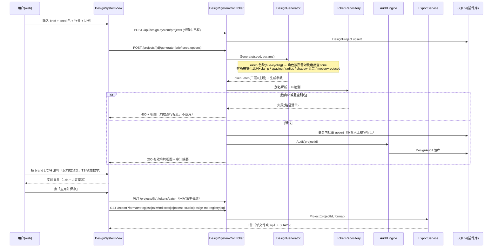
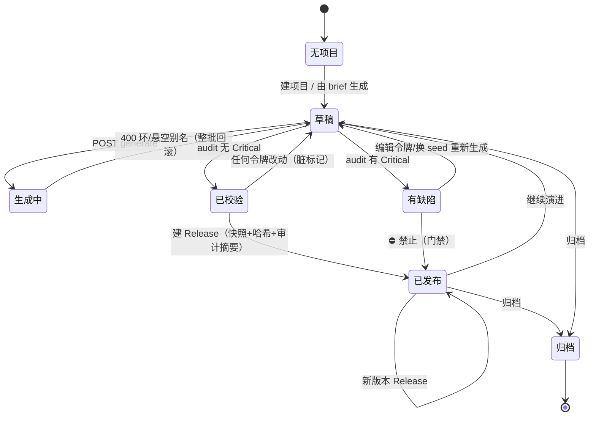
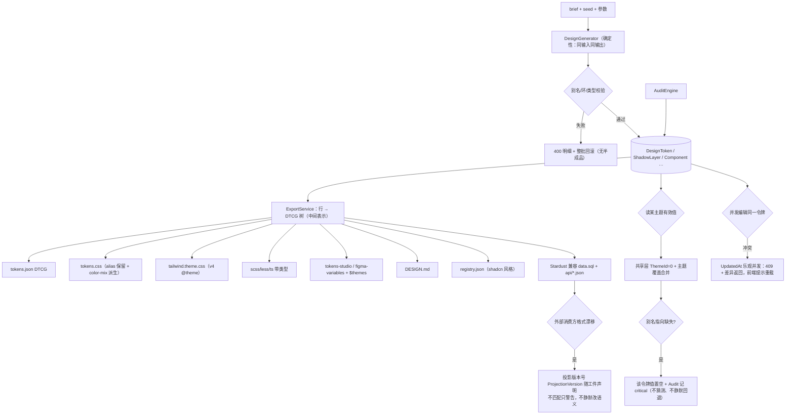

# Design — DesignSystem 插件 v2（架构 · 数据模型 · 端点 · 分期）

> 阶段：立项 Step 3｜Task ID：PILOT-ds-v2｜日期：2026-09-28
> 依据：`research.md`（Stardust A1–A4 + 行业 B1–B9）、`00-repository-understanding.md`（现状与红线）
> 流程图强制清单见 `plugin-feasibility-study` §四：**5 图 + 每图下方「画图发现的缺口」+ 文末汇总表**。

---

## 1. 分层架构

```
Plugins/DesignSystem/
├── plugin.json                     # v2.0.0，frontend 契约不变（views[0]=DesignSystemView）
├── DesignSystemPlugin.cs           # Apply(): 建表 → 种子 → 注册服务（现为 20 行 no-op）
├── DesignSystem.csproj             # 清死引用；随宿主构建
├── Data/
│   ├── Model.xml                   # ★ 11 表列/索引/默认值唯一真源 → xcode Model.xml 生成
│   ├── DesignSystemTables.cs       # ★ 建表唯一真源（铁律 12：先开库再 SetTables，异常不吞）
│   └── Entities/
│       ├── <Name>.cs               # xcode 生成，勿手改
│       └── <Name>.Biz.cs           # 人工：自定义查询/校验（唯一性一律直查 DB，铁律 11）
├── Services/
│   ├── Oklch.cs                    # sRGB↔Linear↔OKLab↔OKLCH、hue-cycling、混色（纯函数）
│   ├── ContrastMath.cs             # WCAG 2.2 相对亮度/比率、AA/AAA/非文本判级
│   ├── ColorRampGenerator.cs       # tone 目标 → 50..950 阶；彩度曲线；感知恒定修正
│   ├── SemanticResolver.cs         # 角色→所需比率→反查 tone（定向选取）；别名解析+环检测
│   ├── TypographyGenerator.cs      # 模块化比例 + fluid clamp()；type role 表
│   ├── ScaleGenerators.cs          # spacing / radius / shadow(分层) / border / motion(+reduced)
│   ├── DesignGenerator.cs          # brief → 参数包 → 全量令牌（确定性；seed/algorithm/version 落库）
│   ├── TokenRepository.cs          # 令牌读写/批量 upsert/路径树/别名图（对控制器的唯一门面）
│   ├── AuditEngine.cs              # 对比度矩阵 + focus + reduced-motion + 跨层违规 + 孤儿
│   ├── ExportService.cs            # 投影层：DTCG 树为中间表示 → 各目标格式
│   ├── Projections/DtcgTree.cs     # 行 → 点分路径 + $type 继承 + {alias} + $extensions
│   ├── Projections/*.cs            # CssVariables/TailwindV4Theme/Scss/TypeScript/TokensStudio/DesignMd/Registry/StardustSql/StardustJson
│   └── ReleaseService.cs           # 快照 + 哈希 + diff
├── Controllers/
│   └── DesignSystemController.cs   # [Authorize("ApiKeyPolicy")] 类级（铁律 17）
└── web/
    ├── scripts/gen-tokens-css.ts   # 保留（宿主预览基线）；改为从后端导出的 tokens.css 覆盖
    └── src/
        ├── http.ts                 # 新增：token from localStorage['forge_api_token']，直连后端
        ├── design/                 # 色彩数学 TS 镜像（仅预览用；后端为唯一真源）+ 黄金值同表单测
        ├── sections/…              # 10 个 section（见 §4）
        └── components/…            # 去硬编码：全部只消费 --ds-*
```

```mermaid
graph TD
  subgraph Host["宿主 ForgeSelf.Api"]
    PLG["插件加载器 ctx.EnsurePluginDataDirectory()"]
    AUTH["ApiKeyPolicy"]
  end
  subgraph DS["Plugins/DesignSystem"]
    subgraph API["Controllers/DesignSystemController"]
      E1["projects CRUD"]
      E2["generate / tokens CRUD"]
      E3["audit / releases / diff"]
      E4["export?format=… / {entity}.json"]
    end
    subgraph SVC["Services（纯逻辑，可单测）"]
      GEN["DesignGenerator → Ramp/Semantic/Typography/Scale"]
      AUD["AuditEngine → ContrastMath"]
      EXP["ExportService → Projections"]
      REPO["TokenRepository（别名图+环检测）"]
      REL["ReleaseService（快照+diff）"]
    end
    subgraph DATA["Data"]
      MX["Model.xml ★真源"]
      ENT["Entities/*.cs (xcode 生成)"]
      TBL["DesignSystemTables.EnsureCreated()"]
      DB[("SQLite ~/.forgeself/Plugins/design-system")]
    end
  end
  WEB["web/ Vue sections（读 API + 本地 TS 预览镜像）"] -->|HTTP + Bearer| API
  API --> SVC --> DATA
  PLG -->|Apply()| TBL --> DB
  AUTH -.->|类级特性| API
  GEN --> REPO
  EXP --> REPO
```

**画图发现的缺口**：
- G1 宿主建表不覆盖插件 → `Apply()` 必须调 `EnsureCreated()` 且**异常不得静默吞**（否则症状是"某张表神秘缺失"，与真因相距极远）。
- G2 前端"实时预览"与后端"权威生成"是两套色彩数学 → 必须显式声明**后端为唯一真源、前端仅预览、保存时回写**，否则两边算出的 hex 会漂。
- G3 `gen-tokens-css.ts` 现在把 CSS 写进受版本控制的 `src/styles/tokens.css`（构建前置步骤）→ 有了后端之后这份文件职责变成"宿主默认基线"，必须明确谁覆盖谁。

---

## 2. 数据模型（11 表，XCode EntityModel）

设计取舍（对照行业 B1/B2 与 Stardust A2 的缺口）：
- **一张 `DesignToken` 收并 Stardust 的 8 张分类表**：Stardust 那种"10 张按类别的表"是**字典不是令牌系统** —— 没有 tier、没有别名图、没有 mode 轴，无法表达 light/dark/brand 排列（行业 B2 明确：mode 是轴）。类别降级为 `Group`/`Type` 列。
- **保留 Stardust 三个好决策**：oklch 拆成数值列（可 SQL 插值/查询）、阴影一层一行、`AliasPath` 保留别名图。
- **双色值表示**（行业 B implication 3）：`Value`(解析后 hex/`oklch()`) + `ColorHex` + `OklchL/C/H` + `Alpha` + `ColorSpace` —— 对比度数学与 DESIGN.md lint 都要 sRGB 读数。
- **tier 与 mode 是列不是表**：`Tier(1 primitive|2 semantic|3 component)`、`ThemeId`（0 = 所有主题共用，主要用于 primitive）。
- **可达性是数据不是散文**（B implication 6/7）：`ContrastRatio`/`WcagLevel` 随色令牌计算落库。
- **生成参数随行持久化**（B implication 5）：`Generator`/`GeneratorSeed`/`GeneratorVersion` → 可复现、可 diff。
- `DesignFontFace` 归为**资产登记**而非令牌、`DesignScreen` 归为**交付清单**而非令牌（行业 B implication 11(e) 点名这两类不该进令牌表）—— 所以我们把它们做成独立表但语义上明确"非令牌"。
- 断点/z-index/栅格 **进 primitive tier**（补 Stardust 的缺口），图表系列色进 semantic（`chart.series-1..n`）。

| # | 表 | DisplayName | 关键列（除 Id/创改时间） | 唯一/辅助索引 |
|---|---|---|---|---|
| 1 | `DesignProject` | 设计系统项目 | Code(唯一), Name, Description, Version, Status(draft/published/archived), SeedText, SeedJson, Generator, GeneratorVersion, TokenCount, PublishedAt | `Code`；`Status` |
| 2 | `DesignTheme` | 主题 | ProjectId, Code(light/dark/high-contrast/…), Name, ModeKind(color/density), IsDefault, SortOrder, BaseThemeId, OverridesJson | `(ProjectId,Code)` |
| 3 | `DesignToken` | 设计令牌 | ProjectId, Tier, Path, Name, Type(color/dimension/fontFamily/fontWeight/duration/cubicBezier/number/string/shadow/border/gradient/typography/transition/strokeStyle), Value, ValueJson, AliasPath, ThemeId, Group, Description, Extensions, ColorHex, OklchL, OklchC, OklchH, Alpha, ColorSpace, IsPrimary, ContrastRatio, WcagLevel, Generator, GeneratorSeed, GeneratorVersion, Deprecated, SortOrder | `(ProjectId,ThemeId,Path)`；`(ProjectId,Tier)`；`(ProjectId,Group)`；`OklchH` |
| 4 | `DesignShadowLayer` | 阴影层 | TokenId, ProjectId, Layer, IsInset, OffsetX/Y, Blur, Spread, ColorValue, ColorAliasPath, Alpha, Usage | `(TokenId,Layer)` |
| 5 | `DesignComponent` | 组件 | ProjectId, Code, Name, Category(primitive/shell/page/kit-chrome), Description, Interactive, DocJson(props/用法/do-don't), A11yNotes, Status(demo/ready/deprecated), SourceRef | `(ProjectId,Code)`；`Category` |
| 6 | `DesignComponentVariant` | 组件变体 | ComponentId, ProjectId, Code, VariantJson(如 {size:lg}), State(default/hover/active/focus/disabled/loading/error), ThemeId, TokenRefsJson(背景/文字/边框→令牌 Path 引用), CssSnippet, Description | `(ComponentId,VariantJson,State,ThemeId)` |
| 7 | `DesignIcon` | 图标 | ProjectId(0=内置库), Code, Collection(lucide/tabler/custom), SvgBody, StrokeWidth, GridPx, Sizes, Tags, Usage, License | `(ProjectId,Code)`；`Collection` |
| 8 | `DesignScreen` | 页面清单 | ProjectId, Code, Title, IconCode, Route, Description, ComponentIdsJson, Notes | `(ProjectId,Code)` |
| 9 | `DesignFontFace` | 字体资产 | ProjectId, Family, Weight, Style, FileName, Display(swap/…), Role(sans/mono/…), SourceUrl, License | `(Family,Weight,Style,ProjectId)` |
| 10 | `DesignAudit` | 审计结果 | ProjectId, ReleaseId, Kind(contrast/focus/reduced-motion/tier-violation/orphan/unused), Severity(critical/warning/info), TargetType, TargetPath, PairedPath, Expected, Actual, Ratio, Passed, Message, CheckedAt | `ProjectId,Kind`；`(ProjectId,Passed)` |
| 11 | `DesignRelease` | 版本快照 | ProjectId, Version, TokensHash, SnapshotJson, ReleaseNotes, SourceReleaseId(供 diff), AuditSummary, CreatedAt | `(ProjectId,Version)` |

**关键语义规则**
- `Path` 点分小写 kebab（`color.brand.500`、`semantic.surface-1`、`component.button.primary.background-hover`）；导出时按目标命名法转换。
- `AliasPath` 只允许 高层→低层（component→semantic→primitive；同层允许）；解析深度上限 16；**检出环 → 生成失败并返回参与环的路径清单**（不是静默取最后一个）。
- `ThemeId=0` 的行是跨主题共享（primitive 基线）；主题行是覆盖（override），查看某主题有效值 = 共享层 + 主题覆盖层按 Path 合并。
- 复合类型（shadow/typography/transition/gradient/border）：`ValueJson` 存 DTCG 复合对象，`shadow` 的每层**同时**进 `DesignShadowLayer`（一处真源 + 一层展开便于查询；导出以 `ValueJson` 为准，两者由服务层保持一致写入）。



**画图发现的缺口**：
- G4 自引用 `AliasPath` + 主题覆盖 → "某令牌在某主题的**有效值**"是两层合并结果，必须有单一函数（`TokenRepository.ResolveEffective`）负责，不能散在各投影里。
- G5 `DesignComponentVariant` 唯一索引含 JSON 文本列（XCode/SQLite 可对 `VariantJson` 建唯一索引，但键序不同即视为不同值）→ 必须**规范化序列化**（键排序）后再入库，否则幂等 upsert 会产生重复行。
- G6 `DesignToken` 一行复合令牌与 `DesignShadowLayer` 展开行是**双写** → 谁为真源必须写死（`ValueJson` 真源，层表为查询投影），并在单测里锁死一致性。
- G7 图标 `ProjectId=0` 表示"内置库"是魔法值 → 改为文档化常量并在鉴权/删除路径上显式拒绝改内置库。

---

## 3. 主流程时序（生成 + 编辑 + 导出）



**画图发现的缺口**：
- G8 生成落库时"人工已覆写的令牌"如何处理？→ 令牌需 `Generator` 列区分 `generated|manual`，重新生成默认**跳过 manual 行**并返回冲突数（提供 `overwrite=true` 显式全量重来）。
- G9 前端滑杆预览与保存之间，语义令牌（如 `semantic.text-1`）该随 primitive 变化而重推导 → 必须明确**预览期只改 primitive 层 + 别名自动重解析**，而不是前端硬算派生角色（前端算不出来的部分保存时由后端重推）。
- G10 导出大项目（数千令牌）单响应可能 >几 MB → 需分页/按 group 导出 + zip 流式；先在 spec 里标 `Unknown`（实测阈值后定）。
- G11 400 失败时是否留下半成品？→ 必须整批事务（全或无），失败不落任何行。

---

## 4. 界面（前端 section → 库驱动）

| Section | 职责（全部读写后端，不再是静态 fixture） | 处置 |
|---|---|---|
| `Projects.vue` | 项目 CRUD、版本徽标、release 列表、diff 视图 | 新增 |
| `TokenStudio.vue` | 三层树 + 主题切换 + 值/别名编辑 + 别名解析实时显示 + 逐行对比度读数 + 校验错误内联 | 新增 |
| `ColorLab.vue` | 种子 → 色阶矩阵、hue-cycling 曲线、对比度热力图、角色定向选取可视化、AA/AAA 反查 | 新增 |
| `TypeScale.vue` | 模块化比例、fluid `clamp()` 生成、type role 表、字体资产登记 | 新增 |
| `DensityScales.vue` | spacing/radius/border + 密度排列 | 新增 |
| `ShadowMotion.vue` | 阴影**逐层**编辑器 + 动效曲线（cubic-bezier 可视化）+ reduced-motion 派生 | 新增 |
| `ComponentGallery.vue` | 从 `DesignComponent`/`Variant` + component tier 令牌渲染真实变体×状态矩阵（**删除写死的 SRE fixture** `:38-58`） | 重写 |
| `IconLibrary.vue` | 内置库 + 项目图标检索、SVG 实渲、stroke/grid 令牌 | 新增 |
| `ThemeLab.vue` | Stardust tweaks 面板的全令牌版：theme/density/brand L-C-H + 任意令牌覆盖，保存进 `DesignTheme` | 新增 |
| `AuditBoard.vue` | 审计台（对比度矩阵/focus/reduced-motion/跨层违规/孤儿），可导出报告，Critical 未清不许发布 | 新增 |
| `ExportCenter.vue` | 投影格式选择 + 预览 + 下载 + zip + SHA256 + 历史 | 新增 |
| `TokenShowcase.vue` | 改为**接受 props + 读库令牌**（去掉 `:6-8/:93/:102/:181` 的写死标签） | 重写 |
| `console/*.vue`（5）、`marketing/MarketingSite.vue` | 它们的正确定位是**组件库的示例消费者**（用 component tier 渲染）；保留但改为数据驱动 + 去死按钮 | 改造（无处理器按钮必须删除或接上） |

**UI 硬性规范**（`plugin-development` §3.4，逐条落到 AC）：点即保存 / 部分更新（`{value?} {aliasPath?} {description?}` 分传）/ 操作成败可见（失败留窗打印原因）/ 空态分级（未选项目 / 项目无令牌 / 生成失败 / 审计无问题）/ 令牌树筛选+分页边界 / 破坏性操作 `ElMessageBox.confirm` + 可单测的确认编排纯函数 / 根视图版本徽标。



**画图发现的缺口**：
- G12 "脏标记"必须有持久字段（否则刷新后丢失）→ `DesignProject.Status` + 审计时间戳与 `token.updatedAt` 比较派生 `dirty`，不新增列。
- G13 Release 后仍可改令牌 → 明确 Release 是**快照**（`SnapshotJson` 不可变），改动只影响草稿态；diff 只在两个快照之间做。
- G14 归档/删除项目是破坏性操作 → 二次确认 + 只软删（`Status=archived`），**永不删库文件**（铁律 10）。

```mermaid
flowchart LR
  N["新增一类设计对象<br/>（如 图表系列色 / 断点 / z-index）"] --> Q1{是"值"类令牌吗?}
  Q1 -- 是 --> A1["只加 primitive/semantic 令牌行<br/>Type=dimension/color/number<br/>零 schema 改动"]
  Q1 -- 否 --> Q2{是新种类的实体?<br/>（如动效关键帧库）}
  Q2 -- 否, 属现有表 --> A2["扩列 → 改 Model.xml → xcode 生成<br/>（禁止手改 Entities/*.cs，业务进 .Biz.cs）"]
  Q2 -- 是 --> A3["Model.xml 加表 → xcode → DesignSystemTables.EntityTypes 登记<br/>→ Repository 门面 → 控制器投影 → 导出投影 → e2e"]
  A1 --> CAP{"投影层需要新格式?"}
  CAP -- 是 --> A4["加 Projections/Xxx.cs 实现 IProjection<br/>+ golden-file 单测（不改表）"]
  CAP -- 否 --> Done["完成"]
  A4 --> Done
```

**扩展判定树 · 画图发现的缺口**：
- G15 派生令牌"类型"必须封闭枚举（与 DTCG `$type` 一一对应）；新增 `$type` 是**契约变更**（影响所有投影），要走 ADR 而非随手加 → 落 `Forbidden` 到 04-task。
- G16 若某类对象需要新查询形状（例如按 hue 区间检索色），索引/列必须现在预留（已加 `OklchH` 索引），否则改表成本随数据量上升。

---

## 5. 数据流与降级（格式漂移 / 失败面）



**降级图 · 画图发现的缺口**：
- G17 悬空别名**不得回退猜测**（行业 B1：别名是字符串，解析失败必须显式）→ 值置空 + critical 审计。
- G18 Stardust 兼容投影（`data.sql` / `api/*.json`）是**对外契约**：必须带 `ProjectionVersion`，且我们的列名与其 88 列**不 1:1**（我们合并了表）→ 兼容投影按"逻辑实体名"重组（`design-color`/`design-shadow`/…），不暴露我们的物理表。踩坑记录：`design-system.data.sql:5` 本身 truncate 语句非法，我们生成时不得照抄。
- G19 宿主 API token 缺失/过期 → 插件 `http.ts` 必须给**分级空态**（"未登录宿主：无法读取设计系统"），不能白屏。
- G20 后端不可用（宿主未起）→ 前端不得静默用 localStorage 假装成功；v1 的 `storage.ts` 降级只允许作为**离线草稿缓存**并显式标注"未落库"。

---

## 6. 扩展性必答四问（技能 §五）
1. **新对象怎么加**：值类对象（断点、z-index、图表系列、新色阶）**声明式**——只加令牌行，不改代码不改表；只有新 `$type`（封闭枚举）或新实体才改 `Model.xml` → `xcode` 生成（见 §4 判定树）。
2. **新能力面怎么加**：以"能力面（Facet）"建模——`projects|tokens|generate|audit|export|releases|icons|components|screens|themes`，每面独立端点 + 独立投影；前端对**未知能力面显式降级**（能力清单来自 `GET /api/design-system/meta`，不在清单里的 tab 灰掉并写"本版本不支持"），不崩。
3. **契约放哪层**：全部**插件私有**（`ForgeSelf.Api.Plugins.DesignSystem.*` + 路由前缀 `api/design-system`）。不上移 `ForgeSelf.Abstractions`——行业 B implication：底座先自用（本插件界面 + 导出工件被其他插件消费），**出现第二个服务端消费者时**再出 ADR 上移令牌读取契约（`architecture-design` 负责，本设计不自裁）。
4. **外部格式漂移怎么发现**：三层版本号——① `ModelVersion`（Model.xml 已有属性）② `GeneratorVersion`（令牌行携带，决定可复现性）③ `ProjectionVersion`（导出工件头声明）。`GET /api/design-system/meta` 返回三者；e2e 断言 meta 与 `plugin.json` 版本自洽；投影端读取时若 `ProjectionVersion` 高于自身则只告警不改义。

---

## 7. 分期（P0→P3）与决策清单

| 期 | 内容 | 里程碑 |
|---|---|---|
| P0 | 库 + 建表 + 令牌/项目/主题 CRUD + 生成引擎（oklch 色阶/对比度定向/排版/尺度）+ 审计 | M1+M2 |
| P0 | 投影：DTCG / CSS / Tailwind v4 / Tokens Studio / Stardust 兼容 JSON+SQL | M3 |
| P1 | 前端 10 section 重写为库驱动 + ThemeLab 全令牌微调 + 去硬编码色值 | M4 |
| P1 | 门禁四步 + e2e 全链路 + v2.0.0 发布 + 走查 | M5 |
| P2 | `registry.json` / DESIGN.md / SCSS/LESS/TS 投影、release diff UI、组件文档与 a11y 标注编辑 | M6 |
| P2 | 可选 **LLM 精修模式**：用宿主 AIAgent 把 brief 解析成生成参数（**仍由确定性引擎产出令牌**，LLM 不直接吐 hex）——把 v1 ROADMAP 的 P2.1 以"参数解析器"而非"codegen"形态兑现 | M7 |
| P3 | 多宿主界面消费 `--ds-*`（宿主主题注入）、采用度遥测、预设分享 | M8 |

| # | 决策 | 背景 | 理由 | 准则 |
|---|---|---|---|---|
| D1 | 后端从"空壳"升级为 11 表 XCode 库 | 用户要"不是玩具"；ROADMAP P1.1 从未开工 | 没有库就没有别名图/模式/版本/审计，所有"完整设计功能"都无落点 | 设计系统状态一律服务端持久；localStorage 只作离线草稿标注 |
| D2 | 一张 `DesignToken` 取代"按类别多表" | Stardust 的 10 表按类别切 | 行业 B2：tier×mode 是轴；按类别切表无法表达主题排列 | 类别 = `Group`/`Type` 列，不是表 |
| D3 | 不追 brief→UI codegen，改做"库 + 校验 + 版本 + 标准投影" | B9：v0/Stitch/Make 已占位 | 我们的差异化与不可替代性在底座，不在一次性输出 | 生成器必须确定性、可复现、可 diff |
| D4 | 色阶用自实现 oklch + 对比度定向选 tone，不装 colorjs.io/culori | v1 是一条写死 L/S 曲线；B3/B4 给了真机制 | 避免新依赖（沙箱装包风险）；纯函数利于双端同表单测 | 引入新依赖须升级给人 |
| D5 | 不做 APCA 门禁，只作参考读数 | B4：APCA 已从 WCAG3 草案移除，2.x ~2030 前规范 | 门禁必须绑规范而非新奇度量 | Critical 判据 = WCAG 2.2 AA |
| D6 | 不改插件名（`DesignSystem`/`design-system`） | 技能 §三 名实相符三问 | 三问全过；改名要牵动宿主路由/菜单 e2e 与已发布版本，收益零 | 命名在功能定稿后 |
| D7 | 契约留在插件内，不上移 Abstractions | 技能 §五 问3 | 暂无第二个服务端消费者 | 出现第二个消费者即出 ADR |
| D8 | 提供 Stardust 兼容只读投影 | A3：`api/index.json:4` 自陈"换成真实 API 只需替换 url" | 直接验证"我们的库能承载参考物"，且给外部查看器插座 | 兼容投影按逻辑实体名，不暴露物理表 |
| D9 | `console/*`、`marketing/*` 保留但改为库驱动的示例消费者 | 现在是静态死按钮页 | 它们是有价值的"设计系统落地示范"，删了等于丢需求；留着不改 = 玩具 | 按钮要么接上要么删除，禁止无处理器控件 |
| D10 | 审计 Critical 未清零禁止发布 Release | v1 的 `selfCheck` 是散文 | 可达性必须是数据与门禁 | 门禁 = WCAG 2.2 AA 4.5:1 / 非文本 3:1 |

## 8. 图解自查：发现的缺口与处置（汇总）

| 缺口 | 出处 | 处置 | 落 Task |
|---|---|---|---|
| G1 插件建表不被宿主覆盖、异常静默吞 | §1 | `Apply()` 调 `EnsureCreated()`，异常记日志并抛出 | T101 |
| G2 双端色彩数学漂移 | §1 | 后端唯一真源；TS 镜像只预览；同表黄金值双端单测 | T104/T201 |
| G3 `tokens.css` 生成物职责不清 | §1 | 明确"后端导出覆盖宿主预览基线"，写入 spec AC | T108 |
| G4 有效值两层合并 | §2 | `TokenRepository.ResolveEffective` 单点负责 | T103 |
| G5 变体唯一索引含 JSON 列键序 | §2 | 入库前规范化序列化（键排序） | T106 |
| G6 复合令牌双写 | §2 | `ValueJson` 真源 + 一致性单测 | T103 |
| G7 内置图标库 `ProjectId=0` 魔法值 | §2 | 常量 + 显式拒改内置库 | T107 |
| G8 重新生成覆盖人工覆写 | §3 | `Generator=manual` 行默认跳过，冲突数返回 | T102 |
| G9 预览期派生层如何跟随 | §3 | 预览只改 primitive + 别名重解析；派生角色保存时后端重推 | T201 |
| G10 大项目导出体积 | §3 | `Unknown`：实测阈值后决定分页/流式（见 02-spec §Unknown） | T302 |
| G11 失败留半成品 | §3 | 整批事务全或无 | T102 |
| G12 脏标记持久化 | §4 | 由 `updatedAt` vs 最近审计时间派生，不加列 | T108 |
| G13 Release 可变性误解 | §4 | Release = 不可变快照；diff 只在快照间 | T109 |
| G14 破坏性归档 | §4 | 软删 + 二次确认编排纯函数；永不删库 | T110 |
| G15 新 `$type` 是契约变更 | §4 | 封闭枚举 + Forbidden 条款 | 各 task |
| G16 查询形状未预留 | §4 | 预留 `OklchH` 等索引 | T101 |
| G17 悬空别名回退 | §5 | 值置空 + critical 审计，不猜 | T103 |
| G18 兼容投影与物理表泄漏 | §5 | 逻辑实体名重组 + `ProjectionVersion`；不照抄其非法 SQL | T301 |
| G19 宿主 token 缺失 | §5 | 分级空态文案 | T111 |
| G20 后端不可用假装成功 | §5 | 离线草稿显式标注"未落库" | T111 |
