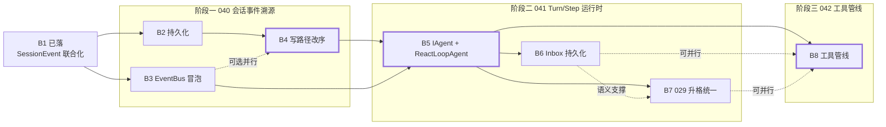

# dsh 架构对齐：B2–B8 任务分解（施工版）

> 功能编号：dsh 架构对齐专项（040–042）· 任务分解
> 状态：分解完成，待排期施工（2026-09-28）
> 作者：架构师（高见远）
> 前置：B1 已落地（代码在工作区，尚未提交）
> 关联：总纲 [`02-spec.md`](02-spec.md)；施工总览 [`03-plan.md`](03-plan.md)；详细设计（原 `specs/040|041|042` 三份详细设计稿已被 `.gitignore` 忽略、不入库，要点摘要见 [`02-spec.md`](02-spec.md)）

> **本文档的性质**：只做「现状核对 + 任务分解」，不改代码，也不推翻 040/041/042 的设计结论。
> 唯一例外是**设计稿与代码实证不符**之处——按用户「不考虑历史包袱、按正确方案落地」的拍板，
> 这些地方以**代码实证为准**修正实施路径，并在 §1 逐条标注 `不符 / 需先决`。

## 0. 一条主线（贯穿 B2–B8，每批门禁都要能回答）

```
一切进模型的东西，必须先落日志，再从日志派生出来。
（Model-visible means logged）
```

判据（B4 落成测试，B5–B8 不得回退）：

> 你在 `ISessionStore` 里塞一次坏数据，模型就一定看到坏数据。
> 只要还存在「表里有、日志没有」的消息，就没改完。

---

## 1. 现状核对表（2026-09-28 实读，`Verified` = 已 grep / 已读文件实证，`Inferred` = 推理未复跑）

### 1.1 B1 已落（作为基线，不重做）

| # | 设计文档主张 | 代码实际情况（文件:行） | 判定 |
|---|---|---|---|
| A1 | `SessionEvent` 改抽象 record + 13 子类 | `ForgeSelf.Abstractions/SessionEvents.cs:12-118`（抽象 record + 13 子类 + 5 枚举 + `ToolCallRef`/`UsageInfo`/`InboxItem`） | 一致 · Verified |
| A2 | `SessionEventMap` + 运行时双向校验 | `ForgeSelf.Abstractions/SessionEventMap.cs:10-25`（13 条注册）、`:35-42 EnsureKnown`（类型名未注册 **或** record 不符均抛）、`:45-48 KnownTypes/IsKnown` | 一致 · Verified |
| A3 | `ISessionStore` 契约 = Append/Replay/DeriveMessages/Fork/Observe | `ForgeSelf.Abstractions/ISessionStore.cs:11-30` | 一致 · Verified |
| A4 | `Append` 首行 `EnsureKnown`；`DeriveMessages` switch 穷举 | `ForgeSelf.Api/Services/InMemorySessionStore.cs:26`、`:67-110`（`default: throw UnknownSessionEventException`） | 一致 · Verified |
| A5 | `Message` 补 `CallId/ToolCalls/Usage` | `ForgeSelf.Abstractions/ILlmRuntime.cs:14-21`（`Role/Content` 不变） | 一致 · Verified |
| A6 | `ChatController` 投 `UserMessageEvent`/`AssistantMessageEvent` | `ForgeSelf.Api/Controllers/ChatController.cs:97-98`、`:124-126` | 一致 · Verified |
| A7 | 契约基类 + 实现级测试 | `ForgeSelf.Abstractions.Tests/SessionStoreContractTests.cs:13`（`abstract SessionStoreContractTestsBase`，5 条）、`ForgeSelf.Api.Tests/Services/InMemorySessionStoreB1Tests.cs`（6 条） | 一致 · Verified |

### 1.2 与 B2–B8 直接相关的现状（逐条含实证）

| # | 设计文档主张 | 代码实际情况（文件:行） | 判定 |
|---|---|---|---|
| B2-1 | `ISessionStore` 只有内存实现 | `ForgeSelf.Api/AppBuilder.cs:119` `AddSingleton<ISessionStore, InMemorySessionStore>()`；全仓 `ISessionStore` 实现类仅 `InMemorySessionStore`（`InMemorySessionStore.cs:15`） | 一致（B2 目标）· Verified |
| B2-2 | 持久化落 Sqlite/XCode，实体带 `SessionId` 索引 | XCode 只在宿主引用：`ForgeSelf.Api/ForgeSelf.Api.csproj:42` `NewLife.XCode 12.0`；Abstractions/Core 均无 → 实体与实现**必须**落 `ForgeSelf.Api`。连接名与建表现成：`ForgeSelf.Api/Data/XCodeConfig.cs:16` `HostDbs = {"ForgeSelf"}`、`:88` `DAL.AddConnStr(name, connStr, null, "SQLite")`、`:159-191` `EnsureTablesCreated()` 反射全量建表（新增实体自动建，无需迁移脚本）。索引写法样板：`ForgeSelf.Api/Entities/ChatMessage.cs:20-23` `BindIndex` + `BindTable(..., ConnName="ForgeSelf")` | 一致 · Verified |
| B2-3 | 「同一套契约测试跑两个实现」 | 契约基类在 `ForgeSelf.Abstractions.Tests`；`ForgeSelf.Api.Tests/ForgeSelf.Api.Tests.csproj` **未引用** `ForgeSelf.Abstractions.Tests`（只有 Api + 各插件） | **需先决**：B2 开工第一步补 `ProjectReference`（仅测试项目，零生产影响），否则契约只能复制一份 · Verified |
| B2-4 | `PayloadJson` 存放 record 完整序列化 | `System.Text.Json` 反序列化抽象基类**无内建多态支持**，必须写 `JsonConverter<SessionEvent>`（按 `Type` → `SessionEventMap.Resolve` 选目标类型）。13 个 record 均为 `sealed record`，无多态陷阱 | **需先决**（设计稿未提，实现必补）· Verified |
| B3-1 | `EventBus` 不跨上下文 | `ForgeSelf.Core/Context.cs:24` `private readonly EventBus _events = new();`（无 parent）；`:26-34` 构造未接收父总线；`ForgeSelf.Core/EventBus.cs:5-138` 无 parent 字段 | 一致（B3 目标）· Verified |
| B3-2 | `Context(parent)` 派生时传父总线即可，`Fiber` 不改 | `Context.cs:76` `Derive() => new Context(this)`；`ForgeSelf.Api/Plugins/PluginManager.cs:623` `new Fiber(_rootContext)` → Fiber 经 Context 链继承，成立 | 一致 · Verified |
| B3-3 | 「平台级单例总线已接线 `tools/*`」= 冒泡到根即可 | **不成立**：`PluginManager.cs:30` `private readonly Context _rootContext = new();` —— 根 Context 自建 `EventBus`，与宿主 DI 单例 `IEventBus`（`AppBuilder.cs:111` `AddSingleton<IEventBus>(new EventBus())`）**不是同一实例**。`AppBuilder.cs:257` 只是事后赋值 `pluginManager.EventBus = ...`，未进 Context 链。`ToolRegistry` 构造注入的是 DI 单例（`ToolRegistry.cs:17`）。→ 仅做「Context 树内冒泡」**无法**让插件 emit 触达 `tools/*` | **不符**：B3 必须额外打通「根 Context 总线 ← 宿主单例总线」· Verified |
| B3-4 | `IEventBus` 公开签名不变 | `ForgeSelf.Core/IEventBus.cs:7-29`（4 分发 + 3 注册，**无 CancellationToken 参数**）；`EventBus.cs:106-109` `WaterfallAsync(name, payload, Func<Task<TResult>> fallback)` —— `fallback` **必填** | 一致（B3 门禁）；但与 041/042 代码示例 **不符**（见 B5-3/B8-3）· Verified |
| B4-1 | `ChatController` 双写，`_sessionStore?.Append` 是旁路 | `ChatController.cs:95,122,173,212` `SaveMessageSafeAsync(...)`（写 `ChatMessage` 表）；`:24` `ISessionStore?` 可空注入；`:97,123` `_sessionStore?.Append`（影子）；**`:101,176` `history = await _messageService.GetHistoryAsync(sessionId)` ← 模型输入真相源仍是 ChatMessage 表** | 一致（B4 目标）· Verified |
| B4-2 | `AIChatController` 同理 | `Plugins/AIAgent/Controllers/AIChatController.cs:67,113,176,210` `SaveMessageAsync`；`:69,178` `GetHistoryAsync`；`:83,189` `RunAgentLoopAsync(aiMessages, ...)` | 一致（B4 目标）· Verified |
| B4-3 | 投影同步器 `Subscribe(async evt => ...)` | `ISessionStore.Append` 是**同步** API（`ISessionStore.cs:14` `long Append(...)`）；`IMessageService.SaveMessageAsync` 是 `Task`。`Subscribe(async ...)` 是 **async void 火后即忘** → 与 `ChatControllerIntegrationTests.cs:166-192 SendMessage_ShouldSaveMessagesToDatabase`（POST 后立即 GET history 断言 2 条）形成竞态 | **不符**：投影必须可显式 await，见 §2.4 风险 R1 · Verified |
| B5-1 | 主循环 `for(i<10)`，无 turn/step | `Plugins/AIAgent/Services/AIAgentService.cs:205-206` `const int maxIterations = 10; for (var iteration = 0; iteration < maxIterations; iteration++)`；循环内 `:240,246,274` 直接 `messages.Add(...)`，**不落日志** | 一致（B5 目标）· Verified |
| B5-2 | `IAgentLoop`/`InMemoryAgentLoop` 删除 | `ForgeSelf.Abstractions/IAgentLoop.cs:34`；`ForgeSelf.Api/Services/InMemoryAgentLoop.cs:12`；注册点 `AppBuilder.cs:121`、seed 点 `PluginManager.cs:205`；**生产消费方 0**（仅测试：`ForgeSelf.Abstractions.Tests/AgentLoopContractTests.cs`、`ForgeSelf.Api.Tests/Services/AgentLoopAndInboxTests.cs`） | 一致（删除面小，可安全删）· Verified |
| B5-3 | 041 代码示例 `WaterfallAsync("agent/pre-step", ctx)` | 实际 `WaterfallAsync` **必填** `fallback`（`IEventBus.cs:13`），且无 `ct` 参数 | **不符**：B5/B8 必须按现有签名调用（`fallback` 传默认决策；`ct` 塞进 payload 或不用）· Verified |
| B5-4 | 新增 `Plugins/AIAgent/Services/AgentRegistryService.cs` | **该文件已存在且被占用**：`Plugins/AIAgent/Services/AgentRegistryService.cs:11-23` `IAgentRegistryService`（Agent 人设/定义注册表：`RegisterAgent/GetAgent/...`） | **不符**：B5 的新运行时注册表改名为 `AgentRuntimeRegistry.cs`（类 `AgentRuntimeRegistry : IAgentRegistry`），避免同目录同名冲突 · Verified |
| B6-1 | `IInbox` 是三 void，未被消费 | `ForgeSelf.Abstractions/IInbox.cs:9,12,15` `Followup/Steer/Inject`；`ForgeSelf.Api/Services/InMemoryInbox.cs:11`；全仓无 loop 侧 `Claim` 调用 | 一致（B6 目标）· Verified |
| B7-1 | 复用 `AgentRun/AgentStepRun`（029 双表） | 实体在 `Plugins/AIAgent/Data/Entities/AgentRun.cs`；编排 `Plugins/AIAgent/Services/RunOrchestratorService.cs:46`（`RunAsync/ResumeAsync/RestartAsync/CancelAsync/InterveneAsync`）、`StepRunLoopService.cs:74`（`RunStepLoopAsync`，`StepRunResult` 含 `Stuck`） | 一致（B7 目标）· Verified |
| B7-2 | 029 有回归面 | 现有测试：`ForgeSelf.Api.Tests/Integration/RunOrchestratorTests.cs`、`Integration/AgentRunPersistenceTests.cs`、`Integration/AgentRunsControllerTests.cs`、`Unit/AgentRunStatusTests.cs` | 需先决（B7 动手前先补行为快照）· Verified |
| B8-1 | `tools/execute` / `tools/post-execute` 用广播（无效接线） | `ForgeSelf.Api/Services/ToolRegistry.cs:323-324` `await _events.EmitAsync("tools/execute", ctx); await _events.EmitAsync("tools/post-execute", ctx);` | 一致（B8 修正目标）· Verified |
| B8-2 | `tools/pre-execute` 是 `string?` 二态 | `ToolRegistry.cs:264,286,305` —— **三处**调用 `SerialAsync<ToolCallContext, string?>`（工具不存在 / 参数校验失败 / 正常路径）。设计稿按 1 处写 | 一致；**实施面=3 处**（设计稿漏列）· Verified |
| B8-3 | 042 的 `WaterfallAsync("tools/execute", exec, terminal: ...)` | 实际签名 `WaterfallAsync<TEvent,TResult>(name, payload, Func<Task<TResult>> fallback)`，**无命名参数 `terminal`、无 `ct`** | **不符**：按现有签名落码，`fallback` = `InvokeToolBodyAsync` · Verified |
| B8-4 | 新增 `ToolExecutionResult`（`CallId/ResultJson/Outcome/...`） | **已存在同名类型**：`ForgeSelf.Abstractions/ToolDtos.cs:36-44` `{Success, Result, ErrorMessage, ToolName, DurationMs}`；使用面 7 个文件 + 2 个插件（`Plugins/AIAgent/Services/ToolFunctions/UniversalTool.cs:95`、`Plugins/McpCenter/Services/UniversalToolForwarder.cs:112`）+ 约 20 处测试断言 | **冲突**：B8 必须在既有类型上**扩展字段**（新增 `CallId/Outcome/DenyReason`，保留 `Success/Result/ErrorMessage`），**禁止新建同名类型**（CS0104 + 大面积破坏）· Verified |
| B8-5 | `IToolRegistry` 重写为 3 方法 | 现有 8 方法（`IToolRegistry.cs:3-14`）。`GetAllTools` 被 `AIChatController.cs:393` 用、`GetToolDefinitions` 被 `AIAgentService.cs` 用、`ValidateParameters/UnregisterTool/GetTool` 被测试与内部用 | **不符**：B8 保留「注册 + 查询」6 方法，只替换/新增执行面 · Verified |
| B8-6 | 删 `ExecuteToolWithResultAsync` / `ExecuteToolWithTimeoutAsync` | 生产调用方：`UniversalTool.cs:95`、`UniversalToolForwarder.cs:112`、`AIAgentService.cs:264`（超时版）、`AIAgentService.cs:943`（超时版）；测试调用方 ~18 处（`Unit/ToolRegistryTests.cs`、`Integration/ToolRegistryIntegrationTests.cs`、`Plugins/UniversalToolTests.cs`、`Plugins/McpCenterTests/*`） | **高风险**：建议 B8 保留旧方法为**薄适配层**（委托 `ExecuteAsync`），调用方另起批次迁移 · Verified |
| B8-7 | 改 waterfall 会打断既有监听 | `ForgeSelf.Api.Tests/Unit/ToolRegistryEventBusTests.cs:32,37,71,76,114,119` 用 `bus.On<ToolCallContext>` 订阅 execute/post-execute（3 条用例）→ 改 waterfall 后**不再被触发** | **需先决**：B8 门禁必须同步把这 3 条改为 `OnWaterfall` · Verified |
| B8-8 | `StreamChunk` 补 `ToolCall/Usage/FinishReason` | `ILlmRuntime.cs:27-34` 仅 `Content/IsFinal`。**另发现**：`ForgeSelf.Api/Services/AIServiceLlmRuntime.cs:26-28` 把 `Message` 降级为 legacy `AIChatMessage` 时**丢掉** `CallId/ToolCalls/Usage` → B8 不补映射的话，`DeriveMessages` 产出的 `tool` 角色消息根本进不了模型 | 一致 + 附加缺陷 · Verified |
| X1 | 提交纪律（每批一次提交） | `git status`：B1 的 6 改 4 新增**全部未提交**（`SessionStoreContractTests.cs`/`ILlmRuntime.cs`/`ISessionStore.cs`/`ChatController.cs`/`InMemorySessionStore.cs`/`SessionStoreAndLlmRuntimeTests.cs` + `SessionEventMap.cs`/`SessionEvents.cs`/`InMemorySessionStoreB1Tests.cs`/3 份设计文档） | **需先决**：B2 开工前先提交 B1 · Verified |
| X2 | 门禁基线 | Abstractions.Tests 15/15 全过；Api.Tests 1487 条 → 通过 1472 / 失败 15（**既有失败**：WorkflowPlanning 6 条 404 路由未注册、TerminalCommandGuard 1 条大小写、ScriptRunner 4 + Sems Runner 2 PowerShell/进程环境、ForgeConfig 1 flaky） | 基线留档；每批门禁 = **不新增失败**（15 条既有失败需原样保留）· Inferred（引自 B1 实测，未本地复跑） |

---

## 2. B2–B8 逐批任务分解

> 每节的「门禁测试清单」是给 QA 的**直接作业单**：测试名 + 断言照抄即可。
> 通用前置（每批都要）：`dotnet build` 编译通过 + `dotnet test` **不新增失败**（基线见 X2）。

### 2.1 B2 · `ISessionStore` 持久化（Sqlite/XCode）

**目标**：内存实现退为测试替身；日志落盘，进程重启可逐字回放。

**验收判据（可测试）**
- A1：`PersistentSessionStore` 与 `InMemorySessionStore` 跑通**同一套**契约测试（5 条 × 2 实现 = 10 次执行）。
- A2：新实例读同一库 → `Replay` 出的事件序列 `Id/SessionId/Timestamp/Type/内容` 与写入**逐字一致**。
- A3：两个 `SessionId` 并发 `Append` 不串号，`Id` 全局单调。
- A4：库中存在 `SessionEventMap` 未注册的 `Type` → `Replay` 抛 `UnknownSessionEventException`（防静默丢历史）。
- A5：`SessionEvent` 表存在 `SessionId` 索引（`PRAGMA index_list`）。
- A6：DI 切换后 `dotnet test` 不新增失败。

**改动文件清单**

| 文件 | 动作 |
|---|---|
| `ForgeSelf.Api/Entities/SessionEventEntity.cs` | **新增**（XCode 实体，`ConnName="ForgeSelf"`） |
| `ForgeSelf.Api/Entities/SessionEventEntity.Biz.cs` | **新增**（沿用仓内 `X.Biz.cs` 惯例） |
| `ForgeSelf.Api/Services/SessionEventJsonConverter.cs` | **新增**（`JsonConverter<SessionEvent>`，按 `Type` 多态还原） |
| `ForgeSelf.Api/Services/SessionEventProjection.cs` | **新增**（**共享**投影函数，两个实现共用，防语义漂移） |
| `ForgeSelf.Api/Services/PersistentSessionStore.cs` | **新增** |
| `ForgeSelf.Api/Services/InMemorySessionStore.cs` | 改：`DeriveMessages` 改为调用共享投影函数 |
| `ForgeSelf.Api/AppBuilder.cs:119` | 改：`AddSingleton<ISessionStore, PersistentSessionStore>()` |
| `ForgeSelf.Api.Tests/ForgeSelf.Api.Tests.csproj` | 改：补 `<ProjectReference Include="..\ForgeSelf.Abstractions.Tests\...csproj" />` |
| `ForgeSelf.Api.Tests/Services/PersistentSessionStoreTests.cs` | **新增**（继承契约基类 + 落盘专属） |
| `ForgeSelf.Api.Tests/Services/InMemorySessionStoreContractTests.cs` | **新增**（继承契约基类，覆盖内存实现） |

**前置依赖**：B1（且须先提交 B1，见 X1）。

**关键类型/接口签名**

```csharp
// ForgeSelf.Api/Entities/SessionEventEntity.cs
[Serializable]
[BindTable("SessionEvent", Description = "会话事件日志（append-only）", ConnName = "ForgeSelf", DbType = DatabaseType.None)]
[BindIndex("IX_SessionEvent_SessionId", false, "SessionId")]
[BindIndex("IX_SessionEvent_SessionId_Id", false, "SessionId,Id")]
public partial class SessionEventEntity : Entity<SessionEventEntity>
{
    public Int64 Id { get; set; }            // 自增主键
    public String SessionId { get; set; }    // Master = true
    public Int64 Ts { get; set; }            // Unix 毫秒（避免时区/精度漂移）
    public String Type { get; set; }         // 事件类型名
    public String PayloadJson { get; set; }  // 长度 -1（文本不限长，参照 ChatMessage.cs:57 注释）
}

// ForgeSelf.Api/Services/SessionEventProjection.cs —— 单一投影真源，两个实现共用
public static class SessionEventProjection
{
    public static IReadOnlyList<Message> Derive(IEnumerable<SessionEvent> events);
    // switch 穷举 + default: throw new UnknownSessionEventException(evt.Type)
}

// ForgeSelf.Api/Services/PersistentSessionStore.cs
public sealed class PersistentSessionStore : ISessionStore
{
    public PersistentSessionStore(string connName = "ForgeSelf", ILogService? log = null);
    public long Append(string sessionId, SessionEvent evt);
        // ① SessionEventMap.EnsureKnown(evt) → ② 序列化 → ③ Insert → ④ 推本会话观察流
    public IReadOnlyList<SessionEvent> Replay(string sessionId);
        // WHERE SessionId=@s ORDER BY Id；反序列化时 SessionEventMap.Resolve(Type) 选类型
        // 库里有、map 里没有 → throw UnknownSessionEventException（严禁静默跳过）
    public IReadOnlyList<Message> DeriveMessages(string sessionId)
        => SessionEventProjection.Derive(Replay(sessionId));
    public string Fork(string sourceSessionId, long beforeEventId, string newSessionId);
        // 事务内复制前缀行到新 SessionId；Id 由自增重排（XCode 自增主键不可指定）
    public IObservable<SessionEvent> Observe(string sessionId);
}
```

**风险与缓解**

| 风险 | 缓解 |
|---|---|
| R1 `System.Text.Json` 反序列化抽象基类失败 | 写 `SessionEventJsonConverter`（`Type → SessionEventMap.Resolve`），B2 内加「13 种事件全量往返」单测 |
| R2 两个实现的投影逻辑漂移 | 抽 `SessionEventProjection.Derive` 单一真源，两个实现都调它（契约测试跑双实现即自动防漂移） |
| R3 测试库污染 / 并行串扰 | 沿用 `ChatControllerIntegrationTests.cs:28-57` 做法：临时目录 + `DAL.AddConnStr("ForgeSelf", ...)` + `EntityFactory.InitConnection`；类上标 `[Collection("XCode")]` |
| R4 `Append` 同步但 `Replay` 每轮全量重放 | 现阶段单会话事件量小；`SessionId,Id` 索引已建。性能兜底留到 B5 的 `request/header` 前缀缓存 |
| R5 起步期旧数据格式不兼容 | 已拍板「直接清库」，**不写迁移脚本**（040 §8） |

**门禁测试清单（QA 照做）**

| # | 测试名 | 断言 |
|---|---|---|
| 1 | `PersistentSessionStore_Contract_Append_UnknownType_Throws` | 抛 `UnknownSessionEventException`（契约基类，×2 实现同跑） |
| 2 | `PersistentSessionStore_Contract_DeriveMessages_OnlyModelVisible` | attempt/turn/context 不入投影，结果 3 条 |
| 3 | `PersistentSessionStore_Contract_DeriveMessages_Roundtrip` | 5 条，顺序 `system,user,assistant,tool,user`；`messages[3].CallId == "c1"` |
| 4 | `PersistentSessionStore_Contract_SessionEventMap_RecordMatchesType` | 反射遍历全部子类均已在 map 注册 |
| 5 | `PersistentSessionStore_Contract_Fork_CopiesPrefix` | 新会话 1 条、源会话 2 条 |
| 6 | `Replay_AfterProcessRestart` | 新建 `PersistentSessionStore` 实例读同库，`Id/Timestamp/Content` 逐字一致 |
| 7 | `Append_ConcurrentSessions` | 2 会话 ×50 条并发 `Append`，各自 `Replay` 得 50 条；全部 `Id` 去重后无重复 |
| 8 | `Replay_UnknownPersistedType_Throws` | 直接 Insert 一行 `Type="test/legacy"` → `Replay` 抛未知事件异常 |
| 9 | `SessionEvent_Roundtrip_All13Types` | 13 种事件各 Append 一次 → `Replay` 的 `GetType()` 与内容全等 |
| 10 | `Index_IX_SessionEvent_SessionId_Exists` | `PRAGMA index_list(SessionEvent)` 含 `SessionId` 索引 |
| 11 | `Di_Resolves_PersistentSessionStore` | 宿主 DI 解析 `ISessionStore` 的运行时类型为 `PersistentSessionStore` |

---

### 2.2 B3 · `EventBus` 父子冒泡（含根总线打通）

**目标**：子上下文 emit，父链监听器可收到；父 emit 子不收（不对称）。`IEventBus` 公开签名零变化。
**额外目标（设计稿未写、代码实证必需）**：根 Context 的总线必须以宿主 DI 单例 `IEventBus` 为父，否则「插件 emit → 平台 `tools/*` 监听器」仍然不通（见 §1 B3-3）。

**验收判据**
- A1：子 `EmitAsync` → 父 `On` 收到；父 `EmitAsync` → 子**不**收到。
- A2：父 `OnSerial` 返回非 null → 子 `SerialAsync` 拿到短路值。
- A3：`WaterfallAsync` 同样冒泡，父中间件位于**最外层**（先执行、最后返回）。
- A4：5 层嵌套链不重复触发、不死循环。
- A5：`IEventBus` 公开方法签名集合与基线**完全一致**（反射断言）。
- A6：现有 `tools/*` 接线回归：`ToolRegistryEventBusTests` 3 条全绿。
- A7：宿主 DI 单例总线上挂 `tools/pre-execute` 监听 → 插件 Fiber 内 `ctx.Events` 触发执行时**能被调到**（这是 B8 waterfall 生效的前提）。

**改动文件清单**

| 文件 | 动作 |
|---|---|
| `ForgeSelf.Core/EventBus.cs` | **改**：加 `_parent` 字段 + `internal EventBus(EventBus?)` + 四模式「先自身后父」+ `internal void SetParent(EventBus)`（一次性、拒绝自引用） |
| `ForgeSelf.Core/Context.cs:24,26-34` | 改：`_events` 改非 readonly，构造时 `new EventBus(parent?._events)`；加 `internal void AttachParentBus(EventBus)` |
| `ForgeSelf.Core/IEventBus.cs` | **不动**（签名零变化是门禁） |
| `ForgeSelf.Api/Plugins/PluginManager.cs:30,46` | 改：`EventBus` setter 内调 `_rootContext.AttachParentBus(...)`，把宿主单例总线挂为根 Context 总线的父 |
| `ForgeSelf.Core.Tests/EventBusBubblingTests.cs` | **新增**（5 条） |
| `ForgeSelf.Core.Tests/EventBusApiSignatureTests.cs` | **新增**（反射断言签名集合） |
| `ForgeSelf.Api.Tests/Plugins/PluginEventBusBubblingTests.cs` | **新增**（A7：插件 Fiber → 宿主单例总线端到端） |

**前置依赖**：无（可与 B2 并行）。**建议先做**——B5/B8 的 waterfall 都压在它上面。

**关键类型/接口签名**

```csharp
// ForgeSelf.Core/EventBus.cs
public sealed class EventBus : IEventBus, IDisposable
{
    private EventBus? _parent;

    public EventBus() : this(null) { }
    internal EventBus(EventBus? parent) { _parent = parent; }

    /// <summary>一次性挂载父总线（供宿主把平台单例总线挂到插件根 Context 上）。
    /// 幂等：已有父则忽略；拒绝自引用，杜绝成环。</summary>
    internal void SetParent(EventBus parent)
    {
        if (ReferenceEquals(parent, this)) return;
        _parent ??= parent;
    }

    public async Task EmitAsync<TEvent>(string name, TEvent payload)
    {
        await DispatchSelfAsync(name, payload);
        if (_parent is not null) await _parent.EmitAsync(name, payload);   // 只朝根方向
    }

    public async Task<TResult?> SerialAsync<TEvent, TResult>(string name, TEvent payload)
    {
        var own = await DispatchSelfSerialAsync<TEvent, TResult>(name, payload);
        return own ?? (_parent is null ? default : await _parent.SerialAsync<TEvent, TResult>(name, payload));
    }

    public async Task<TResult> WaterfallAsync<TEvent, TResult>(
        string name, TEvent payload, Func<Task<TResult>> fallback)
    {
        // 父在最外层：先执行、最后返回 —— 保证父能包裹/短路整条子链
        if (_parent is not null)
            return await _parent.WaterfallAsync(name, payload,
                () => DispatchSelfWaterfallAsync(name, payload, fallback));
        return await DispatchSelfWaterfallAsync(name, payload, fallback);
    }

    public async Task ParallelAsync<TEvent>(string name, TEvent payload)
    {
        await DispatchSelfParallelAsync(name, payload);
        if (_parent is not null) await _parent.ParallelAsync(name, payload);
    }
    // Dispose 只清自身 handler，不动父（Context.cs:94 已调用）
}
```

```csharp
// ForgeSelf.Core/Context.cs
private EventBus _events;
public Context(Context? parent = null)
{
    _parent = parent;
    _root = parent?.GetRoot() ?? this;
    _events = new EventBus(parent?._events);          // ← 关键改动
    _sharedServices = ReferenceEquals(_root, this) ? new(...) : null;
}
internal void AttachParentBus(EventBus parent) => _events.SetParent(parent);
```

**风险与缓解**

| 风险 | 缓解 |
|---|---|
| R1 重复触达 / 成环 | 父指针只朝根；`SetParent` 一次性 + 拒绝自引用；`DeepChain_NoLoop_NoDuplicate` 用触发计数断言 |
| R2 根 Context 与宿主单例总线两张皮（§1 B3-3） | 必须做 `AttachParentBus`；A7 端到端测试兜底（不做则 B8 的 waterfall 全部空转） |
| R3 热重载时重复挂载 | `SetParent` 幂等；`Fiber` 卸载只清自身 handler |
| R4 `IEventBus` 签名被误改 | 新增 `EventBusApiSignatureTests`：反射取 `IEventBus` 全部方法签名，与硬编码基线集合 `Assert.Equal` |

**门禁测试清单**

| # | 测试名 | 断言 |
|---|---|---|
| 1 | `ChildEmit_ParentReceives` | 子 `EmitAsync` → 父 `On` 收到 1 次 |
| 2 | `ParentEmit_ChildDoesNotReceive` | 父 `EmitAsync` → 子 `On` 触发 0 次（不对称） |
| 3 | `ChildSerial_ParentCanShortCircuit` | 父 `OnSerial` 返回非 null → 子拿到该值 |
| 4 | `Waterfall_ParentMiddlewareIsOutermost` | 记录执行序：父中间件先于子中间件进入、后于其返回 |
| 5 | `DeepChain_NoLoop_NoDuplicate` | 5 层嵌套链，根监听器触发计数 == 1，任务不挂死 |
| 6 | `Dispose_UnsubscribesFromParent` | 子注销句柄后父 emit 不再触达；子 `Dispose` 不影响父 handler 表 |
| 7 | `IEventBus_ApiSignature_Unchanged` | 反射签名集合与基线集合相等（顺序无关） |
| 8 | `RootToolsEvents_Regression` | `ToolRegistryEventBusTests` 3 条全绿（既有总线接线行为不变） |
| 9 | `PluginFiber_Emit_ReachesHostSingletonBus` | 宿主单例 `IEventBus` 挂 `tools/pre-execute` → 插件 Fiber 内触发工具执行时被调到 |

---

### 2.3 B4 · 写路径改序（`DeriveMessages` 成为唯一 prompt 来源）— **全案风险最高的一批**

**目标**：`ISessionStore.Append` 成为唯一写路径；模型输入只从 `DeriveMessages` 派生；`ChatMessage` 表降级为**只读投影**。

**验收判据**
- A1：`ChatController` / `AIChatController` 源码中**不再**出现直接写 `ChatMessage` 主表的调用（grep 断言：`SaveMessageSafeAsync`/`SaveMessageAsync` 在两文件内 0 命中）。
- A2：不变量测试常绿——**任何进入模型的消息都能从日志重建**。
- A3：真机走查：发 3 轮 → 杀进程 → 重启 → 同一会话历史**逐字一致** → 再发 1 轮，模型能看到前 3 轮（证明 prompt 来自持久日志而非内存）。
- A4：`ChatControllerIntegrationTests` 全绿（尤其 `SendMessage_ShouldSaveMessagesToDatabase`、`GetHistory_*`，证明投影时效可控）。

**改动文件清单**

| 文件 | 动作 |
|---|---|
| `ForgeSelf.Api/Services/SessionProjectionService.cs` | **新增**：从 `Replay` **幂等全量重投影**到 `ChatMessage`；提供 `Task SyncAsync(sessionId)`；另订阅 `Observe` 供实时 UI |
| `ForgeSelf.Api/Controllers/ChatController.cs` | **改**：删 `SaveMessageSafeAsync` 调用（`:95,122,173,212`）；`ISessionStore` 改为**必选注入**（去掉 `?`）；`:101,176` 的 `GetHistoryAsync` 换为 `_sessionStore.DeriveMessages(sessionId)`；返回前 `await _projection.SyncAsync(sessionId)` |
| `Plugins/AIAgent/Controllers/AIChatController.cs` | **改**：同上（`:67,113,176,210` 双写删除；`:69,178` 换 `DeriveMessages`） |
| `Plugins/AIAgent/Services/AIAgentService.cs` | **改**：`RunAgentLoopAsync` 增 `sessionId` 入参重载；循环内改为「先 `Append` 再 `DeriveMessages`」；旧「外部传 `List<AIChatMessage>`」签名**保留一个批次**作兼容（B5 切 `IAgent` 时删） |
| `ForgeSelf.Api/AppBuilder.cs` | 改：注册 `SessionProjectionService`（Scoped/Singleton 视 `IMessageService` 生命周期而定，后者是 Scoped → 用 Scoped） |
| `ForgeSelf.Api.Tests/Integration/ChatControllerInvariantTests.cs` | **新增**（A2 不变量测试） |
| `ForgeSelf.Api.Tests/Services/SessionProjectionServiceTests.cs` | **新增** |
| `Plugins/AIAgent/Services/AIAgentProjectionService.cs` | **新增**（插件侧投影：从 `tool/call` + `tool/result` 事件配对还原 `ToolCallsJson` 写回 `ChatMessage.ToolCallsJson`） |
| `ForgeSelf.Api/Services/SessionEventSubject.cs` | **新增**（每会话 `IObservable<SessionEvent>` 主题，`InMemorySessionStore`/`PersistentSessionStore` 各自持有一份 `_subjects`，`Observe` 订阅源） |

**前置依赖**：B1 + B2（B3 不阻塞 B4，但 B3 先落可省一次集成重跑）。

**关键类型/接口签名**

```csharp
// ForgeSelf.Api/Services/SessionProjectionService.cs
public sealed class SessionProjectionService
{
    public SessionProjectionService(ISessionStore store, IMessageService messages);

    /// <summary>从日志幂等重投影到 ChatMessage 只读视图。
    /// 幂等性保证：同一事件集合重跑 N 次结果一致（按事件 Id 去重/增量游标）。
    /// 同步等待完成 —— 调用方在响应返回前 await，杜绝 async void 竞态。</summary>
    public Task SyncAsync(string sessionId, CancellationToken ct = default);

    /// <summary>订阅实时事件流，供 UI 推送（不影响正确性，只影响实时性）。</summary>
    public IDisposable Subscribe(string sessionId);
}
```

```csharp
// ChatController 改后主干（示意）
_sessionStore.Append(sessionId, new UserMessageEvent(0, sessionId, DateTimeOffset.Now,
    userMessage, MessageSource.Api));                       // ← 唯一写路径
var derived = _sessionStore.DeriveMessages(sessionId);      // ← 唯一读路径
var aiMessages = derived.Select(m => new LegacyAIChatMessage { Role = m.Role, Content = m.Content }).ToList();
var aiResponse = await _aiService.ChatAsync(aiMessages, request.ChatModelId);
_sessionStore.Append(sessionId, new AssistantMessageEvent(0, sessionId, DateTimeOffset.Now,
    aiResponse, null, null, "stop"));
await _projection.SyncAsync(sessionId);                     // ← 显式 await，投影落地
```

**风险与缓解**

| 风险 | 缓解 |
|---|---|
| R1 **投影时效竞态**（§1 B4-3）：`Subscibe(async evt => ...)` 是 async void，会让 `SendMessage_ShouldSaveMessagesToDatabase` 变 flaky | **不用 async void 增量订阅做正确性路径**。改为 `SyncAsync` 幂等全量重投影 + 返回前 `await`。`Observe` 订阅只用于实时 UI，不承担正确性 |
| R2 动真实写路径，短时破坏聊天 | **先红后绿**：第一步先写不变量测试（必红），再改序转绿；按 AGENTS.md §3 判为**高风险**（架构调整），升级给用户确认后再执行 |
| R3 双写窗口 | 双写只允许存在**一个批次**；投影服务上线即删旧写路径，不留兼容开关 |
| R4 `AIAgentService` 旧签名兼容期 | 旧签名保留 1 个批次，B5 切 `IAgent` 时一并删除；兼容期加 `// TODO(B5): 删除` 注释防遗忘 |

**门禁测试清单**

| # | 测试名 | 断言 |
|---|---|---|
| 1 | `任何进入模型的消息都能从日志重建` | `SpyAIService` 捕获 `ChatAsync` 收到的每条 `AIChatMessage`；`foreach (msg in spy.Captured)` 断言 `store.Replay(sessionId)` 中存在 `Role`+`Content` 全等的对应事件 |
| 2 | `坏数据必被模型看见` | 手工往 store 塞一条伪造 `UserMessageEvent` → 下轮 `DeriveMessages` 必含该条（证明日志是真相源） |
| 3 | `ChatController_不再直接写ChatMessage主表` | 源码级 grep 断言：`ChatController.cs` / `AIChatController.cs` 内 `SaveMessage` 命中数 == 0 |
| 4 | `SendMessage_ShouldSaveMessagesToDatabase`（既有，须保持绿） | POST 后立即 GET history 得 2 条（证明 `SyncAsync` 已同步完成） |
| 5 | `GetHistory_WithValidSessionId_ShouldReturnMessages`（既有，须保持绿） | 投影数据可被 `GetHistoryAsync` 读回 |
| 6 | `SessionProjection_SyncAsync_IsIdempotent` | 同一事件集连续 `SyncAsync` 3 次 → `ChatMessage` 表行数不变 |
| 7 | `SessionProjection_ExcludesNonModelVisibleEvents` | attempt/turn/step/context 事件不投影进 `ChatMessage` |
| 8 | `Multiturn_History_Accumulates` | 连发 3 轮 → 第 3 轮进入模型的消息含前 2 轮的 user/assistant 各 2 条 |
| 9 | 【真机走查】3 轮 → 杀进程 → 重启 → 同会话历史逐字一致 → 再发 1 轮模型仍能引用前 3 轮 | 人工执行，结论回写本文档 |

---

### 2.4 B5 · `IAgent` / `IAgentRegistry` / `TurnFrame` + `ReactLoopAgent`

**目标**：把 `for(i<10)` 换成有身份、有状态、可取消、可恢复的 turn/step 状态机；事件全量进日志。

**验收判据**
- A1：`IAgent`/`IAgentRegistry`/`TurnFrame`/`AgentCancelCause`/`AgentOptions` 落地；`IAgentLoop`/`TurnEvent`/`InMemoryAgentLoop` **已删除**（grep 断言 0 命中）。
- A2：最短路径 `turn → step → tool → step → turn` 的事件序**逐条在日志**。
- A3：max-tokens 粘滞：turn 内任一 step `finish=="length"` → 整个 turn `TurnEndReason.MaxTokens`。
- A4：取消原子性：请求中取消 → 无半截 `user/message`，`turn/end` reason=`Aborted`。
- A5：`DisposeAsync` 后 `TryGetAsync` 返回 null。

**改动文件清单**

| 文件 | 动作 |
|---|---|
| `ForgeSelf.Abstractions/Agents.cs` | **新增**（`IAgent`/`IAgentRegistry`/`TurnFrame` 联合/`AgentCancelCause`/`AgentOptions`/`AgentStatus`） |
| `ForgeSelf.Abstractions/IAgentLoop.cs` | **删除**（含 `AgentRunRequest`/`TurnEvent`） |
| `ForgeSelf.Api/Services/InMemoryAgentLoop.cs` | **删除** |
| `Plugins/AIAgent/Services/AgentRuntimeRegistry.cs` | **新增**（**不用 `AgentRegistryService.cs`，已被占用**，见 §1 B5-4） |
| `Plugins/AIAgent/Services/ReactLoopAgent.cs` | **新增**（turn/step 状态机） |
| `Plugins/AIAgent/Services/AIAgentService.cs` | **改**：退化为编排层（build options + 转发 frame），循环逻辑外迁；删旧 `RunAgentLoopAsync` 入参签名 |
| `Plugins/AIAgent/AIAgentPlugin.cs` | 改：`Apply` 内 `ctx.Register<IAgentRegistry>(new AgentRuntimeRegistry(...))` |
| `Plugins/AIAgent/Controllers/AIChatController.cs` | 改：经 `_ctx.Get<IAgentRegistry>()` 拿 agent → `RunAsync` → SSE 转发 `TurnFrame` |
| `ForgeSelf.Api/AppBuilder.cs:121` | 改：删 `IAgentLoop` 注册 |
| `ForgeSelf.Api/Plugins/PluginManager.cs:205` | 改：seed 清单删 `IAgentLoop`（如需给宿主用则加 `IAgentRegistry`，本批不加） |
| `ForgeSelf.Abstractions.Tests/AgentLoopContractTests.cs` | **删除**（替换为 `AgentContractTests.cs`） |
| `ForgeSelf.Abstractions.Tests/AgentContractTests.cs` | **新增** |
| `ForgeSelf.Api.Tests/Services/AgentLoopAndInboxTests.cs` | 改：删 `IAgentLoop`/`InMemoryAgentLoop` 相关用例（inbox 部分 B6 处理） |
| `Plugins/AIAgent/…/ReactLoopAgentTests.cs`（落 `ForgeSelf.Api.Tests/Plugins/AIAgent/`） | **新增**（7 条） |

**前置依赖**：040 全量（B1+B2+B3+B4）。

**关键类型/接口签名**

```csharp
// ForgeSelf.Abstractions/Agents.cs
public enum AgentStatus { Idle, Running }

public sealed class AgentOptions
{
    public string ModelId { get; init; } = string.Empty;
    public string? SystemPrompt { get; init; }
    public IReadOnlyList<string>? ToolAllowlist { get; init; }   // null = 全部
    public int MaxStepsPerTurn { get; init; } = 10;
    public TimeSpan StepTimeout { get; init; } = TimeSpan.FromSeconds(45);
}

public abstract record AgentCancelCause
{
    public sealed record User : AgentCancelCause;
    public sealed record Parent(string Reason) : AgentCancelCause;
    public sealed record Timeout(string Reason) : AgentCancelCause;
    public sealed record Disposed : AgentCancelCause;
}

/// <summary>live 帧（不落盘）；持久事实一律走 SessionEvent。</summary>
public abstract record TurnFrame;
public sealed record TurnStarted(string TurnId) : TurnFrame;
public sealed record Preparing(IReadOnlyList<InboxItem> Claimed) : TurnFrame;
public sealed record StepStarted(string StepId, int Index) : TurnFrame;
public sealed record AssistantDelta(string Content) : TurnFrame;
public sealed record ToolStarted(string CallId, string ToolName, string ArgsJson) : TurnFrame;
public sealed record ToolCompleted(string CallId, ToolOutcome Outcome, long DurationMs) : TurnFrame;
public sealed record StepCompleted(string StepId, StepEndReason Reason) : TurnFrame;
public sealed record TurnCompleted(string TurnId, TurnEndReason Reason) : TurnFrame;
public sealed record TurnFailed(string StepId, string Error) : TurnFrame;

public interface IAgent
{
    string SessionId { get; }
    AgentOptions Options { get; }
    IInbox Inbox { get; }
    AgentStatus Status { get; }
    IAsyncEnumerable<TurnFrame> RunAsync(CancellationToken ct = default);
    Task CancelAsync(AgentCancelCause cause, bool keepInbox = false);
    Task WhenIdleAsync(CancellationToken ct = default);
}

public interface IAgentRegistry
{
    Task<IAgent> GetOrCreateAsync(string sessionId, AgentOptions? options = null, CancellationToken ct = default);
    Task<IAgent?> TryGetAsync(string sessionId);
    Task<bool> DisposeAsync(string sessionId, CancellationToken ct = default);
}
```

> **落码红线（与代码的阻抗修正，见 §1 B5-3）**
> 1. `IEventBus.WaterfallAsync` 的 `fallback` **必填**、**无 `ct`**。所有 `agent/*` 拦截点一律写成：
>    `await _events.WaterfallAsync<PreStepContext, PreStepDecision>("agent/pre-step", ctx, () => Task.FromResult<PreStepDecision>(new PreStepDecision.Allow()))`
> 2. `agent/turn-stopping` 用 `SerialAsync<TurnStoppingContext, bool>`，无监听时返回 `default(bool)=false` ——
>    **注意语义**：041 写「`if (!stop) continue;`」，则无监听器时永远 `continue` 死循环。
>    **修正**：约定 `SerialAsync` 返回 `true` 表示「可收束」；无监听器时用 `fallback` 语义取 `true`。
>    实现写法：`var stop = await _events.SerialAsync<...>(...); if (stop) break;` —— 无监听 → `false` → 不收束也不对。
>    **最终约定**：本批次在 `ReactLoopAgent` 内显式判断「是否有监听器」不可行，故改为
>    `var bail = await _events.SerialAsync<TurnStoppingContext, bool>("agent/turn-stopping", ctx); if (bail) continue;`
>    并定义：`bail == true` = 有监听器要求再跑一步；无监听器 → `false` → 正常收束。**以「无监听 = 收束」为准**，与 dsh「turn-stopping 是收敛检查点」一致。
> 3. 主循环事件序（照抄 dsh，落到 `while(true)` 内）：
>    `turn/start → claim(inbox) → assemble → agent/pre-step(waterfall) → step/start`
>    `→ 【Append user/message】→ request/header → agent/request(waterfall) → llm/stream`
>    `→ assistant/message | assistant/attempt → tool/call* → 工具调度 → tool/result*`
>    `→ step/end → 还欠请求？→ 下一 step → agent/turn-stopping(serial) → turn/end`

**风险与缓解**

| 风险 | 缓解 |
|---|---|
| R1 `ReactLoopAgent` 一次性写太大 | 先跑通最短路径（测试 1、2），再补取消/重试（测试 4、5、6） |
| R2 `turn-stopping` 语义反了会死循环 | 见上方「落码红线」第 2 条；`MaxStepsPerTurn` 兜底强制收束（测试 6） |
| R3 `IAgentLoop` 删除牵连 | 生产消费方 0（§1 B5-2），只需同步删 2 处注册 + 2 处测试 |
| R4 041 代码示例与真实签名不符 | 按「落码红线」第 1 条统一，禁止照抄示例 |

**门禁测试清单**

| # | 测试名 | 断言 |
|---|---|---|
| 1 | `SingleTurn_NoTools_Completes` | 1 turn 1 step；`Replay` 事件序 == `turn/start, step/start, user/message, request/header, assistant/message, step/end, turn/end` |
| 2 | `TwoSteps_WithTool` | 含 tool_call 时跑 2 step；`tool/call`+`tool/result` 落日志且顺序 == 模型返回顺序 |
| 3 | `MaxTokens_Sticky` | step2 `finish="length"` → `turn/end` reason == `MaxTokens` |
| 4 | `Cancel_DuringRequest_NoPartialCommit` | 请求中 cancel → 日志无半截 `user/message`；`turn/end` reason == `Aborted` |
| 5 | `RequestError_Retry_NoReassembly` | 首次失败返 `Retry` → `user/message` 只出现 1 次、`step/start` 不重复 |
| 6 | `MaxSteps_Enforced` | 连续 tool_call 超过 `MaxStepsPerTurn` → 强制收束且 `turn/end` 存在 |
| 7 | `Dispose_Unregisters` | `DisposeAsync` 后 `TryGetAsync` 返回 null |
| 8 | `IAgentLoop_Removed` | grep 断言：`IAgentLoop`/`TurnEvent`/`InMemoryAgentLoop` 在生产代码中 0 命中 |

---

### 2.5 B6 · `IInbox` 持久化 + 三通道真生效

**目标**：`followup`/`steer`/`inject` 三通道语义分明，且 inbox 成为**持久投影**（无活 agent 时 UI 也能画出待办）。

**验收判据**
- A1：`IInbox` 契约改为 `Send/Claim/Peek/Clear`，`InboxTarget` 生效。
- A2：`steer` 能在**运行中**回合的下一个 step 边界被消费。
- A3：`inject` 在空闲时**不唤醒**，等后续 `followup` 到达时一同被认领。
- A4：进程重启后 `Peek` 内容一致（从 `agent/inbox/spliced` 重放重建）。
- A5：claim 后崩溃（未落 `claimed`）→ 重启消息仍在 inbox（防丢输入）。

**改动文件清单**

| 文件 | 动作 |
|---|---|
| `ForgeSelf.Abstractions/IInbox.cs` | **改**：`Send/Claim/Peek/Clear` + `InboxTarget` 复用 040 已定义枚举 + `InboxBatch` |
| `ForgeSelf.Api/Services/InMemoryInbox.cs` | **改**：适配新契约（保留作测试替身） |
| `ForgeSelf.Api/Services/PersistentInbox.cs` | **新增**：`Send/Clear/Claim` 先 `Append(InboxSplicedEvent)` 再改内存 |
| `ForgeSelf.Api/AppBuilder.cs:122` | 改：`IInbox` → `PersistentInbox` |
| `Plugins/AIAgent/Services/ReactLoopAgent.cs` | 改：接 `Claim`，在 turn 边界/step 边界按语义消费 |
| `ForgeSelf.Abstractions.Tests/InboxContractTests.cs` | **改**（旧三 void 契约用例失效） |
| `ForgeSelf.Api.Tests/Services/AgentLoopAndInboxTests.cs` | **改**（`InMemoryInbox` 4 条按新契约重写） |
| `ForgeSelf.Api.Tests/Services/PersistentInboxTests.cs` | **新增**（5 条） |

**前置依赖**：B5。

**关键类型/接口签名**

```csharp
// ForgeSelf.Abstractions/IInbox.cs
public interface IInbox
{
    void Send(string sessionId, string content, InboxTarget target, MessageSource source, bool wakeup);
    InboxBatch Claim(string sessionId, bool atTurnBoundary);
    IReadOnlyList<InboxItem> Peek(string sessionId);
    void Clear(string sessionId);
}

public sealed class InboxBatch
{
    public IReadOnlyList<InboxItem> Items { get; init; } = Array.Empty<InboxItem>();
    public bool Wakeup { get; init; }
}
// 便捷扩展（同一文件）：Followup = Send(content, NextTurn, source, true)
//                      Steer    = Send(content, NextStep, source, true)
//                      Inject   = Send(content, NextStep, System, false)
```

**语义表（逐条对应测试）**

| 通道 | target | wakeup | 消费时机 |
|---|---|---|---|
| followup | NextTurn | true | 下一个 **turn** 边界 |
| steer | NextStep | true | 运行中回合的**下一个 step 边界**；空闲则开新 turn |
| inject | NextStep | false | 运行中在最近 step 边界认领；空闲**留在 inbox 等唤醒** |

**风险与缓解**

| 风险 | 缓解 |
|---|---|
| R1 claim 语义复杂 | 先落内存版跑通测试 1–3，再加持久化跑测试 4–5 |
| R2 崩溃丢输入 | `Claim` 返回「提案批次」**不删除**；loop 在 step 成功提交后才落 `spliced(op="claimed")` |
| R3 `InboxTarget`/`InboxItem` 重复定义 | 已在 `SessionEvents.cs:109,118` 定义（B1），B6 **只引用不重定义** |

**门禁测试清单**

| # | 测试名 | 断言 |
|---|---|---|
| 1 | `Followup_WakesIdleAgent` | 空闲 agent 收 followup → 开新 turn（日志出现 `turn/start`） |
| 2 | `Steer_ConsumedAtNextStepBoundary` | 运行中发 steer → 下一个 step 的 `pre-step` 上下文含该条 |
| 3 | `Inject_DoesNotWake` | 空闲时 inject → 无 `turn/start`；后续 followup 到达时 inject 与 followup 一同被认领 |
| 4 | `Inbox_SurvivesRestart` | 发送后换实例（同库）→ `Peek` 内容一致 |
| 5 | `Claim_AtomicOnCrash` | Claim 后不落 `claimed` → 新实例 `Peek` 仍含该条 |

---

### 2.6 B7 · `AgentRun/AgentStepRun` 升格为 turn/step，两套循环统一

**目标**：FreeLoop（聊天）与计划驱动（029）共用同一个 `ReactLoopAgent`，消灭「两套循环并存」的双轨债。

**验收判据**
- A1：029 模式与 FreeLoop 解析到**同一个** `ReactLoopAgent` 类型（服务解析断言）。
- A2：运行中 `Intervene` → 走 `steer`，在下一 step 边界生效。
- A3：step 超时 → turn **挂起**而非失败；steer 后恢复。
- A4：029 既有 4 个测试文件全绿（`RunOrchestratorTests`/`AgentRunPersistenceTests`/`AgentRunsControllerTests`/`AgentRunStatusTests`）。

**改动文件清单**

| 文件 | 动作 |
|---|---|
| `Plugins/AIAgent/Services/RunOrchestratorService.cs` | **改**：退化为薄壳（创建 `IAgent`、下发 inbox、订阅 `TurnFrame` 更新双表） |
| `Plugins/AIAgent/Services/StepRunLoopService.cs` | **改**：`while(true)+45s` 逻辑迁入 `ReactLoopAgent`（`StepTimeout`）；`Stuck` 改 `step/end(Failed)` + turn 挂起 |
| `Plugins/AIAgent/Services/AIAgentService.cs` | 改：去掉残余循环分支，统一走 `IAgentRegistry` |
| `Plugins/AIAgent/Data/Entities/AgentRun.cs` / `AgentStepRun.cs` | 改：注释与语义标注为 turn/step 的**运行视图**（真相仍是 `SessionEvent`） |
| `ForgeSelf.Api.Tests/Integration/OrchestratorBehaviorSnapshotTests.cs` | **新增（B7 动手前先落）**：锁定现有行为快照 |
| `ForgeSelf.Api.Tests/Plugins/AIAgent/UnifiedTurnStepTests.cs` | **新增**（4 条） |

**前置依赖**：B5（`ReactLoopAgent` 骨架）；B6 非阻塞但建议先落（`Intervene → steer` 测试依赖）。

**语义映射**

| 029 现有 | 升格后 | 说明 |
|---|---|---|
| `AgentRun` | `turn` | 一次「跑到完成/卡住/取消」的完整回合 |
| `AgentStepRun` | `step` | 回合内一次模型请求 + 工具 |
| `Restart` | 新 turn 接续同会话 | 复用 `inbox.followup` |
| `Cancel` | `agent.CancelAsync(Timeout/User)` | 统一取消原因 |
| `Intervene` | `steer`（运行中）/ `followup`（已停） | 人工输入 = 一条带 source 的消息 |
| `Stuck` | `step` 超时 → turn 挂起等 steer | 不再单独状态 |

**风险与缓解**

| 风险 | 缓解 |
|---|---|
| R1 029 回归面广 | **B7 动手前先补快照测试**（测试 4），用快照锁死现有行为，再改 |
| R2 `Stuck` 语义变更影响前端 | 双表保留作运行视图；`Stuck` 改由 `turn` 状态派生，前端字段保持不变 |
| R3 两套循环并存期 | 统一在本批次内完成，不留开关 |

**门禁测试清单**

| # | 测试名 | 断言 |
|---|---|---|
| 1 | `PlannedRun_UsesSameLoop` | 029 与 FreeLoop 解析到的 loop 运行时类型相同（`ReactLoopAgent`） |
| 2 | `Intervene_AsSteer` | 运行中 `Intervene` → `steer` 在下一 step 边界生效 |
| 3 | `Stuck_BecomesSuspendedTurn` | step 超时 → turn 挂起（非 Failed）；steer 后恢复并继续 |
| 4 | `029_Regression_Snapshot` | 升格前落的快照测试全绿（4 个既有测试文件亦须全绿） |

---

### 2.7 B8 · 工具管线（三态 + 单调守卫 + waterfall 修正 + model-ordered commit + skipped + spill + usage）

**目标**：`tools/pre-execute → 单调守卫 → tools/execute → tools/post-execute → finalize → tools/result` 六道闸门各司其职；日志闭合。

**验收判据**
- A1：决策三态 `Allow/Deny/Ask`，`Ask` 无审批服务时 **fail-closed → Denied**。
- A2：单调守卫只减不增（无 allow 结果），任一守卫非 null → 最终拒绝，waterfall 顺序无法撤销。
- A3：`tools/execute` / `tools/post-execute` 改 waterfall；**测试 5、6 必须先红后绿**（接线修正的判据）。
- A4：model-ordered commit；未执行的 call 合成 `Skipped`，保证「N 个 `tool/call` 必有 N 个 `tool/result`」。
- A5：`StreamChunk` 携带 `Usage/FinishReason/ToolCall`，`assistant/message` 事件 `Usage` 非空。

**改动文件清单**

| 文件 | 动作 |
|---|---|
| `ForgeSelf.Abstractions/ToolPipeline.cs` | **新增**：`PreToolDecision`/`PostToolDecision`/`ToolExecution` |
| `ForgeSelf.Abstractions/ToolDtos.cs:36-44` | **改**：在既有 `ToolExecutionResult` 上**扩展** `CallId`/`Outcome`/`DenyReason`，保留 `Success/Result/ErrorMessage`（**禁止新建同名类型**，见 §1 B8-4） |
| `ForgeSelf.Abstractions/IToolRegistry.cs` | **改**：保留注册/查询 6 方法；**新增** `ExecuteAsync`/`ExecuteBatchAsync`；旧 `ExecuteToolWithResultAsync`/`ExecuteToolWithTimeoutAsync` **保留为薄适配层**（暂不删，见 §6 待明确 3） |
| `ForgeSelf.Abstractions/ILlmRuntime.cs` | **改**：`StreamChunk` 增 `ToolCall/Usage/FinishReason` + 新增 `ToolCallDelta` |
| `ForgeSelf.Core/IToolGuardRegistry.cs` | **新增** |
| `ForgeSelf.Core/ToolGuardRegistry.cs` | **新增** |
| `ForgeSelf.Api/Services/ToolRegistry.cs` | **重写**（465 行 → 六闸门）；`:264,286,305` 三处 pre-execute 统一走三态；`:323-324` 改 waterfall |
| `ForgeSelf.Api/Services/ToolCallContext.cs` | **本批不动**（旧监听契约），B8 之后随旧方法一起退役 |
| `ForgeSelf.Api/Services/IApprovalService.cs` | **新增**：`Ask` 落点；无实现时 `AskAsync` 返回 false（fail-closed） |
| `ForgeSelf.Api/Services/NoopApprovalService.cs` | **新增**（默认注册，fail-closed） |
| `ForgeSelf.Api/Services/AIServiceLlmRuntime.cs` | **改**：补 `tool` 角色 `CallId` 与 `Usage`/`FinishReason` 映射（修 §1 B8-8 缺陷） |
| `ForgeSelf.Api/AppBuilder.cs` | 改：注册 `IToolGuardRegistry`/`IApprovalService` |
| `Plugins/AIAgent/Services/ReactLoopAgent.cs` | 改：工具调度改用 `ExecuteBatchAsync` |
| `ForgeSelf.Api.Tests/Unit/ToolRegistryEventBusTests.cs` | **改**：3 条用例的 `bus.On<ToolCallContext>` 改 `OnWaterfall`（见 §1 B8-7） |
| `ForgeSelf.Api.Tests/Unit/ToolPipelineTests.cs` | **新增**（12 条） |

**前置依赖**：B5（`ReactLoopAgent` 骨架）。**与 B6/B7 可并行**。

**关键类型/接口签名**

```csharp
// ForgeSelf.Abstractions/ToolPipeline.cs
public abstract record PreToolDecision
{
    public sealed record Allow : PreToolDecision;
    public sealed record Deny(string Reason) : PreToolDecision;
    public sealed record Ask(string? Reason) : PreToolDecision;
}

public abstract record PostToolDecision
{
    public sealed record AcceptContent(string Content) : PostToolDecision;
    public sealed record AcceptValue(string ValueJson) : PostToolDecision;
    public sealed record Block(string Feedback) : PostToolDecision;
}

public sealed class ToolExecution
{
    public required string CallId { get; init; }
    public required string ToolName { get; init; }
    public required string ArgsJson { get; init; }
    public required string SessionId { get; init; }
    public CancellationToken Signal { get; set; }   // execute 视图可替换，不可移除
    public long DurationMs { get; set; }
    public PreToolDecision? PreDecision { get; set; }
}

// ForgeSelf.Abstractions/IToolRegistry.cs（执行面）
Task<ToolExecutionResult> ExecuteAsync(ToolExecution execution, CancellationToken ct = default);
Task<IReadOnlyList<ToolExecutionResult>> ExecuteBatchAsync(
    IReadOnlyList<ToolCallRef> calls, string sessionId, CancellationToken ct = default);

// ForgeSelf.Core/IToolGuardRegistry.cs
public interface IToolGuardRegistry
{
    /// <summary>返回 string = 拒绝理由；null = 维持现状。没有 allow 结果 —— 只减不增。</summary>
    IDisposable AddGuard(Func<ToolExecution, string?> guard);
    IReadOnlyList<Func<ToolExecution, string?>> All();
}
```

> **落码红线（与代码的阻抗修正）**
> 1. `WaterfallAsync` 签名是 `(name, payload, Func<Task<TResult>> fallback)`，**没有** `terminal:` 命名参数、**没有** `ct`。
>    正确写法：`await _events.WaterfallAsync<ToolExecution, ToolExecutionResult>("tools/execute", exec, () => InvokeToolBodyAsync(exec, ct));`
> 2. `tools/pre-execute` 有 **3 处**调用点（`ToolRegistry.cs:264/286/305`），三态改造必须三处全覆盖。
> 3. `ToolExecutionResult` **扩展既有类型**，不新建同名类型（避免 CS0104 与 ~20 处测试断言破坏）。
> 4. `Ask` 的 `AskAsync` 必带 `ct`，超时 fail-closed，不挂死 loop。
> 5. `finalizeContent` 恰好一次（含 deny 路径）；`tools/result` 用 `EmitAsync` 且**观测失败被隔离**（try/catch 吞掉）。

**风险与缓解**

| 风险 | 缓解 |
|---|---|
| R1 改 waterfall 打断既有 `tools/*` 监听（3 条既有测试必红） | 明确列入本批改动清单，同步改为 `OnWaterfall`；测试 9（`Result_Frozen_ObserverCannotMutate`）兜底 |
| R2 删旧两方法破坏面大（2 插件 + ~18 处测试） | **建议保留旧方法为薄适配层**，委托 `ExecuteAsync`；删除另起批次（见 §6 待明确 3） |
| R3 `Ask` 阻塞 turn | `AskAsync` 带 `ct`；超时 fail-closed |
| R4 spill 引用与 UI 展示不一致 | `tools/result` 事件放**完整结果**，进 `DeriveMessages` 的才是 spill 引用；UI 走事件流不受影响 |
| R5 大结果撑爆上下文 | `SpillThresholdBytes` 默认 32 KiB 进配置中心（`IConfigurationService`） |

**门禁测试清单**

| # | 测试名 | 断言 | 备注 |
|---|---|---|---|
| 1 | `PreExecute_Deny_SkipsBody` | mock 工具主体调用计数 == 0；`Outcome == Denied` | |
| 2 | `PreExecute_Ask_NoApprovalService_FailClosed` | 无审批服务 → `Ask` 转 `Denied` | |
| 3 | `Guard_AlwaysWins` | 先注册 waterfall 放行、守卫拒绝 → 最终 `Denied`（顺序不可撤销） | |
| 4 | `Guard_NoAllowResult` | 守卫返回 null → 不改变 pre-execute 的 Allow | |
| 5 | `Execute_Waterfall_CanAddTimeout` | 挂一个替换 `Signal` 的 execute 监听器 → 超时生效 | **必须先红后绿** |
| 6 | `PostExecute_CanRewriteResult` | post-execute 返 `AcceptContent` → 最终结果已被改写 | **必须先红后绿** |
| 7 | `Batch_ModelOrderedCommit` | 3 个 call（注入慢工具）→ 结果顺序 == 模型返回顺序，不并发 | |
| 8 | `Batch_Cancel_SkipsRemaining` | 执行中 cancel → 剩余 call 全 `Skipped`，result 数 == call 数 | |
| 9 | `Result_Frozen_ObserverCannotMutate` | `tools/result` 监听器改字段 → 主流程结果不变 | |
| 10 | `Finalize_ExactlyOnce` | `finalizeContent` 调用计数 == 1（含 deny 路径） | |
| 11 | `Dispose_GuardRemoved` | 插件卸载（`ctx.Effect` 回滚）后守卫不再生效 | |
| 12 | `StreamChunk_CarriesUsage` | provider 返 usage → `assistant/message` 事件 `Usage` 非空；`tool` 角色消息 `CallId` 正确传递 | |
| 13 | `ToolRegistryEventBusTests` 3 条既有用例（改 `OnWaterfall` 后） | 保持全绿 | 回归 |

**§2.7 勘误（B9 收官批回填，2026-09-28，以实际落码为准）**

1. **守卫注册表落位**：`IToolGuardRegistry`/`ToolGuardRegistry` 实际落 **`ForgeSelf.Abstractions`**（本表原写 `ForgeSelf.Core`）。原因：工程引用方向为 `Api → Abstractions`，守卫类型需被 Abstractions 层契约测试与 Api 实现共用，落 Core 会造成反向依赖。
2. **`ToolExecution` 执行视图**：除本节签名所列字段外，实际含执行视图 3 字段 `Success`/`ResultJson`/`ErrorMessage`（`tools/execute` 回填、`tools/post-execute` 与 `tools/result` 观测消费），设计稿遗漏。
3. **多 call 帧序**：`ExecuteBatchAsync` 落码帧序为「**全部 `tool/call`+`ToolStarted` 先落 → 批执行 → 逐 result+`ToolCompleted`**」（设计稿未定帧序）。前端配对必须按**最早同名 pending FIFO** 配对（B9-2 `settleToolEventFifo`），不得 LIFO。
4. **旧执行面退役**：本表「保留为薄适配层（见 §6 待明确 3）」已裁决为 B9 全删——旧 `ExecuteToolWithResultAsync`/`ExecuteToolWithTimeoutAsync` 声明与实现、`ToolCallContext.cs` 均已删除，3 个调用方（UniversalTool / UniversalToolForwarder / AIAgentService 超时两处）迁 `ExecuteAsync`/linked CTS；grep 守门测试 `LegacyToolExecutionFace_Removed` 防回潮。

---

## 3. 全局依赖图（B2–B8）



图例：粗边框 = 高风险批次（B4 动真实写路径、B5 状态机最大、B8 破坏面最广）。

---

## 4. 实施顺序建议

### 4.1 推荐推进顺序

| 序 | 批次 | 可否并行 | 理由 |
|---|---|---|---|
| 0 | **提交 B1** | — | 工作区 B1 未提交（X1），先落一个干净基线，否则 B2 的 diff 无法评审 |
| 1 | **B3** | 可与 B2 并行 | 体量最小（2 生产文件 + 3 测试文件），却是 B5/B8 的**硬前置**；先落可让后续批次一次集成到位。且它有 A7 这条「插件→宿主总线」的实证缺口，越早暴露越好 |
| 2 | **B2** | 可与 B3 并行 | 纯新增（不改既有行为），风险最低；顺带把「Api.Tests 引用 Abstractions.Tests」这个先决解掉 |
| 3 | **B4** | 串行（依赖 B1+B2） | **全案风险最高**。必须**先写不变量测试（先红）→ 再改序（转绿）→ 真机走查**。按 AGENTS.md §3 属「高风险（架构调整）」，执行前升级给用户确认 |
| 4 | **B5** | 串行（依赖 B4） | 状态机最大一批。先跑通最短路径（测试 1、2），再补取消/重试（4、5、6） |
| 5 | **B8** | **与 B6/B7 并行** | 只需 B5 的 loop 骨架；改动集中在 `ToolRegistry` 与 Abstractions 新增类型，与 inbox/029 无交叉。**建议 B8a（三态+守卫+waterfall+测试 5、6 先红后绿）与 B8b（batch/skipped/spill/usage）分两次提交** |
| 6 | **B6** | 与 B8 并行 | 先内存版（测试 1–3），再加持久化（测试 4、5） |
| 7 | **B7** | 与 B8 并行 | **动手前先补 029 行为快照测试**，再升格 |

### 4.2 必须先落「先红后绿」判据测试的批次

| 批次 | 先红的判据测试 | 为什么必须先红 |
|---|---|---|
| **B4**（最高） | `任何进入模型的消息都能从日志重建`、`坏数据必被模型看见` | 这两条在改序前必然是红的（模型输入还来自 `ChatMessage` 表）。它们转绿 = 根因 1 被真正解决；若不先红，无法证明「改序」而非「碰巧通过」 |
| **B8** | `Execute_Waterfall_CanAddTimeout`、`PostExecute_CanRewriteResult` | 042 §7 明确：这两条在旧 `EmitAsync` 接线下**必然是红的**，转绿才证明 waterfall 接线真的生效（否则改了也白改） |
| **B5** | `SingleTurn_NoTools_Completes`（事件序断言） | 旧 `for(i<10)` 根本不落 `turn/start`/`step/start`，必红；转绿 = 状态机真的接管了写路径 |
| **B7** | `029_Regression_Snapshot` | 严格说是「先绿后保持绿」：升格**之前**先落，用于锁死现有行为；没有它就没有回归基线 |

### 4.3 风险排序（高 → 低）

1. **B4**（高）：动真实写路径 + 投影时效竞态 + 需真机走查。→ 先红后绿 + 用户确认 + 真机走查 spec 036 流程。
2. **B8**（高）：破坏面最广（2 插件 + ~20 处测试既有断言）。→ 保留旧方法薄适配层 + 3 条既有事件测试同步改造。
3. **B5**（中高）：状态机实现量大 + `turn-stopping` 语义易写反导致死循环。→ 最短路径优先 + `MaxStepsPerTurn` 兜底。
4. **B7**（中）：029 回归面广。→ 先补快照。
5. **B2**（中）：多态序列化 + 测试库隔离。→ 13 种往返单测 + `[Collection("XCode")]`。
6. **B3**（中）：根总线两张皮的实证缺口。→ A7 端到端测试。
7. **B6**（中低）：语义复杂但面小。→ 先内存后持久化。

---

## 5. 跨批次共享约定

### 5.1 类型归属（**只在所属批次定义，下游只引用**）

| 类型 | 定义批次 | 定义位置 | 下游只用不定义 |
|---|---|---|---|
| `SessionEvent` 13 子类 + 5 枚举 + `ToolCallRef`/`UsageInfo`/`InboxItem` | **B1（已落）** | `ForgeSelf.Abstractions/SessionEvents.cs` | B2–B8 全部 |
| `SessionEventMap` / `UnknownSessionEventException` | **B1（已落）** | `ForgeSelf.Abstractions/SessionEventMap.cs` | B2–B8 全部 |
| `Message`（含 `CallId/ToolCalls/Usage`） | **B1（已落）** | `ForgeSelf.Abstractions/ILlmRuntime.cs` | B2–B8 全部 |
| `SessionEventProjection`（共享投影函数） | **B2** | `ForgeSelf.Api/Services/SessionEventProjection.cs` | 内存/持久化两实现共用 |
| `SessionEventEntity` | **B2** | `ForgeSelf.Api/Entities/` | — |
| `AgentStatus`/`AgentOptions`/`AgentCancelCause`/`TurnFrame` 联合/`IAgent`/`IAgentRegistry` | **B5** | `ForgeSelf.Abstractions/Agents.cs` | B6/B7/B8 |
| `InboxBatch` | **B6** | `ForgeSelf.Abstractions/IInbox.cs` | B7 |
| `PreToolDecision`/`PostToolDecision`/`ToolExecution` | **B8** | `ForgeSelf.Abstractions/ToolPipeline.cs` | — |
| `IToolGuardRegistry`/`ToolGuardRegistry` | **B8** | `ForgeSelf.Abstractions/ToolGuardRegistry.cs`（§2.7 勘误 1：原定 Core，落码改 Abstractions） | — |
| `ToolExecutionResult` | **既有**（B8 **只扩展**） | `ForgeSelf.Abstractions/ToolDtos.cs:36` | B8 加 `CallId`/`Outcome`/`DenyReason` |

> 铁律：**任何批次都不得重复定义上表已有类型**。发现同名冲突（如 `AgentRegistryService.cs`、`ToolExecutionResult`）一律「改名/扩展」，不新建。

### 5.2 事件命名

| 域 | 命名 | 落盘？ | 例子 |
|---|---|---|---|
| 持久事件 | `<域>/<动作>`，必须注册进 `SessionEventMap` | ✅ | `user/message`、`assistant/message`、`tool/call`、`tool/result`、`turn/start`、`turn/end`、`step/start`、`step/end`、`request/header`、`request/context`、`agent/inbox/spliced`、`system/message`、`assistant/attempt` |
| live 事件 | `agent/*`、`llm/stream` | ❌ | `agent/pre-step`、`agent/request`、`agent/request-error`、`agent/turn-stopping`、`llm/stream` |
| 能力事件 | `tools/*`、`fs/*`、`telemetry/*` | ❌ | `tools/pre-execute`、`tools/execute`、`tools/post-execute`、`tools/result` |

新增事件三步走：① 定义 record → ② 注册进 `SessionEventMap` → ③ 在 `DeriveMessages`（即 `SessionEventProjection.Derive`）加 `case`。漏注册测试（契约测试 4）常绿即抓得出。

### 5.3 编码规范（沿用 AGENTS.md §4.2）

- 分层：`Controllers` / `Services` / `Entities`；新插件走 `Plugins/` + `plugin.json`。
- 异步统一 `async/await`，**禁止 `.Result` / `.Wait()` / `async void`**。
  - 特别注意：B4 的投影同步**不得**用 `Subscribe(async evt => ...)`（async void 火后即忘），必须走可 await 的 `SyncAsync`。
- 中文 XML 注释；新增类型必须带 `<summary>`，并写明「是否落盘 / 由谁消费」。
- 数据持久化**只用 NewLife.XCode**（唯一 ORM），且只能在 `ForgeSelf.Api`（唯一引用 XCode 的项目）与插件自己的插件库（走 `XCodeConfig.PluginDbs`）内使用。
- 不引入新 NuGet 包；新实体只需 `[BindTable(..., ConnName="ForgeSelf")]`，`XCodeConfig.EnsureTablesCreated()` 自动建表，**不写迁移脚本**（起步期直接清库）。

### 5.4 提交粒度

- 每批次 = 一次提交；提交说明按本文件各批的「改动文件清单」逐条列文件。
- 每批次必须自带门禁测试，**不得后置**。
- 建议的提交序列：`B1 提交` → `B3` → `B2` → `B4` → `B5` → `B8a` → `B6` → `B8b` → `B7` → `B9`（收官清理批，最后提；B8 分两次提则拆 `B8a/B8b`）。
- 每批提交前跑：`dotnet build` + `dotnet test`，并声明「新增失败 0 条，既有 15 条失败原样保留」。

### 5.5 门禁口径

- 基线（X2）：Abstractions.Tests 15/15；Api.Tests 1487 条 → 1472 通过 / 15 失败（既有失败清单见 X2）。
- 判定：**不新增失败**即为通过；15 条既有失败**不允许**通过删测试方式消除（AGENTS.md §5.2）。
- Core.Tests 每批一并复跑（`EventBusTests` 现有 3 条 + B3 新增）。

---

## 6. 待明确事项（需用户拍板，≤5 条）

### 待明确 1（最高优先级）· B4 投影同步的时序契约

`ISessionStore.Append` 是同步 API，而 `IMessageService.SaveMessageAsync` 是异步；040 §6.2 给的 `Subscribe(async evt => ...)` 是 async void，会让 `ChatControllerIntegrationTests.SendMessage_ShouldSaveMessagesToDatabase` 变 flaky（POST 后立刻 GET history 断言 2 条）。

**三个候选**：
- **(a) 推荐**：`SessionProjectionService.SyncAsync(sessionId)` 从 `Replay` **幂等全量重投影**；`ChatController`/`AIChatController` 在响应返回前 `await`。`Observe` 订阅只用于实时 UI，不承担正确性。
- (b) Channel + 后台 pump + `DrainAsync(sessionId)`，改序处 `await DrainAsync`。
- (c) 给 `ISessionStore` 加 `Task AppendAsync(...)`，全链路改异步。

**请拍板**：是否采纳 (a)？若采纳，是否接受「每轮一次全量重投影」的性能代价（后续由 `request/header` 前缀缓存优化）？

> **裁决结论（2026-09-29 已实施）**：采纳 (a)。`SessionProjectionService.SyncAsync` 为幂等全量重投影，调用方在响应返回前 `await`（`SessionProjectionService.cs:15` 时序契约注释明确"主理人裁决"）；`Observe`/`Subscribe` 退化为 UI 占位（NoopObserver），不承担正确性路径。

### 待明确 2 · B5 `agent/turn-stopping` 的布尔语义

`IEventBus.SerialAsync` 无监听器时返回 `default(bool) == false`。041 §3.2 写的是 `if (!stop) continue;`，照抄会导致**无监听器时死循环**。

**建议**：定义「`true` = 有监听器要求再跑一步（bail）」，无监听器 → `false` → 正常收束。即写成 `if (bail) continue;`。

**请拍板**：确认采用「无监听 = 收束」语义？还是改为给 `SerialAsync` 增加可空返回（`bool?`）以区分「无人反对」与「有监听但同意收束」？后者需改 `IEventBus` 签名，会打破 B3 的「签名零变化」门禁。

> **裁决结论（2026-09-29 已实施）**：采用 `bool?` 可空返回方案——`SerialAsync<TurnStoppingContext, bool?>` + `?? true`（无监听即收束，有监听反对才继续），既避免死循环又区分"无人反对"与"有监听同意收束"（`ReactLoopAgent.cs:101` 裁决语义文档 + `:770-772` 落地）。未破坏 `IEventBus` 签名（返回类型泛型参数化，零变化）。

### 待明确 3 · B8 两个旧工具方法的删除时机

042 §6 要求删除 `ExecuteToolWithResultAsync` / `ExecuteToolWithTimeoutAsync`。实证破坏面：2 个插件生产代码（`UniversalTool.cs:95`、`UniversalToolForwarder.cs:112`、`AIAgentService.cs:264,943`）+ 约 18 处测试断言。

**建议**：B8 内**保留**这两个方法作为薄适配层（内部委托 `ExecuteAsync`，补 `CallId`/`SessionId` 默认值），**删除另起一个批次**（B9），先把 2 个插件调用方迁到 `ExecuteBatchAsync` 再删。

**请拍板**：接受「B8 保留薄适配层 + B9 删除」？还是坚持 B8 一次删干净（则需接受 B8 同时改 2 个插件 + 18 处测试）？

### 待明确 4 · B3 根总线打通的方式

§1 B3-3 实证：根 Context 的 `EventBus` 与宿主 DI 单例 `IEventBus` 不是同一实例，仅做「Context 树内冒泡」无法让插件 emit 触达 `tools/*`。

**建议**：`EventBus` 加 `internal void SetParent(EventBus)`（一次性、拒绝自引用），`Context` 加 `internal void AttachParentBus(...)`，`PluginManager.EventBus` setter 内把宿主单例挂为根 Context 总线的父。

**请拍板**：接受这个「事后挂载」的最小侵入方案？还是改为「`PluginManager` 构造时注入 `IEventBus` 并直接用它建根 Context」（更干净，但要改 `PluginManager` 构造签名与所有 new 处，含单元测试）？

> **裁决结论（2026-09-29 已实施）**：采纳「事后挂载」最小侵入方案——`PluginManager.EventBus` setter 内将宿主单例总线挂为根 Context 总线的父（SetParent 一次性、拒绝自引用，`PluginManager.cs:49-52` 注释）。未改 `PluginManager` 构造签名、未改 `IEventBus` 公开签名。

### 待明确 5 · B7 之后是否需要 B9 收尾批次

B8 薄适配层删除（待明确 3）、`ToolCallContext` 退役、`IAgentLoop` 相关测试文件清理，三项若不在 B8 内做完，需要一个 B9「退役与清理」批次。

**请拍板**：是否同意在 B8 之后增设 B9（纯删除/迁移批次，无新功能）？还是把这三项全部压进 B8？

> **裁决结论（2026-09-29 已实施）**：已同意增设 B9 收尾批次，并已完成——B9 含旧执行面退役（`ExecuteToolWithResultAsync`/`ExecuteToolWithTimeoutAsync` 删 + `ToolCallContext.cs` 删 + 3 调用方迁移 + grep 守门）、前端 FIFO 配对、`plan:{runId}` 展示、测试基建根治（`FORGESELF_DATA_ROOT`）、`ConfigUnifier` 健壮化、spill 32 KiB 进配置中心、文档同步。详见施工总览 B9 行。

---

## 边界约定（Allowed / Forbidden）

> 明确本分解的 scope 边界，避免施工越界（与协作铁律一致）。

**Allowed（允许）**
- 在所属批次内新增/修改 `SessionEvent`、`TurnFrame`、工具管线等类型与契约；
- 为门禁补「先红后绿」判据测试（契约测试、对抗测试、canary）；
- 跨批次的公共类型在所属批次定义、下游只引用；
- B9 纯退役 / 迁移 / 清理（无新功能）。

**Forbidden（禁止）**
- 在 B2–B9 之外引入与 dsh 对齐无关的新功能或重构；
- 把投影（`ChatMessage` 等）当持久真相源写回，违反「Model-visible means logged」主线；
- 删除 / 改动其他 spec（027 等）既有的事件总线契约而不在本案登记；
- 跳过门禁测试直接改序写路径；
- 把 `specs/` 详细设计稿当作可入库来源（已被 `.gitignore` 忽略）。

---

## 附：本分解与三份设计稿的偏差汇总（供评审）

| # | 设计稿原文 | 本分解的修正 | 依据 |
|---|---|---|---|
| 1 | 040 §4.4：B2 只改 5 个文件 | 增加 `SessionEventJsonConverter.cs`、`SessionEventProjection.cs`、`Api.Tests.csproj` 引用 | §1 B2-3 / B2-4 |
| 2 | 040 §5.2：`Context(parent)` 传父总线即可 | 追加「根 Context ← 宿主 DI 单例总线」的打通动作 | §1 B3-3 |
| 3 | 040 §6.2：`Subscribe(async evt => ...)` | 改为可 await 的 `SyncAsync` 幂等重投影 | §1 B4-3 |
| 4 | 041 §3.5：新增 `Plugins/AIAgent/Services/AgentRegistryService.cs` | 改名为 `AgentRuntimeRegistry.cs`（原名已被 Agent 定义注册表占用） | §1 B5-4 |
| 5 | 041/042：`WaterfallAsync(name, payload)` / `terminal:` / `ct` | 按真实签名 `(name, payload, fallback)` 落码，`fallback` 必填、无 `ct` | §1 B5-3 / B8-3 |
| 6 | 041 §3.2：`if (!stop) continue;` | 改为「无监听 = 收束」，防死循环 | 待明确 2 |
| 7 | 042 §6：`IToolRegistry` 重写为 3 方法 | 保留注册/查询 6 方法，只换执行面 | §1 B8-5 |
| 8 | 042 §3.2：新建 `ToolExecutionResult` | 在既有 `ToolDtos.cs` 类型上扩展字段，禁止新建同名类型 | §1 B8-4 |
| 9 | 042 §6：删 `ExecuteToolWithResultAsync`/`ExecuteToolWithTimeoutAsync` | 本批保留薄适配层，删除另起批次 | 待明确 3 |
| 10 | 042 §6：未提既有 `tools/*` 测试 | 补：`ToolRegistryEventBusTests` 3 条须同步改 `OnWaterfall` | §1 B8-7 |
| 11 | 042 §5：只提 `StreamChunk` 扩展 | 补：`AIServiceLlmRuntime` 丢 `CallId/ToolCalls/Usage` 的映射缺陷 | §1 B8-8 |
